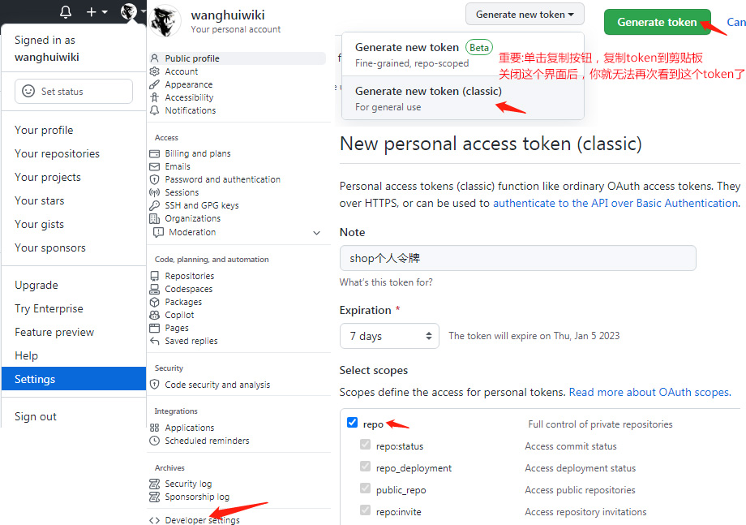

1、用token代替账号密码

```shell
Username for 'https://github.com': 253482626@qq.com
Password for 'https://253482626@qq.com@github.com': 
remote: Support for password authentication was removed on August 13, 2021.
remote: Please see https://docs.github.com/en/get-started/getting-started-with-git/about-remote-repositories#cloning-with-https-urls for information on currently recommended modes of authentication.
fatal: Authentication failed for 'https://github.com/azuo-ayou/BigData.git/'
```

**一定要记得勾选 repo**




2、添加本地的SSH密钥到Git账户

自己百度吧，记得有这么回事情就行  