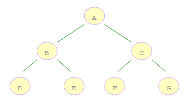

## 一、二叉树遍历



- 前序遍历：根、左、右。前序遍历的结果是【A, B, D, E, C, F, G】
- 中序遍历：左、根、右。中序遍历的结果是【D, B, E, A, F, C, G】
- 后续遍历：左、右、根。后序遍历的结果是【D, E, B, F, G, C, A】
- 层序遍历：这个建议使用队列


## 二、遍历方法

这里以前前序遍历为例子

### 1、递归

```
什么问题可以采用递归求解呢？

需要满足三个条件：

一个问题的解可以分解为若干个子问题的解；
这个问题与分解的子问题，除了数据规模不同外，求解思路相同
存在递归终止条件。
那么在知道一个问题可以采用递归实现之后，如何写出递归代码呢？

关键在于能写出递归公式，找到终止条件。
```

在二叉树的前序遍历问题上，它的递归公式是:

```
preorder(node) = print node —> preorder(node->left) --> preorder(node->right)
```

