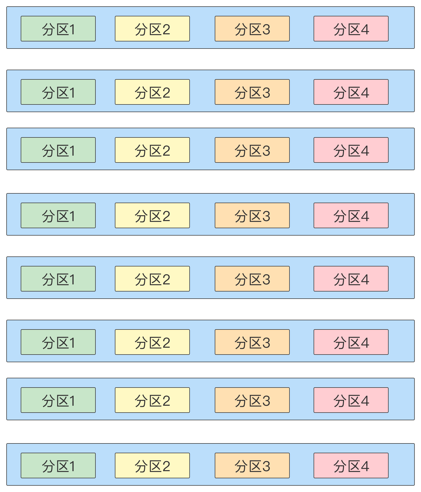

背景：大数据计算框架MapReduce（mr）算是比较成熟的技术了，关于mr的执行流程想必大家都很清楚，尤其对于“环形缓冲区”已经耳熟能详了，而我今天要讲的就是“环形缓冲区”溢写落盘，到reduce阶段数据聚合之前，那些可能被忽略的数据流转的小过程。

## 知识回顾

我们知道整个mr的执行流程大致可以分为如下几个步骤：

1. driver端获取集群信息和划分切片，并将任务提交到集群
2. map端读取并处理切片数据，将数据暂时存在缓冲区
3. map环形缓冲区，多次溢写，产生多个文件
4. map端将多次溢写的文件，合并成一个文件
5. reduce端拉取已经完成map的数据
6. reduce端合并从不同map节点拉取过来的数据文件
7. reduce端聚合合并完成后的数据，并且生成最终的文件

其实严格来时shuffle应该是3、4、5、6阶段，由于第3阶段大家都很熟悉啦，我们今天主要讲的就是4、5、6阶段，我们需要知道环形缓冲区溢写的数据文件，是有序的，按照分区和key的大小是有序的。

## map阶段的合并文件

我们知道map阶段，一个节点（maptask），可能会有多次溢写，就会产生很多个文件，每个文件又包含很多个分区的数据，需要将多次溢写的文件，合并为一个有序的文件，那mr是怎么把多个文件合并起来并且保证有序的呢？下面是一个整体的理解，某个map节点产生了8个溢写文件。

这里其实由外到内涉及到两层的循环

1. 循环遍历所有分区
   1. 循环遍历所有文件，取对应的分区数据
      1. 取当前文件的当前分区数据
   2. 已经获得了当前分区所有的文件数据，循环合并这些文件
      1. 每次合并n（mr中默认参数factory=10，也就是即便有很多文件，我们一次只合并10个）个文件，并将生成的文件，插入剩下未合并的文件

大家先有个整体的了解就行，往下看

这里需要理解合并多次溢写文件并不是直接对文件合并，而是按分区合并，每个分区也需要多次合并，所以我们需要关注的是，一个分区怎么样多次合并的？其中一次的合并具体是什么样的？

主要步骤

1. 每次只合并一个分区的数据，是所有文件相同分区的数据先合并
2. 所有这些文件，相同分区的数据按照，分区数据量大小（不是数据条数）排序
3. 每次合数据量最小的N个分区(mr中，每次默认参数是10)，生成的文件，按二分法插入未合并的分区中
4. 最终这个分区的数据合并成一个文件
5. 循环1-4合并下一个分区

### 分区数据合并

为了大家更好的理解上述过程，如下图：某个map节点共进行了8次溢写产生了8个文件，每个文件有四个分区。

如下图：是上述8个文件其中分区1数据的合并过程，我们假设每次默认的合并参数factory = 3；

7幅图分别是：

1. 有8个分区一的文件
2. 先合并2个最小的文件（我们默认的factory = 3）
3. 将上述合成的文件二分法插入剩下未合并的文件，并删除已合并的文件
4. 合并3个最小的文件
5. 将上步骤合成的文件二分法插入剩下未合并的文件
6. 合并3个最小的文件
7. 将上步骤合成的文件二分法插入剩下未合并的文件

考虑如下问题：

1. 为什么要先合并数据量小的文件呢？
2. 为什么第一步合并2个文件，不是3个文件呢？就是说为什么合并顺序是2-3-3-3，而不是3-3-3-2？
3. 为什么不一次合并完成呢？

我是这样想的，也不一定正确，欢迎大家一起讨论：

1. 减少磁盘的io；我们考虑这样一个场景，假如某次合并有五个文件，大小分别是1M、2M、3M、4M、5M，每次合并三个文件。第一种情况先合并大文件写入磁盘3+4+5=12M，剩下1+2+12 = 15M，两次合并的磁盘io是12+15 = 27M；第二种情况先合并小文件写入磁盘1+2+3=6M，剩下4+5+6 = 15M，两次合并的磁盘io是6+15 = 21M；显然先合并小文件io要小；
2. 减少磁盘io，同理假如某次合并有四个文件，大小分别是1M、2M、3M、4M，每次合并三个文件。第一种情况先合并三文件写入磁盘1+2+3=6M，剩下4+6 = 10M，两次合并的磁盘io是10+6 = 16M；第二种情况先合并两个文件写入磁盘1+2=3M，剩下3+3+4 = 10M，两次合并的磁盘io是10+3 = 13M；显然先合并两个文件io要小；
3. 这就涉及到内存和时间复杂度的问题了，因为每次溢写一个key，都会进行一次排序，如果某次map过程产生了很多文件，那么这个排序的时间复杂度就有点高了（这里可以看完下面内容再思考一下）

### 一次具体的数据合并是怎么执行的

一个节点合并文件，要按分区来合并，每一个分区又会有多次合并的过程，那么每一次合并是怎么样的呢？我们知道，每个文件分区内是有序的，一个文件的一个分区的第一个key一定是最小的，所以合并文件的时候，有如下步骤：

1. 比较N文件的第一个key，得到其中一个文件的第一key最小
2. 取这个文件第一个key的写入磁盘，并移除这个文件的第一个key
3. 重复步骤1-2，直到N文件全为空 

上述分区1文件的某次合并过程如下，这次合并了三个文件

这里合并完会生成一个文件（理解这个过程很简单，我就不赘述了），然后二分法插入剩下待合并的文件，继续合并，直到没有待合并文件，完成分区1数据合并。当然了，这只是其中一个分区的数据合并，接着合并下一个分区的数据，直到所有分区数据合并完成。

## reduce阶段的合并文件

其实reduce阶段也分为两个部分，shuffle和reduce，我们今天要说的就是shuffle，也就是拉取文件和合并文件。具体做了哪些事情呢？主要如下三件事情：

1. 监听maptask，获取成功的maptask节点信息
2. 拉取maptask执行成功节点的数据，也就上述map阶段完成合并的数据
3. 将不同节点的数据合并起来

由于，reduce阶段并不是等map阶段所有的task都完成才开始的，所以上述的三件事，是同时开始的，由不同的人（线程）执行，分别是成功事件抓取器，数据拉取器，文件合并管理器；

1. 成功事件抓取器：一个reduce会起多个线程取监听maptask的状态，如果成功，将一些元数据信息保存在调度器
2. 调度器：存储成功maptask的元数据信息
3. 数据拉取器：访问调度器，拉取相应maptask节点的数据，将数据交给文件合并管理器
4. 文件合并管理器（重点）：会起两个线程，一个内存合并的线程，一个磁盘合并的线程，当拉取的数据较小时，进入内存合并，当拉取的数据较大时，进入磁盘合并

流程如图：

合并中需要注意的点

1. 这里提到文件合并，合并过程和map端的合并是一样的，就不展开说了
2. 文件被拉取到reduce并不是立马合并，而是先放入数组，当数据长度达到一定阈值才会将数组加入待合并队列
3. 待合并队列，为什么不是达到阈值立马合并？因为可能会存在拉取数据快，合并较慢，这样就会造成，生成很多达到阈值待合并的组数，这时就是按先后顺序排队
4. 内存合并完生成的文件，会进入磁盘文件合并；磁盘合并完生成的文件，再次进入磁盘合并
5. 最终完成reduce阶段的文件合并，也就是reduce阶段的shuffle 

这里也有一个大家需要考虑的问题，假如有combine阶段，那他会发生在哪个阶段呢？或者说哪些阶段？我们首先要明白，为什么要combine，好处是什么？对，好处就是合并相同的key从而减少数据量，降低数据传输的开销，那我们只有在三个地方有机会做这个事情：

1. map阶段缓冲区溢写磁盘的时候
2. map阶段合并多次溢写文件的时候
3. reduce阶段合并从多个节点拉取的数据的时候 

## 总结

### 问题

对于上述分区数据的合并，大家可以思考如下几个问题，感兴趣的可以找我讨论

考虑如下问题：

1. 为什么要先合并数据量小的文件呢？
2. 为什么第一步合并2个文件，不是3个文件呢？就是说为什么合并顺序是2-3-3-3，而不是3-3-3-2？
3. 为什么不一次合并完成呢？

### 总计

map阶段合并文件：按分区合并，每次合并一定数量的文件，多次合并。

reduce阶段合并文件：分内存合并和磁盘合并，多线程协同工作；监听负责获取map完成节点数据，拉取器负责拉取数据，文件合并器负责合并文件。

目的是为了让大家对mr中的文件合并有一定的了解，如果大家对源码感兴趣的话，或者这些合并的过程有补充和疑问，或者对本文以外的其他流程感兴趣等，欢迎一起讨论。