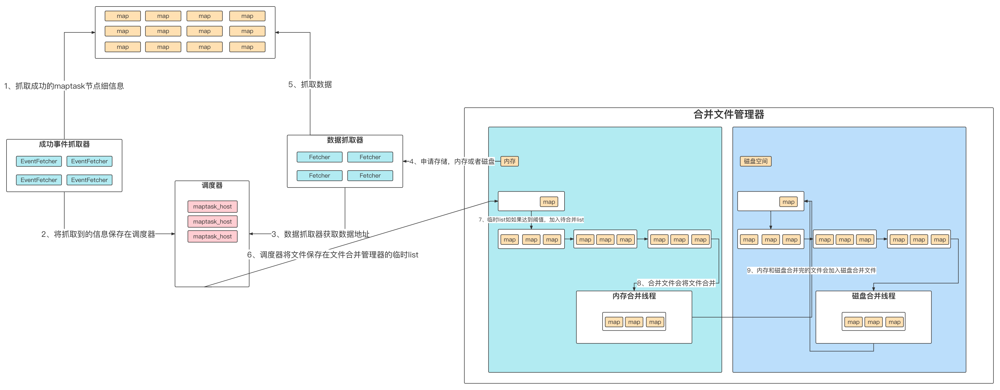

## 了解大致流程

在看源代码之前，我们先了解一下这个环节的具体步骤。能够更好的帮助我们理解这个过程，将更容易理解代码的架构



1. 事件抓取器获取成功的maptask信息，包括节点地址、文件路径、文件大小等
2. 将获取到的信息保存在调度器中
3. 数据抓取器在调度器中拿到maptask信息
4. 合并文件管理器分配存储，当文件大小超过一定阈值，就分配磁盘空间，否则分配内存空间
5. 拉取数据放入分配的存储
6. 调度器将文件保存在文件管理器的临时list中
7. list被多个maptask的数据加入时，当临时list大小到达一定阈值（总文件大小，不是文件个数），就会被合并
8. 第七步被合并的文件，并不是真正被合并，而是加入了一个队列，因为之前可能还有没被合并完的文件
9. 5-8是内存和磁盘合并文件都会有的步骤，那么内存和磁盘合并完的文件怎么办呢？**内存和磁盘合并完的文件再次加入磁盘合并文件**

**最后的阶段**：类似于环形缓冲区，当最后所有task都结束了，还有未合并的文件，内存和磁盘都会有，还有多次内存合并和磁盘合并产生的文件

1. 在文件合并器的close方法中，会执行最后阶段的**finalMerge**

注：5-8内存合并和磁盘合并步骤是一样的，但是走的是不同的代码！！！

## 了解重要组件

首先说明一下，这里讲的是reduce阶段的shuffle，这里不太懂的话，建议先整理了解一下mr的全局流程；为了大家能有一个从浅入深的过程，我先介绍reduce阶段shuffle过程用到的一些重要组件

- **shuffleConsumerPlugin**：是这个过程中的一个全局的类，shuffle器
- **EventFetcher**：获取map地址；这个组件也是一个线程，很好理解，解释为了获取已经完成map阶段的task地址（不获取实际数据）
- **Fetcher**：获取数据；这个也很好理解，也是线程，去拉取完成map阶段task的数据
- **ShuffleScheduler**：调度器；EventFetcher获取的地址会放到这里，Fetcher会来这里获得已经成功完成map的机器地址
- **MergeManager**：合并管理器；顾名思义，负责合并多个maptask拉取过来的数据


## 源码部分详细流程

1. 初始化一个shuffle插件，

2. 在初始化方法init中，同时会创建MergeManager<K,V>（接口）用于merge数据。MergeManagerImpl<K, V>是其实现类。MergeManagerImpl<K, V>的构造方法会start两个线程：
     1、inMemoryMerger：数据从内存到磁盘的merge
   2、数据从磁盘到磁盘的merge

     ```java
     /***
     1、shuffleConsumerPlugin插件调用init方法
     2、init方法中创建了合并文件的MergeManager，createMergeManager
     3、createMergeManager方法中的MergeManager的构造方法起了两个线程，内存合并和磁盘合并
     4、MergeManager构造方法
     ***/
     public void init(Context context) {
             this.metrics = new ShuffleClientMetrics(this.reduceId, this.jobConf);
             this.copyPhase = context.getCopyPhase();
             this.taskStatus = context.getStatus();
             this.reduceTask = context.getReduceTask();
             this.localMapFiles = context.getLocalMapFiles();
             this.scheduler = new ShuffleSchedulerImpl();
       			// 创建了合并文件的MergeManager
             this.merger = this.createMergeManager(context);
         }
     
     protected MergeManager<K, V> createMergeManager(Context context) {
             return new MergeManagerImpl();
         }
     
     public MergeManagerImpl() {
       			// 起两个线程，内存合并和磁盘合并
             this.inMemoryMerger = this.createInMemoryMerger();
             this.inMemoryMerger.start();
             this.onDiskMerger = new MergeManagerImpl.OnDiskMerger(this);
             this.onDiskMerger.start();
         }
     ```
     
     
   
3. shuffleConsumerPlugin的run方法中起两个线程，eventFetcher和Fetcher（拉取可能会有多个线程）；其中eventFetcher获取成功的map；Fetcher去拉取数据；

     ```java
     public RawKeyValueIterator run() throws IOException, InterruptedException {
       			
       			// 创建EventFetcher
             int eventsPerReducer = Math.max(100, 3000000 / this.jobConf.getNumReduceTasks());
             int maxEventsToFetch = Math.min(10000, eventsPerReducer);
             EventFetcher<K, V> eventFetcher = new EventFetcher();
             eventFetcher.start();
       
       			// 创建Fetcher
             boolean isLocal = this.localMapFiles != null;
             int numFetchers = isLocal ? 1 : this.jobConf.getInt("mapreduce.reduce.shuffle.parallelcopies", 5);
             Fetcher<K, V>[] fetchers = new Fetcher[numFetchers];
             if (isLocal) {
                 fetchers[0] = new LocalFetcher();
                 fetchers[0].start();
             } else {
                 for(int i = 0; i < numFetchers; ++i) {
                     fetchers[i] = new Fetcher();
                     fetchers[i].start();
                 }
             }
     
             while(!this.scheduler.waitUntilDone(2000)) {
                 this.reporter.progress();
                 synchronized(this) {
                     if (this.throwable != null) {
                         throw new Shuffle.ShuffleError();
                     }
                 }
             }
     
             eventFetcher.shutDown();
             Fetcher[] arr$ = fetchers;
             int len$ = fetchers.length;
     
             for(int i$ = 0; i$ < len$; ++i$) {
                 Fetcher<K, V> fetcher = arr$[i$];
                 fetcher.shutDown();
             }
     
             this.scheduler.close();
             this.copyPhase.complete();
             this.taskStatus.setPhase(Phase.SORT);
             this.reduceTask.statusUpdate(this.umbilical);
             arr$ = null;
     
             RawKeyValueIterator kvIter;
             try {
                 kvIter = this.merger.close();
             } catch (Throwable var13) {
                 throw new Shuffle.ShuffleError("Error while doing final merge ", var13);
             }
     
             synchronized(this) {
                 if (this.throwable != null) {
                     throw new Shuffle.ShuffleError();
                 } else {
                     return kvIter;
                 }
             }
         }
     ```

     

4. Fetcher通过scheduler得到host，然后copy数据，先调用copyFromHost，这个方法中调用copyMapOutput，返回失败的task，会有重试策略；在这个方法中，this.merger.reserve()和mapOutput.shuffle()完成数据的具体拉取；前者返回在哪理处理数据，后者实现具体的读数据操作，具体是读取在一个byte数组中；

     Fetcher类中，scheduler和merger的协调工作，具体是this.merger.reserve()返回一个mapOutput，mapOutput的本质就是一个byte数组，用mapOutput的shuffle()方法读取数据；this.scheduler.copySucceeded()方法，提交数据，提交给merge，当达到合并的阈值后，会触发stratmerge方法，但是这时候并不会真正merge，只是加入到merge队列，由另个线程负责meger，最后当所有的Fetcher，都完成后，merge调用finalmeger方法，生成最后的RawKeyValueIterator，这个是在merge的close方法中。

     

     下边详细的梳理一下

     ```java
     // reducer 端的合并
     
     //获取map任务成功的节点地址信息
     class EventFetcher<K, V> extends Thread {
        
         private final ShuffleScheduler<K, V> scheduler; // 获取已经完成的map，放在scheduler中
         public void run() {
           ...
         }
         
     }
     
     
     // 拉取数据
     class Fetcher<K, V> extends Thread {
         protected final MergeManager<K, V> merger;  //合并读取的文件
         protected final ShuffleSchedulerImpl<K, V> scheduler; // 调度器
         protected final ShuffleClientMetrics metrics;
         protected final int reduce;
       
         public void run() {
           host = this.scheduler.getHost(); // 获取调度器中已经完成的map，这里要和EventFetcher合作
           this.copyFromHost(host); // 这里的host是一个数组，多个map
       	}  
       
       	protected void copyFromHost(MapHost host) throws IOException {
           
             List<TaskAttemptID> maps = this.scheduler.getMapsForHost(host);
     
        			// 拉取数据，并且返回拉取失败的task,有重试策略
             failedTasks = this.copyMapOutput(host, input, remaining, this.fetchRetryEnabled);
         }
       
       private TaskAttemptID[] copyMapOutput() throws IOException {
         
         // 获得一个用来保存数据的内存空间，实际上是一个byte数组，会根据大小来判断是磁盘空间还是内存空间
         mapOutput = this.merger.reserve(mapId, decompressedLength, this.id);
         
         // 拉取数据，将数据放在mapOutput
         mapOutput.shuffle(host, is, compressedLength, decompressedLength, this.metrics, this.reporter);
         
         // 把数据放在merger类中，记录长度和阈值，达到阈值就开始合并操作
         this.scheduler.copySucceeded(mapId, host, compressedLength, startTime, endTime, mapOutput);
                       
     
     }
         
     
       
       
     public class MergeManagerImpl<K, V> implements MergeManager<K, V> {
         
         Set<InMemoryMapOutput<K, V>> inMemoryMapOutputs = new TreeSet(new MapOutputComparator());
         private final MergeThread<InMemoryMapOutput<K, V>, K, V> inMemoryMerger;
         
         private long commitMemory; //已经提交的内存大小
         
       	// 生成磁盘或者内存mapoutput
       	public synchronized MapOutput<K, V> reserve() throws IOException {
             if (requestedSize > this.maxSingleShuffleLimit) { 
                 return new OnDiskMapOutput();
             } else if (this.usedMemory > this.memoryLimit) {
                 return null;
             } else {
                 return this.unconditionalReserve(mapId, requestedSize, true);
             }
         }
       
       // 每当拉取完一个map，上交到merger，当达到一定的阈值开始合并
       // 需要注意的是我们可以查看inMemoryMerger这个线程，达到阈值以后，只是添加到待合并的队列，因为上一次合并可能还没有结束呢！！
       	public synchronized void closeInMemoryFile(InMemoryMapOutput<K, V> mapOutput) {
             this.inMemoryMapOutputs.add(mapOutput);
             this.commitMemory += mapOutput.getSize();
             if (this.commitMemory >= this.mergeThreshold) {
               // 达到阈值，开始合并操作
                 this.inMemoryMerger.startMerge(this.inMemoryMapOutputs);
                 this.commitMemory = 0L;
             }
         }
       
     }
     ```

     

5. 将获取的一个节点的数据，放入merge管理器中，当达到一定的阈值开始合并

   ```java
   public class ShuffleSchedulerImpl<K, V> implements ShuffleScheduler<K, V> {
       
     
   		// 将获取的成功的map节点放入调度器
       public void resolve(TaskCompletionEvent event) {
           switch(event.getTaskStatus()) {
           case SUCCEEDED:
               URI u = getBaseURI(this.reduceId, event.getTaskTrackerHttp());
               this.addKnownMapOutput(u.getHost() + ":" + u.getPort(), u.toString(), event.getTaskAttemptId());
               this.maxMapRuntime = Math.max(this.maxMapRuntime, event.getTaskRunTime());
               break;
           case FAILED:
           case KILLED:
           case OBSOLETE:
               this.obsoleteMapOutput(event.getTaskAttemptId());
               LOG.info("Ignoring obsolete output of " + event.getTaskStatus() + " map-task: '" + event.getTaskAttemptId() + "'");
               break;
           case TIPFAILED:
               this.tipFailed(event.getTaskAttemptId().getTaskID());
               LOG.info("Ignoring output of failed map TIP: '" + event.getTaskAttemptId() + "'");
           }
   
       }
   
      
   		// 将获取的一个节点的数据，放入merge管理器中
       public synchronized void copySucceeded(TaskAttemptID mapId, MapHost host, long bytes, long startMillis, long endMillis, MapOutput<K, V> output) throws IOException {
           this.failureCounts.remove(mapId);
           this.hostFailures.remove(host.getHostName());
           int mapIndex = mapId.getTaskID().getId();
           if (!this.finishedMaps[mapIndex]) {
               output.commit();
               this.finishedMaps[mapIndex] = true;
               this.shuffledMapsCounter.increment(1L);
               if (--this.remainingMaps == 0) {
                   this.notifyAll();
               }
   
               long copyMillis = endMillis - startMillis;
               if (copyMillis == 0L) {
                   copyMillis = 1L;
               }
   
               float bytesPerMillis = (float)bytes / (float)copyMillis;
               float transferRate = bytesPerMillis * 9.536743E-4F;
               String individualProgress = "copy task(" + mapId + " succeeded" + " at " + this.mbpsFormat.format((double)transferRate) + " MB/s)";
               this.copyTimeTracker.add(startMillis, endMillis);
               this.totalBytesShuffledTillNow += bytes;
               this.updateStatus(individualProgress);
               this.reduceShuffleBytes.increment(bytes);
               this.lastProgressTime = Time.monotonicNow();
               LOG.debug("map " + mapId + " done " + this.status.getStateString());
           } else {
               LOG.warn("Aborting already-finished MapOutput for " + mapId);
               output.abort();
           }
   
       }
   
       
   ```

   

6. 需要注意的是我们可以查看inMemoryMerger这个线程，达到阈值以后，只是添加到待合并的队列，因为上一次合并可能还没有结束呢！！

   ```java
   abstract class MergeThread<T, K, V> extends Thread {
       
   		
     	// 将文件添加到待合并的队列
       public void startMerge(Set<T> inputs) {
           if (!this.closed) {
               this.numPending.incrementAndGet();
               List<T> toMergeInputs = new ArrayList();
               Iterator<T> iter = inputs.iterator();
   
               for(int ctr = 0; iter.hasNext() && ctr < this.mergeFactor; ++ctr) {
                   toMergeInputs.add(iter.next());
                   iter.remove();
               }
   
               LOG.info(this.getName() + ": Starting merge with " + toMergeInputs.size() + " segments, while ignoring " + inputs.size() + " segments");
               synchronized(this.pendingToBeMerged) {
                   this.pendingToBeMerged.addLast(toMergeInputs);
                   this.pendingToBeMerged.notifyAll();
               }
           }
   
       }
   
      
       public void run() {
          synchronized(this.pendingToBeMerged) {
            // 等待合并的文件
            while(this.pendingToBeMerged.size() <= 0) {
              this.pendingToBeMerged.wait();
            }
   				
            // 获取一个合并的文件
            inputs = (List)this.pendingToBeMerged.removeFirst();
          }
         this.merge(inputs);
   }
   
   ```

   

7. 


## 函数调用关系

1. shuffle类：调度器和合并管理器

   1. run方法：有EventFetcher和Fetcher
      1. EventFetcher:
      
         1. 获取完成的map放入调度器
      
      2. Fetcher:
      
         1. host = this.scheduler.getHost()
      
         2. this.copyFromHost(host)
      
         3. this.copyMapOutput()
      
         4. mapOutput = this.merger.reserve();  获得保存结果的内存
      
         5. mapOutput.shuffle(); 拉取数据
      
         6. this.scheduler.copySucceeded()
      
            1. mapOutput.commit().closeInMemoryFile()
            2. this.inMemoryMerger.startMerge(this.inMemoryMapOutputs);//MergeThread的方法，只是添加到待合并队列
            3. MergeThread类的run方法中才有真正的合并逻辑
      
            


**全网最详细的reduce阶段的shuffle**

参考文献：https://blog.csdn.net/u013063153/article/details/62238383

https://blog.csdn.net/qq_39192827/article/details/90601777

https://blog.csdn.net/qq_34132046/article/details/117033814

