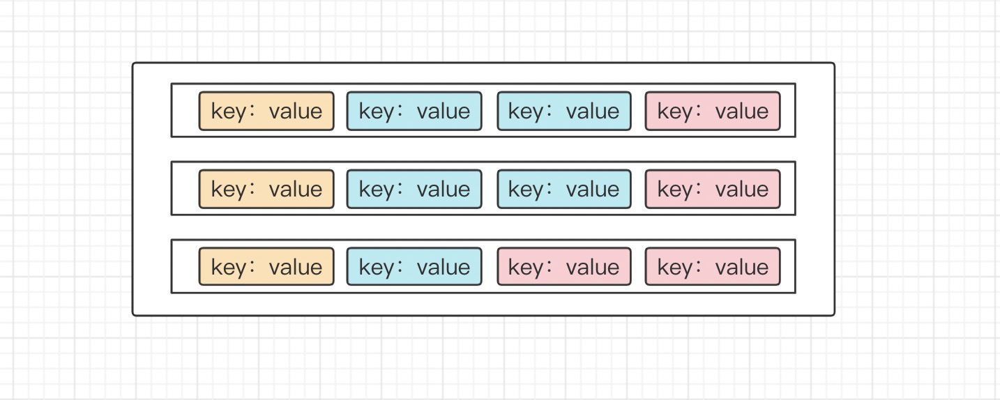

### 上次遗留问题

1. map阶段合并文件最后落盘了吗？最后落盘盘了，生成一个文件
2. reduce阶段shuffle是：a)合并的时候拉取文件，b)还是先拉取文件，再合并? 先拉取文件，放在磁盘或者内存达到一定阈值以后，合并文件
3. 迭代器中每调用一次，就会读文件一次吗？不是，会有缓存，默认是8192byte大小的数组


### 本次分享内容

1. MR的reduce阶段的执行原理？
2. 迭代器到底是什么，怎么运作？
3. MR读（写）一个key-value对的流程是怎么样的？


我们经常会看到这样的描述，reduce阶段，reducer先去map节点拉取数据，然后将文件合并，如果内存不足就先落盘；实际上也没啥毛病，但是我们通过第三将，会更加细致的了解到这个过程


本质是reduce最后并没合并完成，而是返回了一个迭代器，迭代器就是reduce阶段合并文件的最后一步，这时候并不是一个文件，而是有几个文件生成的迭代器，可以参考前几节的内容

~~reduce处理数据分两种情况~~

- ~~有缓存，并不是来一条数据处理一条，先缓存到BackupStore这个类中，然后处理数据~~
- ~~”来一条数据，处理一条数据“~~


### 有缓存的情况：（先忽略）

有缓存的情况，是将读取的数据先缓存在内存或者是磁盘中，这个是封装在**BackupStore**这个类中，具体待深入了解，但不影响整体的理解

### 没有缓存的情况：

利用了双重迭代器的思想 

1. 整个reduce要处理的数据是一个大的迭代器
2. 对于每一个相同的key，是一个小的迭代器

没有缓存的情况，大致就是，每一次reduce聚合，我们对shuffle后生成的迭代器进行一层封装，对用户暴露的就是，每一次reduce，都是相同key下value的处理逻辑，那么怎么实现的这个逻辑呢？每一次reduce处理数据，封装一个小的迭代器，当这个小迭代器的下一个key和当前key不一样的时候就，跳出循环；进入下一次reduce聚合，也就是进入下一个小的迭代器



如图：是一个我们reduce要处理的文件，由三个文件组成，生成的一个大迭代器A；相同颜色的是相同key的数据，也就是每种颜色又封装成一个小的迭代器B；大迭代器，是只有当所有数据都被处理完，才关闭，小迭代器本质上也是调大迭代器的nextkeyvalue()方法，但是又附加了，当下一个key和当前key是不一样的时候，就跳出，也就是B.next()返回false，这里由变量nextKeyIsSame控制；同时也就会进入下一个小迭代器，也就是下一个颜色，一下个相同的key的集合


具体有如下步骤：

1. 调用nextKey()方法获取一个小迭代器，本质上调用的ReduceContextImpl.nextKeyValue()，
2. 循环这个迭代器，处理我们自己写的reduce逻辑，本质上也是调用ReduceContextImpl.nextKeyValue()获取相同key的每一个value，一直到**nextKeyIsSame = false**
3. 返回第一步

```java
public void run(Reducer<KEYIN, VALUEIN, KEYOUT, VALUEOUT>.Context context) throws IOException, InterruptedException {
        this.setup(context);

        try {
            while(context.nextKey()) { // 为了得到一个小的迭代器
              
              /*** 这里是我们真整的reduce处理逻辑
              context.getCurrentKey() 得到这次处理数据的key 
              context.getValues() 得到这次处理数据value的迭代器，
              context 上下文环境
              ***/
                this.reduce(context.getCurrentKey(), context.getValues(), context); //进入我们自定义reduce
              
              
              // 如果有缓存操作会执行如下代码
                Iterator<VALUEIN> iter = context.getValues().iterator();
                if (iter instanceof ValueIterator) {
                  // 重置我们的缓存空间
                    ((ValueIterator)iter).resetBackupStore();
                }
            }
        } finally {
            this.cleanup(context);
        }

    }
```

```java
public class ReduceContextImpl<KEYIN, VALUEIN, KEYOUT, VALUEOUT> extends TaskInputOutputContextImpl<KEYIN, VALUEIN, KEYOUT, VALUEOUT> implements ReduceContext<KEYIN, VALUEIN, KEYOUT, VALUEOUT> {
   
  /***
  为了代码简洁，好理解，省略了构造方法和属性定义
  ***/
  
  

  // 获取下一个value值，这样就会使得是不是很多keyvalue浪费掉，不知道为啥会有这一步？？？？是为了过滤掉异常的值吗
    public boolean nextKey() throws IOException, InterruptedException {
        while(this.hasMore && this.nextKeyIsSame) {
            this.nextKeyValue();
        }

        if (this.hasMore) {
            if (this.inputKeyCounter != null) {
                this.inputKeyCounter.increment(1L);
            }

            return this.nextKeyValue();
        } else {
            return false;
        }
    }

  // 从迭代器中获取下一个key
    public boolean nextKeyValue() throws IOException, InterruptedException {
        if (!this.hasMore) {
            this.key = null;
            this.value = null;
            return false;
        } else {
            this.firstValue = !this.nextKeyIsSame;
            DataInputBuffer nextKey = this.input.getKey();
            this.currentRawKey.set(nextKey.getData(), nextKey.getPosition(), nextKey.getLength() - nextKey.getPosition());
            this.buffer.reset(this.currentRawKey.getBytes(), 0, this.currentRawKey.getLength());
            this.key = this.keyDeserializer.deserialize(this.key);
            DataInputBuffer nextVal = this.input.getValue();
            this.buffer.reset(nextVal.getData(), nextVal.getPosition(), nextVal.getLength() - nextVal.getPosition());
            this.value = this.valueDeserializer.deserialize(this.value);
            this.currentKeyLength = nextKey.getLength() - nextKey.getPosition();
            this.currentValueLength = nextVal.getLength() - nextVal.getPosition();
            if (this.isMarked) {
                this.backupStore.write(nextKey, nextVal);
            }

            this.hasMore = this.input.next();
            if (this.hasMore) {
                nextKey = this.input.getKey();
              
              // 这里判断下一个key是否相同，是否要跳出下一个迭代器了
                this.nextKeyIsSame = this.comparator.compare(this.currentRawKey.getBytes(), 0, this.currentRawKey.getLength(), nextKey.getData(), nextKey.getPosition(), nextKey.getLength() - nextKey.getPosition()) == 0;
            } else {
                this.nextKeyIsSame = false;
            }

            this.inputValueCounter.increment(1L);
            return true;
        }
    }

    public KEYIN getCurrentKey() {
        return this.key;
    }

    public VALUEIN getCurrentValue() {
        return this.value;
    }

    BackupStore<KEYIN, VALUEIN> getBackupStore() {
        return this.backupStore;
    }

    public Iterable<VALUEIN> getValues() throws IOException, InterruptedException {
        return this.iterable;
    }

    protected class ValueIterable implements Iterable<VALUEIN> {
        private ReduceContextImpl<KEYIN, VALUEIN, KEYOUT, VALUEOUT>.ValueIterator iterator = ReduceContextImpl.this.new ValueIterator();

        protected ValueIterable() {
        }

        public Iterator<VALUEIN> iterator() {
            return this.iterator;
        }
    }

    protected class ValueIterator implements org.apache.hadoop.mapreduce.ReduceContext.ValueIterator<VALUEIN> {
        private boolean inReset = false;
        private boolean clearMarkFlag = false;

        protected ValueIterator() {
        }
				// 判断有没有下个值，1、缓存中判断；2、下一个key是否一样
        public boolean hasNext() {

            return ReduceContextImpl.this.firstValue || ReduceContextImpl.this.nextKeyIsSame;
        }
				
      
      // 获取下一个value 1、缓存中得到；2、调用ReduceContextImpl.this.nextKeyValue()得到;
        public VALUEIN next() {
            
            if (ReduceContextImpl.this.firstValue) {
                ReduceContextImpl.this.firstValue = false;
                return ReduceContextImpl.this.value;
            } else if (!ReduceContextImpl.this.nextKeyIsSame) {
                throw new NoSuchElementException("iterate past last value");
            } else {
                try {
                    ReduceContextImpl.this.nextKeyValue();
                    return ReduceContextImpl.this.value;
                } catch (IOException var2) {
                    throw new RuntimeException("next value iterator failed", var2);
                } catch (InterruptedException var3) {
                    throw new RuntimeException("next value iterator interrupted", var3);
                }
            }
        }

  
        
    }
}

```


## 迭代器总结

这里我详细的讲一下这个迭代器的工作原理

#### 首先你需要知道的几个重点

- 本质：迭代器的本质，就是几个中间文件，或者说是临时文件，每一个文件存放着**有序**的key—value对
- 本质原理：双重迭代器，每一个文件生成一个迭代器，所有文件生成的迭代器又是一个外层的迭代器
- 出现的地方：map端合并文件，reduce端shuffle合并文件，reduce端reduce聚合结果
- 目的：通过迭代器的封装，每次取的都是所有文件中最小的key，可以使得数个文件整体有序（迭代器内部可以实现，可以参考第二讲的堆排序）
- 实现方式：由于每个文件内部是有序的，且最小的是出现在文件的第一个key，每次只需要取所有文件中第一个key中，最小的key，这个key就是这些文件最小的key 


#### 工作原理

不管是合并文件，还是最后的聚合操作都会用到同样的步骤，这里以合并文件为例：

1. 生成这样一个迭代器A 
2. 调用A.next方法，这个方法会返回一个迭代器a，这个迭代器就是第一个key最小的那个文件生成的迭代器
   1. 会判断，A中是否还有元素，没有就结束
   2. 每次调用，就会调整A中元素，使得调用A.next时，得的文件迭代器的第一个元素是最小的
3. 调用a.next方法，拿到这个迭代器（文件）第一个key
   1. 判断a中是否有元素，没有就移除这个元素
4. 写入磁盘
5. 重复2-4

如图，有剪头指向的默认就是堆顶，所以每次只需要取堆顶文件的第一个元素即可


#### 源码级别

```java
// 生成这样一个迭代器，就不写了
// 直接看调用，这里用reduce阶段的reduce举例

public boolean next() throws IOException {
                  boolean ret = rIter.next(); //这里就是外层迭代器的next
                  reporter.setProgress(rIter.getProgress().getProgress());
                  return ret;
              }


public boolean next() throws IOException {
            if (this.size() == 0) { // 是否为空
                this.resetKeyValue();
                return false;
            } else {
                if (this.minSegment != null) { //minSegment就是最小key在的文件生成的迭代器
                    this.adjustPriorityQueue(this.minSegment); // 调整迭代器，使得堆顶迭代器就是，最小key所在的文件
                    if (this.size() == 0) {
                        this.minSegment = null;
                        this.resetKeyValue();
                        return false;
                    }
                }

                this.minSegment = (Merger.Segment)this.top(); // 获得最小key所在的迭代器
                long startPos = this.minSegment.getReader().bytesRead;
                this.key = this.minSegment.getKey(); //通过最小key所在的迭代器，获取最小key，我们具体看这个方法
                
                ......
                return true;
            }
        }

// 调整迭代器
private void adjustPriorityQueue(Merger.Segment<K, V> reader) throws IOException {
            long startPos = reader.getReader().bytesRead;
  					//reader是上一个最小的key所在的文件，我们需要获取下一个key，然后调整整个迭代器
            boolean hasNext = reader.nextRawKey(); // 我们来看一下，具体的一个文件迭代器是怎么获取key的
            long endPos = reader.getReader().bytesRead;
            this.totalBytesProcessed += endPos - startPos;
            this.mergeProgress.set(Math.min(1.0F, (float)this.totalBytesProcessed * this.progPerByte));
  					// 下边是调整的具体的方法，内部是一个堆数组，有兴趣的可以具体看看，我这里就不一一展开了
            if (hasNext) {
                this.adjustTop();
            } else {
                this.pop();
                reader.close();
            }

        }


 public boolean nextRawKey(DataInputBuffer key) throws IOException {
   					// positionToNextRecord在下边细讲
            if (!this.positionToNextRecord(this.dataIn)) { // 是否能到下一条记录，这个方法最要是为了得到key和value的长度
                return false;
            } else {
                if (this.keyBytes.length < this.currentKeyLength) {
                    this.keyBytes = new byte[this.currentKeyLength << 1];
                }

                int i = this.readData(this.keyBytes, 0, this.currentKeyLength); // 读取具体key值
                if (i != this.currentKeyLength) {
                    throw new IOException("Asked for " + this.currentKeyLength + " Got: " + i);
                } else {
                    key.reset(this.keyBytes, this.currentKeyLength);
                    this.bytesRead += (long)this.currentKeyLength;
                    return true;
                }
            }
        }


protected boolean positionToNextRecord(DataInput dIn) throws IOException {
            if (this.eof) {
                throw new EOFException("Completed reading " + this.bytesRead);
            } else {
                this.currentKeyLength = WritableUtils.readVInt(dIn); //读取key的长度 
                this.currentValueLength = WritableUtils.readVInt(dIn); // 读取value的长度
                
                }
            }
        }


```


## MR读取一个key的过程

我们肯定有疑问，mr中间过程的数据是怎么存，又是怎么读的？

存：全部都是序列化以后的数据，byte为单位

### 数据读取过程

以读取一个key为例，讲述一下过程，比如hello，会被存为长度+key，也就是 **5hello**，那么读取过程如下

1. 获取key的长度 keylength = 5
   1. 如何获取这个5呢？存的都是byte，我要读取几位呢，假如是129呢，怎么读取？
2. 读取5个byte，就得到这个key


### 长度读取

1. 读取一个byte，这个byte用来保存，keylength占用几个byte，占用n个byte
2. 读取取n个byte，并转化为long类型的长度m，也就是数据长度为m
3. 读取m个byte 


一个long类型最多只需要8位，一个byte，-127 =<byte <=128，可以表示255位，为了提高利用率 

-119<= n < -112表示 正数的8位

-120<= n <= -127表示 负数的8位 

n >= -122 直接表示长度


比如长度为130的二进制是 1000 0010 ，会被存成 [-113,-126]，-113代表需要再读一次，就会读到-126，-126&255 = 130

比如长度为259的二进制是  1 0000 0011，会被存成 [-114,1,3] ，-144代表需要再读两次，分如下三步 ：

1. 1 & 255 << 8 = 256
2. 3 & 255 = 3 
3. 3 ｜256 = 259


# 源码

WritableUtils类中有具体的写方法和读方法

```java
public static long readVLong(DataInput stream) throws IOException {
        byte firstByte = stream.readByte(); // 先读一个byte
        int len = decodeVIntSize(firstByte); // 判断还需要读吗？
        if (len == 1) {
            return (long)firstByte;
        } else {
          // 需要继续读
            long i = 0L;
						// 将每次读的结果meger起来
            for(int idx = 0; idx < len - 1; ++idx) {
                byte b = stream.readByte();
                i <<= 8;
                i |= (long)(b & 255);
            }

            return isNegativeVInt(firstByte) ? ~i : i; // 判断数据的正负
        }
    }
```

## 参考文献

1. https://blog.csdn.net/RuiClear/article/details/107295606
2. https://www.jianshu.com/p/4e4c7958582f
