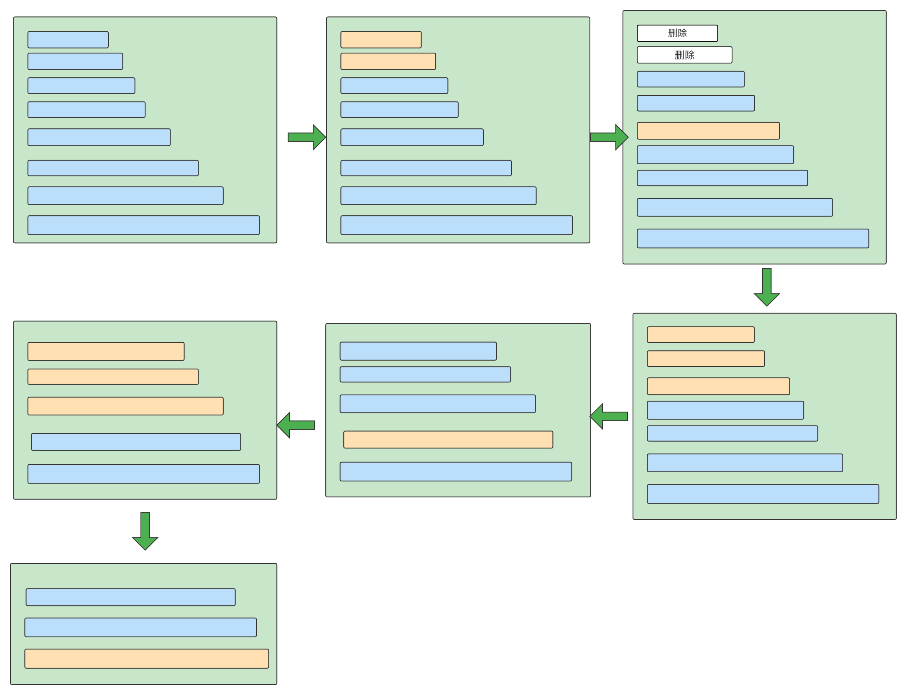
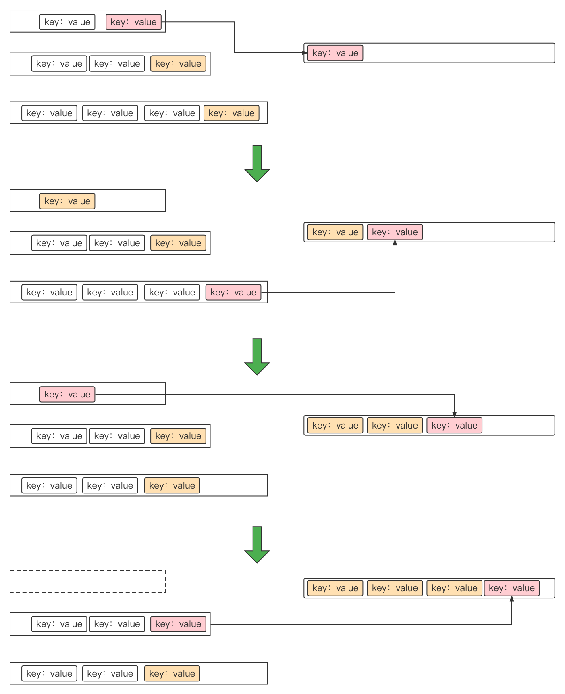

## 归并排序合并文件

**思考**：大家都知道合并文件的时候用的是归并排序，那么

1. 为什要合并文件？1、combine减少文件传输；2、使得文件有序
2. 什么是归并排序？
3. 如何用到归并排序？
4. 涉及到几次排序？2次，一次选最小的10个文件，一个比较key的大小，写入磁盘


# map阶段结束

为了让大家更加理解，归并排序处于整个过程中位置，我们补充一点知识。一个maptask说简单点，无非会有三个过程：

- 初始化：这个过程完善配置信息
- map逻辑：这个过程是重点，我们说的溢写就是在这个阶段
- close：关闭资源、合并多次溢写的文件，等等

一个maptask可能会发生很多次溢写，当map方法的最后一条数据执行完后，mapper就完成了；就到了我们自己理解的close阶段，接下来会执行output的close方法，也是我们接下来要重点看的，close方法做了只做了一件事，调用了collector的flush方法，flush方法做了如下的事情，可以先参考下边代码

- 环形缓冲区可能还有数据，将数据写入磁盘
- 调用mergeParts方法，归并文件

我们主要看如何归并文件的

```java
private <INKEY, INVALUE, OUTKEY, OUTVALUE> void runNewMapper(JobConf job, TaskSplitIndex splitIndex, TaskUmbilicalProtocol umbilical, TaskReporter reporter) throws IOException, ClassNotFoundException, InterruptedException {
  
        // 这里有很多先置条件和配置项，对于理解过程暂时没有影响，有兴趣可以看看源码
        
        try {
            input.initialize(split, mapperContext); // 初始化输入切片信息
            mapper.run(mapperContext); // 我们真正的map逻辑在这里执行，包括重要的溢写阶段
            this.mapPhase.complete();  // map阶段完成
            this.setPhase(Phase.SORT); 
          // 排序阶段，这里需要注意下，reducerNumber不等于0时，mapreduce的map阶段分为了map和sort两个阶段
            this.statusUpdate(umbilical);
            input.close(); 
            input = null;
          // 当map结束的时间会执行output的close方法，我们重点看close方法的代码，我也放在下边
            ((RecordWriter)output).close(mapperContext); 
            output = null;
        } finally {
            this.closeQuietly((org.apache.hadoop.mapreduce.RecordReader)input);
            this.closeQuietly((RecordWriter)output, mapperContext);
        }

    }

// close方法中，我们可以直接看最重要flush方法
public void close(TaskAttemptContext context) throws IOException, InterruptedException {
            try {
                this.collector.flush();
            } catch (ClassNotFoundException var3) {
                throw new IOException("can't find class ", var3);
            }

            this.collector.close();
        }

public void flush() throws IOException, ClassNotFoundException, InterruptedException {
            
								// 这里有很多溢写的逻辑，我就不详细说了，也没有放代码
                try {
                    this.spillThread.interrupt();
                    this.spillThread.join();
                } catch (InterruptedException var6) {
                    throw new IOException("Spill failed", var6);
                }

                this.kvbuffer = null;
                this.mergeParts();   // 这个方法中就是归并文件啦，具体操作，我们后边再详细看
                Path outputPath = this.mapOutputFile.getOutputFile();
                this.fileOutputByteCounter.increment(this.rfs.getFileStatus(outputPath).getLen());
            }
        }
```


## 整体理解

上述过程讲了，合并文件在整个过程中所处的位置，为了方便大家理解我先粗略讲一下，整个归并合并的思路和流程

- 加载索引信息。在溢写的过程，当缓存超过1M的时候，接下来溢写数据索引信息就不放在内存了，溢写到磁盘，这时候要重新加载回来。

- 排序。理解这里我们要先知道，文件合并并不是真正意义上的文件合并，源码中是按顺序进行分区合并，也就是说，拉取所有文件的第一个分区数据，进行合并，写入磁盘，接着第二个分区.......（也就是说，这里是先拿所有文件的一部分合并，再拿所有文件的一部分合并......，我们这里只详细说一下一个分区的归并，代码是在循环中的，也没啥好说的....）

  这里的排序，是多个文件的同一个分区的数据按照分区数据量的大小进行排序，这里排序是为了方便下边归并操作

- 归并文件（分区）。每次会有一个默认的归并数量，就是一次最多归并几个文件的数据，从小到大合并文件，合并的时候会根据每个文件下一个key的大小决定写入磁盘的顺序，保证分区内也是有序的；将生成的大文件，二分法插入剩下的文件中，继续合并，直到剩下一个文件，然后合并其他分区；

  假设有7个文件，每次最多合并3个，这时候会先合并最小的3个，比较三个文件中下一个key的大小，小的写入磁盘，再次比较，写入.....，最后生成一个文件，刚才剩余4个文件，将这个文件二分法插入这4个文件中，然后从这5个文件中合并最小的3个，将生成的文件插入剩下的2个文件中，合并最后的3个文件，生成一个文件，然后这个分区就合并完成了


## 一、读取索引文件到indexCacheList

**索引文件记录每个溢写文件的 分区起始位置和对应分区数据大小**

我们都知道，溢写完了会生成多个文件，每次溢写会生成一个数据文件，可能会有一个index文件，之前前讲过了，索引文件不超过1M的时候，是在内存当中的，当索引缓存达到1M的时候，接下来的索引数据才会写入磁盘；所有溢写完成后，会合并溢写文件，这时候会先把溢写到磁盘的索引文件重新加载到**indexCacheList**，此时的indexCacheList还保存了当时没有溢写的索引数据

```java
for(i = this.indexCacheList.size(); i < this.numSpills; ++i) {
    finalIndexFile = this.mapOutputFile.getSpillIndexFile(i);
    this.indexCacheList.add(new SpillRecord(finalIndexFile, this.job));
}
```

## 二、生成**List<Segment<K, V>> segmentList**

Segment是什么？Segment是记录分区的索引信息，一个Segment就记录一个分区数据在一个文件的索引信息，所以segmentList就是记录某一个分区，在所有溢写文件的索引信息，也就是说拿到segmentList就可以知道这个分区在每个溢写文件中的数据，就可以合并这个分区的数据啦


## 三、合并文件

map阶段合并溢写文件的时候并不是一次合并完所有的文件，一次合并**sort.factor**个文件，默认是10个，先合并最小的10个，然后采用二分法，将新生成的一个文件（Segment）用二分法插入**segmentList**。假如有8次溢写，产生了8个文件，每次最多合并三个文件，那么他其中一个分区的合并过程，流程如下图




这里又几个问题

1. 如果是13个文件，那么是先合并4个文件还是先合并9个文件呢？先合并4个  **思考为什么是这样 ？**

2. 合并文件的时候用的堆排序

3. 取最小的十个，这时候怎么取呢？这里的排序怎么排的呢？**Collections.sort(segments, this.segmentComparator);**这里是集合的排序，大小是按照文件的大小，源码如下：

   ```java
   public MergeQueue(Configuration conf, FileSystem fs, List<Merger.Segment<K, V>> segments, RawComparator<K> comparator, Progressable reporter, boolean sortSegments, TaskType taskType) {
       this.segments = new ArrayList();
       this.mergeProgress = new Progress();
       this.value = new DataInputBuffer();
       this.diskIFileValue = new DataInputBuffer();
       this.includeFinalMerge = false;
   
       class NamelessClass_1 implements Comparator<Merger.Segment<K, V>> {
           NamelessClass_1() {
           }
   				// 归并大小排序是按照文件的大小排序
           public int compare(Merger.Segment<K, V> o1, Merger.Segment<K, V> o2) {
               if (o1.getLength() == o2.getLength()) {
                   return 0;
               } else {
                   return o1.getLength() < o2.getLength() ? -1 : 1;
               }
           }
       }
   
       this.segmentComparator = new NamelessClass_1();
       this.conf = conf;
       this.fs = fs;
       this.comparator = comparator;
       this.segments = segments;
       this.reporter = reporter;
       if (taskType == TaskType.MAP) {
           this.considerFinalMergeForProgress();
       }
   
       if (sortSegments) {
         // 具体的排序算法是集合的默认排序方法
           Collections.sort(segments, this.segmentComparator);
       }
   
   }
   ```

4. 排序完的segmentList，并不是取完前几个最小的就直接开始合并文件了，这里有个小细节是，假如我取了前factor（默认为10）个最小的，但是发现这是个当中有空值，也就是说hasnext返回的是false，会继续加入合并文件，直接有10个为止；

5. 开始合并文件，这里是用的堆排序，维护一个小顶堆

6. 将临时文件插入索引文件，继续步骤4，直到最后一次合并

   


### 堆排序

堆排序其实是合并文件中的最关键的部分，具体是怎么实现的呢？假如一次合并10个文件，那么就维护一个大小为10的小顶堆，其实就是个数据，元素就是每个索引文件segment；也就是每个文件的每个分区元数据生成的迭代器是堆中的元素，堆中的元素并不是每个kv对，堆的调整，也是根据每个堆中元素的当前key的大小来维护的，如下图，我仅展示两次合并操作，只看第一次

1. 每一行：其实就是一个文件的一个分区数据，这也是堆中的一个元素
2. 由于每个元素是一个迭代器，迭代器当前的key认为是堆中元素的大小，如图红的比两个黄色的小，那就任务第一行比较小，就将第一行放在堆顶
3. 每次写入磁盘的是堆顶元素的第一个key！！！





具体源代码如下

```java
this.initialize(segmentsToMerge.size()); // 初始化堆
this.clear(); // 清空堆，方便下边添加元素
Iterator i$ = segmentsToMerge.iterator();

while(i$.hasNext()) {
    Merger.Segment<K, V> segment = (Merger.Segment)i$.next();
    this.put(segment); // 往堆中添加元素
}
```

怎么维护这个堆呢？首先堆排序是按照key的大小排序的，也就是每个segment的nextKey排序，将最小的segment放在堆顶；

```java
public boolean next() throws IOException {
  this.adjustPriorityQueue(this.minSegment); // 调整堆
	this.minSegment = (Merger.Segment)this.top(); // 取堆顶元素


private void adjustPriorityQueue(Merger.Segment<K, V> reader) throws IOException {
  boolean hasNext = reader.nextRawKey(); // 上次的堆顶元素是否还有nextRawKey
  if (hasNext) {
    this.adjustTop(); // 有的话就调整堆
  } else {
    this.pop(); // 没有就堆顶元素pop()
    reader.close();
  }
}
```


```java
/*** 
这是我们最后需要的迭代器，本质上就是一个小顶堆，堆中每个元素是每一次溢写的文件输入流
抽象类PriorityQueue是父类，MergeQueue就是子类，并且实现了RawKeyValueIterator接口
***/

// 下边是整个小顶堆的代码
public abstract class PriorityQueue<T> {
    private T[] heap;
    private int size;
    private int maxSize;

    public PriorityQueue() {
    }

    protected abstract boolean lessThan(Object var1, Object var2);

    protected final void initialize(int maxSize) {
        this.size = 0;
        int heapSize = maxSize + 1;
        this.heap = (Object[])(new Object[heapSize]);
        this.maxSize = maxSize;
    }

    public final void put(T element) {
        ++this.size;
        this.heap[this.size] = element;
        this.upHeap();
    }

    public boolean insert(T element) {
        if (this.size < this.maxSize) {
            this.put(element);
            return true;
        } else if (this.size > 0 && !this.lessThan(element, this.top())) {
            this.heap[1] = element;
            this.adjustTop();
            return true;
        } else {
            return false;
        }
    }

    public final T top() {
        return this.size > 0 ? this.heap[1] : null;
    }

    public final T pop() {
        if (this.size > 0) {
            T result = this.heap[1];
            this.heap[1] = this.heap[this.size];
            this.heap[this.size] = null;
            --this.size;
            this.downHeap();
            return result;
        } else {
            return null;
        }
    }

    public final void adjustTop() {
        this.downHeap();
    }

    public final int size() {
        return this.size;
    }

    public final void clear() {
        for(int i = 0; i <= this.size; ++i) {
            this.heap[i] = null;
        }

        this.size = 0;
    }

    private final void upHeap() {
        int i = this.size;
        T node = this.heap[i];

        for(int j = i >>> 1; j > 0 && this.lessThan(node, this.heap[j]); j >>>= 1) {
            this.heap[i] = this.heap[j];
            i = j;
        }

        this.heap[i] = node;
    }

    private final void downHeap() {
        int i = 1;
        T node = this.heap[i];
        int j = i << 1;
        int k = j + 1;
        if (k <= this.size && this.lessThan(this.heap[k], this.heap[j])) {
            j = k;
        }

        while(j <= this.size && this.lessThan(this.heap[j], node)) {
            this.heap[i] = this.heap[j];
            i = j;
            j <<= 1;
            k = j + 1;
            if (k <= this.size && this.lessThan(this.heap[k], this.heap[j])) {
                j = k;
            }
        }

        this.heap[i] = node;
    }
}
```


总结：

3.1、 合并过程

合并和过程是两次迭代器取数，

1. 通过hasnext()获取堆中是否有元素，这里通过adjustPriorityQueue()先调整堆，也就是堆排序，有的话获取到minSegment
2. 然后通过minSegment.nextKey获取数据，写入磁盘


3.2、堆维护过程

1. 堆中每个元素，就是一个迭代器，按照每个迭代器的nextKey排序，如果这个迭代器的nextKey为false，就将堆中这个元素pop掉
2. 如果堆中元素为空，那么这次合并文件完成

### 部分源码

```java
// 这是默认取每次合并的个数，第一次的话就取mod，后几次直接取factor
private int getPassFactor(int factor, int passNo, int numSegments) {
    if (passNo <= 1 && numSegments > factor && factor != 1) {
        int mod = (numSegments - 1) % (factor - 1);
        return mod == 0 ? factor : mod + 1;
    } else {
        return factor;
    }
}

// 2021.11.11
//两层循环，外层合并文件，直到文件个数小于等于factor，跳出循环；内层循环，取文件个数合并，直到取到factor个（因为可能有空值）


/***
2022.03.01
三次循环
1、循环合并文件，每次循环合并一次
2、循环取文件索引，直到segmentsConsidered == factor
3、循环检查每次取的numSegmentsToConsider，是否有空值
***/
while(true) {
  factor = this.getPassFactor(factor, passNo, numSegments - inMem);
  if (1 == passNo) {
    factor += inMem;
  }
  List<Merger.Segment<K, V>> segmentsToMerge = new ArrayList();
  int segmentsConsidered = 0;
  int numSegmentsToConsider = factor;
  long startBytes = 0L;

  while(true) {
    List<Merger.Segment<K, V>> mStream = this.getSegmentDescriptors(numSegmentsToConsider);
    Iterator i$ = mStream.iterator();

    while(i$.hasNext()) {
      Merger.Segment<K, V> segment = (Merger.Segment)i$.next();
      segment.init(readsCounter);
      long startPos = segment.getReader().bytesRead;
      boolean hasNext = segment.nextRawKey();
      long endPos = segment.getReader().bytesRead;
      if (hasNext) {
        startBytes += endPos - startPos;
        segmentsToMerge.add(segment);
        ++segmentsConsidered;
      } else {
        segment.close();
        --numSegments;
      }
    }

    // 达到合并文件的个数，或者待合并的数量为零，就是取不到segment了
    if (segmentsConsidered == factor || this.segments.size() == 0) {
      if (numSegments <= factor) {
        // 如果条件成立则说明是最后一次合并
        // 这里直接生成迭代器，返回
      }
      // 合并文件跳出循环
      break;
    }
    
    // 合并的几个文件中有空值，不到factor个，继续取差值个文件，可以防止多次磁盘io
    numSegmentsToConsider = factor - segmentsConsidered;
  }
}
```
```java
// 以下是merge方法的全部源码
RawKeyValueIterator merge(Class<K> keyClass, Class<V> valueClass, int factor, int inMem, Path tmpDir, Counter readsCounter, Counter writesCounter, Progress mergePhase) throws IOException {
    Merger.LOG.info("Merging " + this.segments.size() + " sorted segments");
    int numSegments = this.segments.size();
    int origFactor = factor;
    int passNo = 1;
    if (mergePhase != null) {
        this.mergeProgress = mergePhase;
    }

    long totalBytes = this.computeBytesInMerges(factor, inMem);
    if (totalBytes != 0L) {
        this.progPerByte = 1.0F / (float)totalBytes;
    }

    while(true) {
        factor = this.getPassFactor(factor, passNo, numSegments - inMem);
        if (1 == passNo) {
            factor += inMem;
        }

        List<Merger.Segment<K, V>> segmentsToMerge = new ArrayList();
        int segmentsConsidered = 0;
        int numSegmentsToConsider = factor;
        long startBytes = 0L;

        while(true) {
            List<Merger.Segment<K, V>> mStream = this.getSegmentDescriptors(numSegmentsToConsider);
            Iterator i$ = mStream.iterator();

            while(i$.hasNext()) {
                Merger.Segment<K, V> segment = (Merger.Segment)i$.next();
                segment.init(readsCounter);
                long startPos = segment.getReader().bytesRead;
                boolean hasNext = segment.nextRawKey();
                long endPos = segment.getReader().bytesRead;
                if (hasNext) {
                    startBytes += endPos - startPos;
                    segmentsToMerge.add(segment);
                    ++segmentsConsidered;
                } else {
                    segment.close();
                    --numSegments;
                }
            }

            if (segmentsConsidered == factor || this.segments.size() == 0) {
                this.initialize(segmentsToMerge.size());
                this.clear();
                Iterator i$ = segmentsToMerge.iterator();

                while(i$.hasNext()) {
                    Merger.Segment<K, V> segment = (Merger.Segment)i$.next();
                    this.put(segment);
                }

                if (numSegments <= factor) {
                    if (!this.includeFinalMerge) {
                        this.totalBytesProcessed = 0L;
                        totalBytes = 0L;

                        for(int i = 0; i < segmentsToMerge.size(); ++i) {
                            totalBytes += ((Merger.Segment)segmentsToMerge.get(i)).getRawDataLength();
                        }
                    }

                    if (totalBytes != 0L) {
                        this.progPerByte = 1.0F / (float)totalBytes;
                    }

                    this.totalBytesProcessed += startBytes;
                    if (totalBytes != 0L) {
                        this.mergeProgress.set(Math.min(1.0F, (float)this.totalBytesProcessed * this.progPerByte));
                    } else {
                        this.mergeProgress.set(1.0F);
                    }

                    Merger.LOG.info("Down to the last merge-pass, with " + numSegments + " segments left of total size: " + (totalBytes - this.totalBytesProcessed) + " bytes");
                    return this;
                }

                Merger.LOG.info("Merging " + segmentsToMerge.size() + " intermediate segments out of a total of " + (this.segments.size() + segmentsToMerge.size()));
                long bytesProcessedInPrevMerges = this.totalBytesProcessed;
                this.totalBytesProcessed += startBytes;
                long approxOutputSize = 0L;

                Merger.Segment s;
                for(Iterator i$ = segmentsToMerge.iterator(); i$.hasNext(); approxOutputSize = (long)((double)approxOutputSize + (double)s.getLength() + ChecksumFileSystem.getApproxChkSumLength(s.getLength()))) {
                    s = (Merger.Segment)i$.next();
                }

                Path tmpFilename = (new Path(tmpDir, "intermediate")).suffix("." + passNo);
                Path outputFile = Merger.lDirAlloc.getLocalPathForWrite(tmpFilename.toString(), approxOutputSize, this.conf);
                FSDataOutputStream out = this.fs.create(outputFile);
                out = CryptoUtils.wrapIfNecessary(this.conf, out);
                Writer<K, V> writer = new Writer(this.conf, out, keyClass, valueClass, this.codec, writesCounter, true);
                Merger.writeFile(this, writer, this.reporter, this.conf);
                writer.close();
                this.close();
                Merger.Segment<K, V> tempSegment = new Merger.Segment(this.conf, this.fs, outputFile, this.codec, false);
                int pos = Collections.binarySearch(this.segments, tempSegment, this.segmentComparator);
                if (pos < 0) {
                    pos = -pos - 1;
                }

                this.segments.add(pos, tempSegment);
                numSegments = this.segments.size();
                long inputBytesOfThisMerge = this.totalBytesProcessed - bytesProcessedInPrevMerges;
                totalBytes -= inputBytesOfThisMerge - tempSegment.getRawDataLength();
                if (totalBytes != 0L) {
                    this.progPerByte = 1.0F / (float)totalBytes;
                }

                ++passNo;
                factor = origFactor;
                break;
            }

            numSegmentsToConsider = factor - segmentsConsidered;
        }
    }
}
```


# 总结

一、合并文件分为两部分

1. 多次溢写，会产生很多索引文件，首先要把所有的索引文件加载到内存
2. 循环分区次数，每次合并一个分区的数据，然后记录一次索引文件和一次溢写的索引一样；整体上来看，要合并partitions次文件
3. 删除溢写文件


二、在每次分区合并的过程中，我们知道，并不是一次合并所有的文件，这里有个默认值factor，每次合并factor个文件，生成的临时文件，索引信息再二分法插入剩下的文件，所有又会有以下步骤：

1. 对当前分区的所有文件索引，进行排序，按照每个文件当前分区数据的大小排序
2. 每次取factor数据进行合并，假如只有segmentsConsidered个文件有值，再取factor - segmentsConsidered个文件，直到取到factor个不为空的文件；如果没有剩下文件（segmentsConsidered == factor || this.segments.size() == 0），直接返回，跳到6
3. 合并当前factor个文件，产生临时文件，和临时文件索引tempSegment；这里用的是堆排序
4. 二分法将tempSegment插入索引数组中segments
5. 回到2
6. 当前是最后一次合并文件，就返回一个迭代器了
7. 合并最后的factor文件
8. 记录这个分区合并完数据后的索引文件


https://blog.csdn.net/weixin_43955361/article/details/111193111

https://blog.csdn.net/weixin_43955361/article/details/111193111

