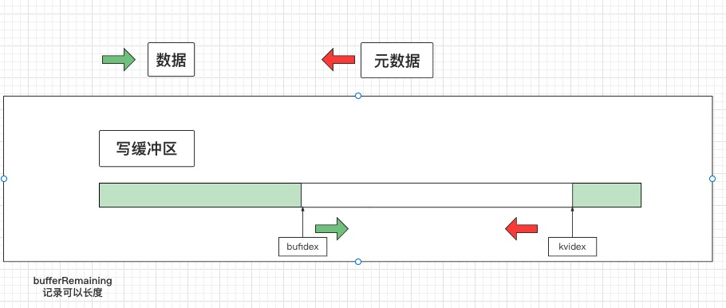
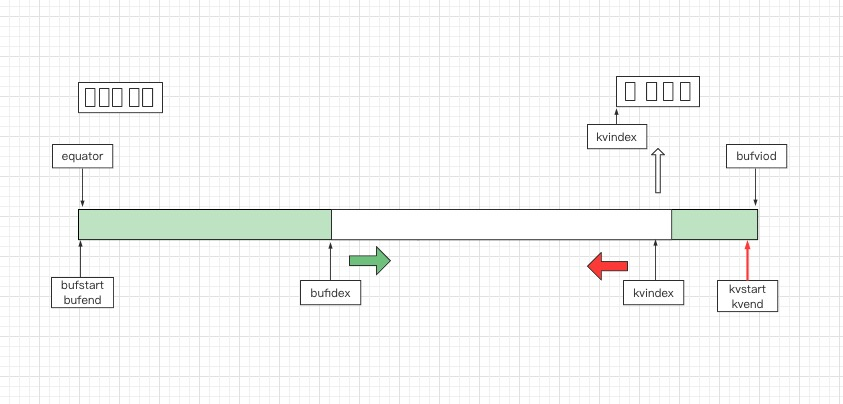
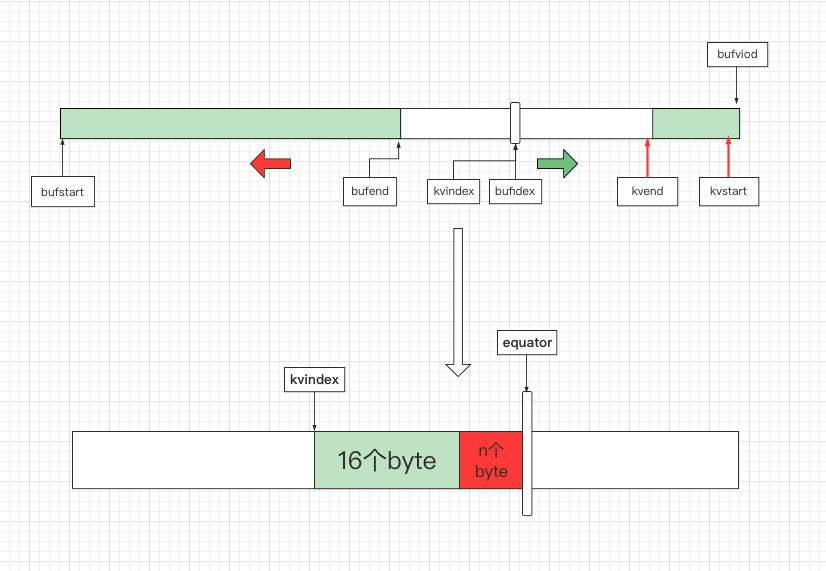
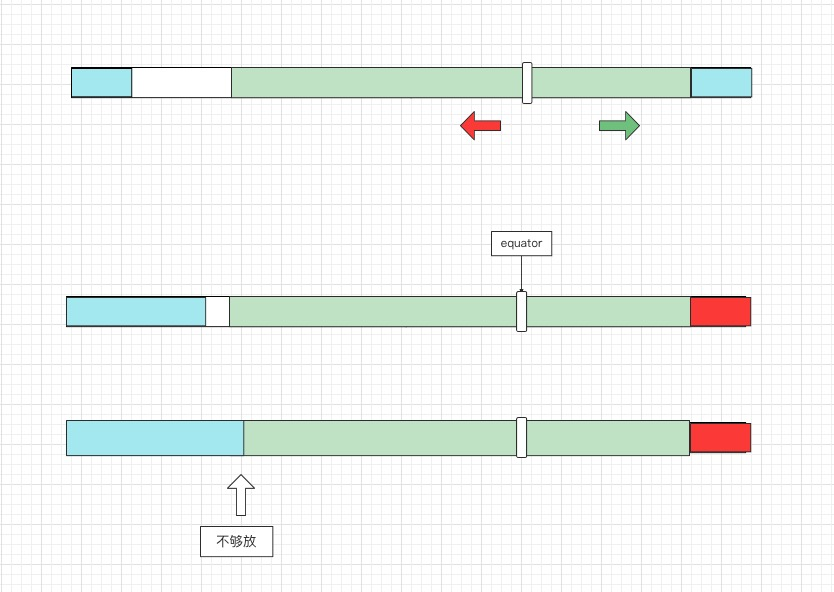

# mr环形缓冲区


从三个层次来理解缓行缓冲区

**直观**：环形缓冲区的运作

1. 环形缓冲区存kv数据和元数据
2. 元数据是int类型，一对key-value

**细节：** 一些边界条件的处理

1. kvindex往后写
2. 四个溢写条件
3. 赤道的变化
4. 排序是对元数据排序

**源码**：代码是怎么实现的


1. mr缓冲区的介绍，介绍工作原理，byte数据和meta数据，元数据记录那些东西？
2. 怎么实现，数据和元数据结合使用的，元数据put方法，kvindex的指针总是提前几个
3. 溢出的过程，缓冲区怎么变化
4. 几个溢出的点，最后一个为什么？
5. 默认的compare算法
6. 排序算法
7. mr的读写


### 环形缓冲区



**作用：**一个用来缓存map逻辑处理完以后的数据，当缓冲区达到一定阈值时，排序后写入磁盘。

**信息：** 记录真实key-value数据，和kay-value的元数据，分区和key-value的索引信息

**数据结构：**实际上环形缓冲区是一个默认**100MB**的数组，byte [104857600]，我们所有记录数据的操作都是在这里完成的

**问题：** 

1. 为啥需要元数据信息？
2. 元数据要存什么信息？为什么需要？
   1. 分区：需要往不同reducer发信息
   2. key，value的索引，长度怎么确定？
3. 一个byte数组怎么同时记录key-value数据信息和元数据信息
   1. 对同一个结构实现不同的封装

MapOutputBuffer，就是为我们封装好的缓存，实际上是byte [104857600]，为了好理解，我先介绍数据结构相关的变量

```java
public static class MapOutputBuffer<K, V> implements MapOutputCollector<K, V>, IndexedSortable {
        private IntBuffer kvmeta;
        int kvstart; // 溢写时meta数据的起始位置
        int kvend; // 溢写时meta数据的结束位置
        int kvindex; // 每次元数据记录到的位置-4，以为一对kv需要四个int来记录
        int equator;  // 赤道-----
        int bufstart; // 溢写时raw数据的起始位置
        int bufend; // 溢写时raw数据的结束位置
        int bufmark; 
        int bufindex; // 实际kv数据写到的byte[] kvbuffer的位置，就是说写一次key或者value就是从数组的这个地方开始
        int bufvoid;
        byte[] kvbuffer; // 真正意义上的存数据的缓冲数组
        private final byte[] b0 = new byte[0]; // 固定长度的valueLenth会用这个填充元数据kvmeta
  
        // 每次kv，四个int，对应位置分别记录的是，value开始的位置，key开始的位置
  			private static final int VALSTART = 0; 
        private static final int KEYSTART = 1;
        private static final int PARTITION = 2;
        private static final int VALLEN = 3;
  
        private static final int NMETA = 4;
        private static final int METASIZE = 16; // 元数据实际需要的字节大小，4个int，16个byte
        
        int bufferRemaining;  //byte数组剩余可用大小
        
```

```java
kvbidx = this.bufindex; //key开始的位置，在byte数组中的索引
this.keySerializer.serialize(key); //将key序列化到缓冲区，同时也会更新bufindex

if (this.bufindex < kvbidx) {
this.bb.shiftBufferedKey();
kvbidx = 0;
}

kvbend = this.bufindex; // value开始的位置，在byte数组中的索引
this.valSerializer.serialize(value);// //将value序列化到缓冲区，同时也会更新bufindex
this.bb.write(this.b0, 0, 0);
bUsed = this.bb.markRecord(); // 一条记录写完以后，这时候，bufindex的位置

this.mapOutputRecordCounter.increment(1L);// 记录加一
this.mapOutputByteCounter.increment((long)this.distanceTo(kvbidx, bUsed, this.bufvoid)); 
// 当前记录（kv）用了多少byte

this.kvmeta.put(this.kvindex + 2, partition); // 分区位置号
this.kvmeta.put(this.kvindex + 1, kvbidx); // key开始的位置
this.kvmeta.put(this.kvindex + 0, kvbend); // vuale开始的位置
// value的长度，为啥不用存key的长度呢？因为相减一下就行了，那value不能用上一个减吗？不能，因为不能依赖其他key——value
this.kvmeta.put(this.kvindex + 3, this.distanceTo(kvbend, bUsed));

// 由于mate数据是从数组后边写的，所以kvindex-4，这里kvindex是int，上边的bufindex是用的byte
this.kvindex = (this.kvindex - 4 + this.kvmeta.capacity()) % this.kvmeta.capacity(); 
```

### kv数据和kv元数据

#### kv数据

这里强调一下TEXT类型的写入，TEXT在序列化的时候不单单是存的值，还会存值的长度，长度和值合起来认为是，数据的TEXT类型，比如**hello---->5hello**，写入步骤如下

1. 写入长度
   1. 判断长度用几个byte可以存长度信息，比如00000000 00000000 10101010 01010101，用两个byte就可以存，此时就写入三个byte，第一个存的就是2，第二个和第三个就是真实的长度，然后分别把每个byte写入
   2. 第一个byte只存需要byte的个数是不是有点浪费，因为long类型，个数最多8个；所以做了一下优化。-112到-128表示长度，-112到127就是表示真实的值
2. 写入数据

写入数据很好理解，以下是写入长度的源码

```java
public void write(DataOutput out) throws IOException {
        WritableUtils.writeVInt(out, this.length); // 写入长度
        out.write(this.bytes, 0, this.length); // 写入序列化后的byte数组
    }

// 这里是写入长度时候的源代码
public static void writeVLong(DataOutput stream, long i) throws IOException {
    if (i >= -112L && i <= 127L) {
        stream.writeByte((byte)((int)i));
    } else {
        int len = -112;
        if (i < 0L) {
            i = ~i;
            len = -120;
        }
				// 判断需要的btye个，同时从-112到-128做了一个映射
        for(long tmp = i; tmp != 0L; --len) {
            tmp >>= 8;
        }
				
        stream.writeByte((byte)len);
        len = len < -120 ? -(len + 120) : -(len + 112);

        for(int idx = len; idx != 0; --idx) {
            int shiftbits = (idx - 1) * 8;
            long mask = 255L << shiftbits;
            stream.writeByte((byte)((int)((i & mask) >> shiftbits)));
        }
    }
}
```

#### kv元数据

在mr的数据缓存的结构中，用的是MapOutputBuffer类，这个类的属性中，存kv的是**byte[] kvbuffer**，存元数据的是**kvmeta**，要存存储的是int类型的数据，怎么样实现操作同一个缓存区呢？

1. meta也是封装了kvbuffer
2. meta的put方法，提供了将元数据写入kvbuffer的接口**kvmeta.put( int kvindex + 2, int partition)**;
   1. 判断第一个参数**i**的合法性，大于零，小于最大值
   2. **i<<2**, 分别将**j、j>>8、j>>16、j>>24**，对数组赋值

需要注意的是，虽然元数据是从数组尾部向头部写数据，但是指针**kvindex**每次都是提前减四个int，然后局部的是往后写，就是说对于一个个的元数据来说（姑且认为，记录一对key-value数据的元数据叫做一个元数据），是从尾到头的，但是在一个元数据中的四个int数据，也就是16个byte数据，是从头到尾方向写入的，从代码中可以看到，每次记录完数据，都会有一个kvindex-4的操作，就是提前把指针前移四个int，方便下次往后写




以下是元数据写入缓冲区的源码

```java
// 更新元数据，第一个位置存value的开始位置，第二个位置是key的开始位置，第三个是分区信息，第四个是value的长度
this.kvmeta.put(this.kvindex + 2, partition);
this.kvmeta.put(this.kvindex + 1, kvbidx);
this.kvmeta.put(this.kvindex + 0, kvbend);
this.kvmeta.put(this.kvindex + 3, this.distanceTo(kvbend, bUsed));  

// 会将kvindex -4 然后，往后写数据
this.kvindex = (this.kvindex - 4 + this.kvmeta.capacity()) % this.kvmeta.capacity();
```

下边是一次put方法的具体操作

```java

  this.kvmeta.put(this.kvindex + 2, partition);

public IntBuffer put(int i, int x) {
        Bits.putIntL(bb, ix(checkIndex(i)), x);
        return this;
    }

// 检查是否合法
final int checkIndex(int i) {                      
        if ((i < 0) || (i >= limit))
            throw new IndexOutOfBoundsException();
        return i;
    }

// 将int数据索引，转换成byte数组索引
protected int ix(int i) {
        return (i << 2) + offset;
    }


static void putIntL(ByteBuffer bb, int bi, int x) {
        bb._put(bi + 3, int3(x));
        bb._put(bi + 2, int2(x));
        bb._put(bi + 1, int1(x));
        bb._put(bi    , int0(x));
    }

// int转byte
private static byte int3(int x) { return (byte)(x >> 24); }
private static byte int2(int x) { return (byte)(x >> 16); }
private static byte int1(int x) { return (byte)(x >>  8); }
private static byte int0(int x) { return (byte)(x      ); }
// 赋值给byte数组
void _put(int i, byte b) {          
        hb[i] = b;
    }
```


### 数据溢写

1. 溢写过程中，缓冲区是怎么变化的，map继续运行覆盖了其他数据怎么半呢？

数据溢写，我们都是知道环形缓冲区默认的大小是100M，使用率超过0.8就会发生溢写，那我们怎么判断是不是超过了0.8呢，这里是维护了一个变量**bufferRemaining=0.8.100.1024.1024**个byte，当bufferRemaining<0认为是触发溢写（这里先暂且认为是触发了溢写）

注意：mr的写缓冲区，其实也可以细分为两个流程



1. 缓冲区没有数据，第一次到达0.8阈值，bufferRemaining<0，触发溢写spill线程，重置bufferRemaining，同时map线程继续运行
2. 在出发过溢写线程后，重置的bufferRemaining再次小于0，这时候并不会触发溢写，这里会触发重置参数，意思就是释放之前的空间，也就是说溢写线程完了，并不会释放空间，会一直等到下一次bufferRemaining<0，就是剩余的20%的空间触发的bufferRemaining<0
3. 重置参数后，相当于释放了空间，就是回到第一步，当再次使用80%的时候，触发溢写

切记：**bufferRemaining<0**，并不是意味着会触发溢写

下边是触发溢和触发重置的源代码

```java
public synchronized void collect(K key, V value, int partition) throws IOException {
    this.reporter.progress();
    if (key.getClass() != this.keyClass) {
        throw new IOException("Type mismatch in key from map: expected " + this.keyClass.getName() + ", received " + key.getClass().getName());
    } else if (value.getClass() != this.valClass) {
        throw new IOException("Type mismatch in value from map: expected " + this.valClass.getName() + ", received " + value.getClass().getName());
    } else if (partition >= 0 && partition < this.partitions) {
        this.checkSpillException();
        this.bufferRemaining -= 16;
        int kvbidx;
        int kvbend;
        int bUsed;
        if (this.bufferRemaining <= 0) {
            this.spillLock.lock();

            try {
               // 没有溢血的时候会到这个流程
                if (!this.spillInProgress) {
                    kvbidx = 4 * this.kvindex; //当前元数据记录的位置
                  
                  // 如果是1、发生将要开始发生溢写，这个就是元数据开始记录的位置
                  // 如果是2、刚进行完溢写，这个位置就是上次溢写元数据结束的位置
                    kvbend = 4 * this.kvend; 
                  
                  // 数组被使用空间的大小
                    bUsed = this.distanceTo(kvbidx, this.bufindex);
                    boolean bufsoftlimit = bUsed >= this.softLimit; //被使用的大小是否超过阈值
                  
                  // 这里判断是溢血到这个流程还是准备溢写到这个流程的，
                    if ((kvbend + 16) % this.kvbuffer.length != this.equator - this.equator % 16) {
                        this.resetSpill(); //溢写玩更新参数
                      
                      // 重新设置可以用数组大小
                        this.bufferRemaining = Math.
                        				min(this.distanceTo(this.bufindex, kvbidx) - 32, this.softLimit - bUsed) - 16;
                    } else if (bufsoftlimit && this.kvindex != this.kvend) {
                        this.startSpill();//开始溢血，计算平均每条数据的占用的byte大小
                        int avgRec = (int)(this.mapOutputByteCounter.getCounter() / 
                        												this.mapOutputRecordCounter.getCounter());
                        int distkvi = this.distanceTo(this.bufindex, kvbidx); //计算未被使用的数组大小
                      
                      // 计算新的赤道位置
                        int newPos = (this.bufindex + Math.max(31, Math.
                        							min(distkvi / 2, distkvi / (16 + avgRec) * 16))) % this.kvbuffer.length;
                        this.setEquator(newPos);
                        this.bufmark = this.bufindex = newPos;
                        int serBound = 4 * this.kvend;
                      
                      // 重新设置可以用数组大小
                        this.bufferRemaining = Math.min(this.distanceTo(this.bufend, newPos), 
                        							Math.min(this.distanceTo(newPos, serBound), this.softLimit)) - 32;
                    }
                }
            } finally {
                this.spillLock.unlock();
            }
        }

      
				// 写入部分，先写key，再写入value，然后更新元数据
        try {
            kvbidx = this.bufindex; // 记录当前缓冲区真实kv的位置，也就是等会更新元数据key的其实位置
            this.keySerializer.serialize(key); // 序列化key，顺便也将key写入到缓冲区，更新信息
            if (this.bufindex < kvbidx) {
                this.bb.shiftBufferedKey(); // 处理特殊情况，key一半在末尾一半在开始的情况
                kvbidx = 0;
            }

            kvbend = this.bufindex; // 记录写完key后的位置，也就是等会value开始的位置
            this.valSerializer.serialize(value);// 序列化value，顺便也将value写入到缓冲区，更新信息
            this.bb.write(this.b0, 0, 0); 
            bUsed = this.bb.markRecord();
            this.mapOutputRecordCounter.increment(1L); // 当前处理过的数据条数
          
           //当前处理过数据的byte大小
            this.mapOutputByteCounter.increment((long)this.distanceTo(kvbidx, bUsed, this.bufvoid));
          
          // 更新元数据，第一个位置存value的开始位置，第一个位置是key的开始位置，第三个是分区信息，第四个是value的长度
            this.kvmeta.put(this.kvindex + 2, partition);
            this.kvmeta.put(this.kvindex + 1, kvbidx);
            this.kvmeta.put(this.kvindex + 0, kvbend);
            this.kvmeta.put(this.kvindex + 3, this.distanceTo(kvbend, bUsed));
          
          // 会将kvindex -4 然后，往后写数据
            this.kvindex = (this.kvindex - 4 + this.kvmeta.capacity()) % this.kvmeta.capacity();
        } catch (MapTask.MapBufferTooSmallException var15) {
            MapTask.LOG.info("Record too large for in-memory buffer: " + var15.getMessage());
            this.spillSingleRecord(key, value, partition);
            this.mapOutputRecordCounter.increment(1L);
        }
    } else {
        throw new IOException("Illegal partition for " + key + " (" + partition + ")");
    }
}
```

赤道的变化

```java
int avgRec = (int)(this.mapOutputByteCounter.getCounter() / this.mapOutputRecordCounter.getCounter());
int distkvi = this.distanceTo(this.bufindex, kvbidx);
int newPos = (this.bufindex + Math.max(31, Math.min(distkvi / 2, distkvi / (16 + avgRec) * 16))) % this.kvbuffer.length;
this.setEquator(newPos);
this.bufmark = this.bufindex = newPos;
int serBound = 4 * this.kvend;

// 重置剩余的可用空间
this.bufferRemaining = Math.min(this.distanceTo(this.bufend, newPos), 
                                Math.min(this.distanceTo(newPos, serBound), this.softLimit)) - 32;


// 重置元数据开始的位置2
private void setEquator(int pos) {
    this.equator = pos;
    int aligned = pos - pos % 16;
    this.kvindex = (int)(((long)aligned - 16L + (long)this.kvbuffer.length) % (long)this.kvbuffer.length) / 4;
    MapTask.LOG.info("(EQUATOR) " + pos + " kvi " + this.kvindex + "(" + this.kvindex * 4 + ")");
}


111100001001010010000110000111000000101000111010001000000000000
```


### 触发溢写

溢写的触发是在那个点？

mate数据和kv数据的写入都会触发，在数据写入缓冲区的时候，会维护一个**bufferRemaining**变量，每次写入key、value、meta数据，都会判断**bufferRemaining**是不是小于零，小于零就会触发溢写

1. 写元数据时候**bufferRemaining-16**
2. 写入key时候**bufferRemaining-key.length**
3. 写入value时候**bufferRemaining-value.length**
4. key可以写入，但是key首尾没有放在一个地方的时候，且头部长度不够的时候

### key首尾不相连



虽然在逻辑上，kvbuffer是个环状缓冲区，但是物理上只是内存中的一段连续空间。len代表的是待插入数据的长度，bufindex是起点，bufindex+len是终点，如果终点超过buffer的长度（bufvoid)，我们就应该将多余部分移到buffer开始的部分。每次将buffer中数据spill到本地磁盘时，会按照raw数据的key进行排序。输入到RawComparator中的key要求是内存中的一段连续空间，而上面写入的逻辑，有可能将key一段写在buffer尾部，另一部分写在buffer头部（如上图)。BlockingBuffer在Buffer的基础上封装了调整key放置的操作，即将整个key移到起始位置。放入之前，从起始位置到meta边缘的部分是空闲的。这里有两种情况，如果空余空间足够放入key（如上图的Enough space)，可以直接拷贝过去，如果空间不足(如上图的Crash)，就得触发溢写，腾一些空间出来。

注：这样修改完以后，数组尾部的一部分是用不了啦，就是图上红色部分，那这样的话空间不是会越来越少吗？是的，当不能放下一条记录的时候，就会设置赤道为0，相当于初始化参数，第一次写入数据的情况；

```java
// 处理头尾不相连的情况
protected void shiftBufferedKey() throws IOException {
  int headbytelen = MapOutputBuffer.this.bufvoid - MapOutputBuffer.this.bufmark; // 判断尾部写入的长度
  
  // 将边界调整为写入key之前的位置，也就是上一份地方的value
  MapOutputBuffer.this.bufvoid = MapOutputBuffer.this.bufmark; 
  
  int kvbidx = 4 * MapOutputBuffer.this.kvindex; //元数据正在记录的位置
  int kvbend = 4 * MapOutputBuffer.this.kvend; // 元数据开始记录的位置
  
  // 判断头部还有多少空间可以用？可以放下整个key
  int avail = Math.min(MapOutputBuffer.this.distanceTo(0, kvbidx), MapOutputBuffer.this.distanceTo(0, kvbend));
  if (MapOutputBuffer.this.bufindex + headbytelen < avail) {
    // 如果可以就分两次把数组copy过去
    System.arraycopy(MapOutputBuffer.this.kvbuffer, 0, 
                     MapOutputBuffer.this.kvbuffer, headbytelen, MapOutputBuffer.this.bufindex);
    System.arraycopy(MapOutputBuffer.this.kvbuffer, 
                     MapOutputBuffer.this.bufvoid, MapOutputBuffer.this.kvbuffer, 0, headbytelen);
    MapTask.MapOutputBuffer var10000 = MapOutputBuffer.this;
    var10000.bufindex += headbytelen;
    var10000 = MapOutputBuffer.this;
    var10000.bufferRemaining -= MapOutputBuffer.this.kvbuffer.length - MapOutputBuffer.this.bufvoid;
  } else {
    // 如果不行，就要发生溢写
    // 就创建个临时的数组，分两次写入，写入的过程就会发生溢写
    byte[] keytmp = new byte[MapOutputBuffer.this.bufindex];
    System.arraycopy(MapOutputBuffer.this.kvbuffer, 0, keytmp, 0, MapOutputBuffer.this.bufindex);
    MapOutputBuffer.this.bufindex = 0;
    this.out.write(MapOutputBuffer.this.kvbuffer, MapOutputBuffer.this.bufmark, headbytelen);
    this.out.write(keytmp);
  }

}
```

### 排序

排序是怎么排的？数据移动不是很麻烦吗？

1. 拿到元数据的的开始和结束位置
2. 对这段数据进行排序：
   1. 先对分区排序
   2. 对key排序
   3. 快速排序
   4. 这里排序是将数组中 [mstart，mend]这一段排序，会将元数据排序，不会移动真实数据数据


### 默认的**compare**方法

在mr溢写的过程中，会涉及到排序，排序就会涉及到比较方法，这里以TEXT类型为例，讲解一下默认的**compare**方法

TEXT类型：TEXT在序列化的时候不单单是存的值，还会存值的长度，比如**hello---->5hello**，所以在读取的时候会先读取长度

具体的算法是：

1. 先判断是不是相同的数据和相同offset以及相同的长度，是的话返回0
2. 每次取八个byte，专成long类型，做异或比较，然后判断不是零的部分**最早**发生在那个byte
3. 然后返回结果
4. 最后如果不足8个字节，就单独一个byte一个byte的比较

**算法的精髓：不用逐个byte比较，用long类型做异或然后找不为零的，效率很高**

```java

public int compare(byte[] b1, int s1, int l1, byte[] b2, int s2, int l2) {
    int n1 = WritableUtils.decodeVIntSize(b1[s1]);//读取当前key长度在数组中存了几个byte
    int n2 = WritableUtils.decodeVIntSize(b2[s2]);
    return compareBytes(b1, s1 + n1, l1 - n1, b2, s2 + n2, l2 - n2);
}


public int compareTo(byte[] buffer1, int offset1, int length1, byte[] buffer2, int offset2, int length2) {
  // 先判断是不是相同的数据和相同offset以及相同的长度  
  if (buffer1 == buffer2 && offset1 == offset2 && length1 == length2) {
      return 0;
    } else {
      int minLength = Math.min(length1, length2);
      int minWords = minLength / 8;
      int offset1Adj = offset1 + BYTE_ARRAY_BASE_OFFSET;
      int offset2Adj = offset2 + BYTE_ARRAY_BASE_OFFSET;

      int i;
    
    // 这里就是每个八个byte取数一次数
      for(i = 0; i < minWords * 8; i += 8) {
        long lw = theUnsafe.getLong(buffer1, (long)offset1Adj + (long)i);
        long rw = theUnsafe.getLong(buffer2, (long)offset2Adj + (long)i);
        long diff = lw ^ rw;
        if (diff != 0L) {
          if (!littleEndian) {
            return lessThanUnsigned(lw, rw) ? -1 : 1;
          }

          int n = 0;
          int x = (int)diff;
          // 取到低32位，判断是否为零，这里有点二分的意思
          if (x == 0) {
            x = (int)(diff >>> 32);
            n = 32;
          }
					
          //不为零：再取（高32位或者低32不为零，先取低32位）低16位，判断是否为零
          int y = x << 16;
          if (y == 0) {
            n += 16;
          } else {
            x = y;
          }

          y = x << 8;
          if (y == 0) {
            n += 8;
          }

          return (int)((lw >>> n & 255L) - (rw >>> n & 255L)); // 这里没看懂
        }
      }
			
    // 如果最后长度不是8的倍数，会剩余1-7个byte，然后逐个比较
      for(i = minWords * 8; i < minLength; ++i) {
        int result = UnsignedBytes.compare(buffer1[offset1 + i], buffer2[offset2 + i]);
        if (result != 0) {
          return result;
        }
      }

      return length1 - length2;
    }
  }
```

### 溢写

一、

二、元数据

1. 元数据写磁盘的时候，每个分区溢血完数据，会记录一条数据rec，记录数据开始位置，数据长度，压缩后的长度三个long类型的值，占24个字节；然后**spillRec.putIndex(rec, i)**，spillRec是每次溢写要保存的记录，rec是每次分区要保存的记录，spillRec是rec*24的大小

   ```java
   // 每当一个分区溢写完记录的元数据
   rec.startOffset = segmentStart;
   rec.rawLength = writer.getRawLength() + (long)CryptoUtils.cryptoPadding(this.job);
   rec.partLength = writer.getCompressedLength() + (long)CryptoUtils.cryptoPadding(this.job);
   spillRec.putIndex(rec, i);
   ```

   ```java
   // rec
   public class IndexRecord {
       public long startOffset;
       public long rawLength;
       public long partLength;
   
       public IndexRecord() {
       }
   
       public IndexRecord(long startOffset, long rawLength, long partLength) {
           this.startOffset = startOffset;
           this.rawLength = rawLength;
           this.partLength = partLength;
       }
   }
   ```

   ```java
   // spillRec
   // 本质上就是一个 24*numPartitions 的byte数组
   // 每个分区需要记录三个long类型的值，也就是8*3 = 24 ；
   public class SpillRecord {
       private final ByteBuffer buf;
       private final LongBuffer entries;
   
       public SpillRecord(int numPartitions) {
           this.buf = ByteBuffer.allocate(numPartitions * 24);
           this.entries = this.buf.asLongBuffer();
       }
     // 然后对应get、put方法即可
     public int size() {
           return this.entries.capacity() / 3;
       }
   
       public IndexRecord getIndex(int partition) {
           int pos = partition * 24 / 8;
           return new IndexRecord(this.entries.get(pos), this.entries.get(pos + 1), this.entries.get(pos + 2));
       }
   
       public void putIndex(IndexRecord rec, int partition) {
           int pos = partition * 24 / 8;
           this.entries.put(pos, rec.startOffset);
           this.entries.put(pos + 1, rec.rawLength);
           this.entries.put(pos + 2, rec.partLength);
       }
   ```

2. 每次溢血完成后，也就是所有分区元数据都记录下来，会判断当前缓存长度是不是大于设置长度，默认1M，如果是就把spillrec写入磁盘，如果不是就把spillrec保存下来到**indexCacheList**

   **问题：**这里有个疑问，每次都会判断，那会不会这次超过了，下次就可以放进去，这样的话，那不就乱了吗？就是说可能indexCacheList存了1、3、5次溢写的数据，2、4、6太大了，溢写到文件了，这不知道顺序会给第三部造成困难

   **解答：**应该是不会，因为每次溢写spillRec的大小是固定的就是 24*numPartitions；所以当达到阈值的时候，后边的spillRec都会溢写到磁盘，不会indexCacheList.add(spillRec)、只可能发生 1、2、3存满了，4、5、6溢写磁盘

   （这里的1、2、3、4、等是指第n次溢写产生的spillRec对象）

   

   注：一个分区的索引信息是re，一次溢写是spillRec，一个map的所有溢写indexCacheList，所以一次溢写的全部元数据会放在一起，也就是说一次溢写对应文件的索引，要么全在缓存，要么全部落盘

   ```java
   // indexCacheMemoryLimit 默认是 1048576 byte = 1M
   
   if (this.totalIndexCacheMemory >= this.indexCacheMemoryLimit) {
     Path indexFilename = this.mapOutputFile.
       getSpillIndexFileForWrite(this.numSpills, (long)(this.partitions * 24));
     spillRec.writeToFile(indexFilename, this.job);
   } else {
     this.indexCacheList.add(spillRec);
     this.totalIndexCacheMemory += spillRec.size() * 24;
   }
   
   MapTask.LOG.info("Finished spill " + this.numSpills);
   ++this.numSpills;
   ```

3. 所有溢写完成后会合并溢血文件，这时候会把溢写到磁盘的文件重新加载到**indexCacheList**

   ```java
   for(i = this.indexCacheList.size(); i < this.numSpills; ++i) {
       finalIndexFile = this.mapOutputFile.getSpillIndexFile(i);
       this.indexCacheList.add(new SpillRecord(finalIndexFile, this.job));
   }
   ```

   **梳理：** 一个map会有一个全局的indexCacheList，一次溢写一个spillRec（SpillRecord），每次分区溢写完生成一个rec（IndexRecord）；每一个分区溢写完成将rec存入spillRec，每一次溢写完成将spillRec存入indexCacheList，当totalIndexCacheMemory达到阈值，每一次溢写完成将spillRec写入磁盘；在合并所有溢写文件的时候，会将写入磁盘的spillRec重新加载进indexCacheList；

### 参考文献

https://blog.csdn.net/ebay/article/details/50204969

