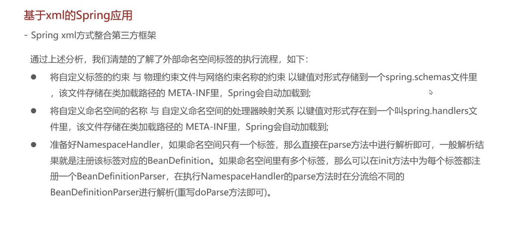

## spring xml

20230315开始

三种application context 

- classpath
- filesystem
- 注解

spring - web 还有另外两个容器

### bean对象的创建（实例化）

1. 构造方法
   - 有参
   - 无参数
2. 工厂
   - 静态工厂：一般只需要一步
   - 实例工厂：两步，先对象，再工厂

需要考虑到是否需要注入

看22集

#### 0316

22-24

#### 0317

看25

标签

默认标签：beans、bean。可以通过beans配置多个环境，通过设置用什么环境

1. beans：公共的什么时候都会生效
2. bean
3. import：导入其他模块的xml文件
4. alias：起别名的作用
   - 与name属性的区别

自定义标签：

引入配置文件先，需要引入对应的pom依赖

### getBean的三种方式

- getBean(name) 需要强行转换
- getBean(name, type) 不需要转换
- getBean(type) 只能针对只有唯一类型的bean才可以

### spring配置非自定义的bean：比如 mysql 、date（日期）

考虑如下：

1. 是怎么实例化的？是否有无参数构造
   - 没有
     - 有参数构造方法实例化
     - **通过类方法得到的**，那就通过静态工厂得到   比如链接 mysql
     - **通过对象方法得到的**，先配置得到对象，再配资动态工厂模式
2. 是否需要注入必要属性

下一节 P：35

### **bean的实例化过程**

1. 加载xml
2. 封装到map中
3. 遍历map创建bean
   - bean的生命周期
4. 放到 singlemap
5. getbean得到bean

### **spring的后处理器**

作用：

1. 介入beans创建过程
2. 修改bean信息
3. 动态注入bean，可以不在xml中配置
4. **牛逼，自定义实现注解**

分类

1. bean工厂后处理器：beandefintionmap完事后一次，主要针对bean定义
2. bean后处理器：每个bean创建后都会处理一次，主要针对bean对象

### bean的生命周期

1. 属性注入

   - 普通属性
   - 单向注入
     - 有的话直接注入
     - 没有的话，先暂停注入，先创建bean，类似于递归
   - 循环引用
     - 注入的时候先从singleton map找，找不到的话从另一个map中找
     - 三级缓存（每个对象创建都会先走一遍三级缓存）
       - singleton objects （spring，bean）： 存储创建完的bean
       - early singleton objects（spring，bean）： 存储半成品的bean
       - singleton factory（spring，factorybean）： 存储未被引用的半成品的bean

2. aware，自动注入等等

   

3. beans后处理器 before方法

4. init接口的初始化方法

5. xml配置的初始化方法

6. bean后处理器的after方法

下一节看p51

#### 0319

### sping的总结看总结 **p56**

### **spring xml整合第三方框架。总结看p61**

整合mybatis，

1. 链接数据库，通过工厂后处理器的方法，注入sqlsessionfactory的
2. 获得map，通过扫描包，把接口注入到beandefinitionmap，但是又通过bean的后处理器，把注册换成factorybean，最后获得的对象还是通过getmap方法实现的

### 自定义命名空间标签的解析

## spring 注解

#### 类的注入

@component注解：代替bean标签，记得配置扫描包的路径；注意有四种衍生

@scope 范围，单例或者非单例

@lazy，是否延迟加载

@postconstruct 相当于init方法

@predetory 销毁前需要执行的方法

#### 属性的注入

@aotuware

@quliflier

@reouce

#### 非自定义的类注入

通过一个类，和一个方法注入，用@bean注解实现

#### 配置类的开发

使用一个配置类代替，之前的xml文件，使用@configuration注解实现

@configuration

@compptentScan

@propertyReouce

#### 其他注解

@primary 当有两个一样类型的bean的时候，优先选择有primary注解的

@priflie 配置类属于哪个容器环境

#### 注解自动装配的实现

@import 注解 也可以注入第三方框架的类

下一节看81

20230323

### aop 的 aspect配置：直接通过配置

下一节P87

切点表达式的配置方式

*所有包、所有类、所有方法

.. 子包，和所有参数

#### 通知的类型

1. 前置通知
2. 后置通知 after return
3. 环绕通知
4. 异常通知 ：只有异常才会通知
5. 最终通知 ：不管怎么样都会执行

### aop 的advice（advisor） 方式配置 ： 通过实现接口方式

AOP的原理

1. 解析标签
2. 通过defenition 注册bean或者beanpostprocess 来增强对象的方法
3. 对于aop来说，其实就是后处理的时候，生成一个**代理对象**存进spring的容器中

cglib方式的代理，相当于继承了目标类，生成了一个子类

下一节：

P91

### 注解配置AOP

新增加两个注解

- @aspect
- @before
- @afterreturning
- @afterthrowing
- @round
- @after
- pointcut - 用来定义切点的
- enableAspectJparox：全注解的情况下的注解开发

flume数据一致性 拦截器  数据倾斜  hbase rowkey三大原则

下一节 P95

Spring的事物控制

1. 业务研发没有更新证书，推动升级的老师2-3提醒，但是研发老师这边认为当前不重要，没升级，后来推动的老师离职了，这个事情就行搁置了，直到出现问题。后续平台会出方案，解决类似的问题
   1. 证书必须每年更新一次，重要的，高优先级，必须有高效的通知方式
   2. 未知的问题，无法判断需求或者故障，要及时向上反馈
   3. 如果判定新发版的app不会影响到投放
      1. 功能的改变
2. 证书更新的机制，
3. 其他app的过期需要确定。。。。。。
4. 晓东老师主R，梳理全链路，发版前测试核心指标。（我们可以再次check下我们的cpa指标监控核心）

结论：由于造成的损失并没有直接结算出去，且后续可以继续投放，损失为可挽回的损失，所以最终事故顶级为P3。

**各环节加强校验**

我们的蓝鲸 天级别的报表真的合适吗？可用吗？是不是考虑重启启动小时级任务。

attribution_deviceid_aggregate

下一节106