## G1垃圾回收器

单拿G1垃圾回收来说吧，大家可能很熟悉，又不太熟悉，网上看了一些资料，今天整理一些。

G1垃圾回收器的整体理解，或者说与之前的CMS等垃圾回收的不同

1. 可以控制gc时间，在期望的停顿时间内，回收垃圾
2. 把堆内存划分为了大小相等的region，默认是划分为2048个
3. eden、survive、老年代区域不再是连续的；同时增加巨大对象区
4. G1新生代和老年代的垃圾回收

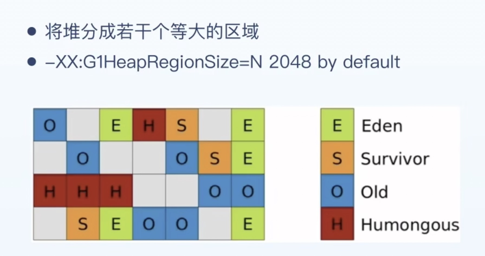

具体了解一下

### 1、region

region，什么是region，大小相同的内存区域，主要包括Card table、RemerberedSet

card tabel：region会被分为多个card table，对象就会放在card table中

RemerberedSet：每个region会有一个RemerberedSet，里边记录引用了当前region中对象   的对象所在的其他region的card table（这里可能比较绕，大家理解一下）

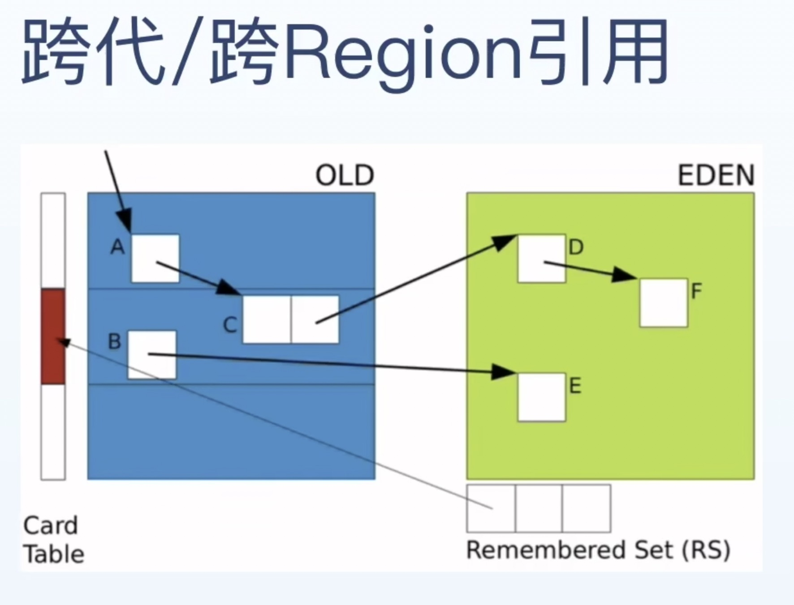

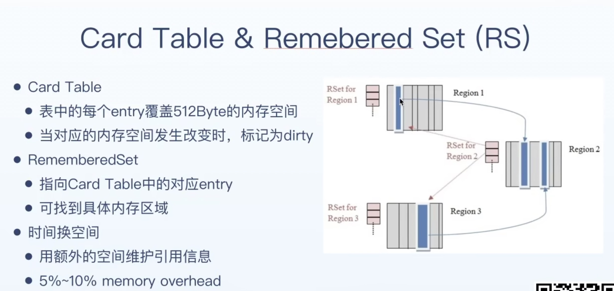

### 2、Write barrier

什么是写屏障呢，jvm在进行引用赋值（指针删除，或者改变）的时候，注入了一小段代码，用于记录指针的变化，比如 object1.field = object2，这时候会将object2所在的card标记为dirty，脏卡，并放入到一个脏卡队列

脏卡队列：队列，根据队列大小分区四个等级 白、绿、黄、红

白：没什么事情发生，应用程序不断执行，脏卡队列不断增大

绿：reginement线程开始处理脏卡队列，更新将脏卡所在region的RemerberedSet，使得RemerberedSet信息正确

黄：所有的reginement线程启动

红：应用程序线程停止，帮忙处理

问：为什么当card变成脏的时候直接更新RemerberedSet，可能引起并发问题，加锁的话，性能太低了

### 3、Fully young GC （STW）

年轻代GC是完全STW的，具体流程如下：

1. 构建collect set：由于G1并不是回收所有的区域，所以要先找到需要回收的eden和survive region区
2. 扫描GC Roots：找到存活的对象（接下来要复制的对象）
3. Updata RemerberedSet：更新RemerberedSet，排空脏卡队列
4. 扫描 RemerberedSet：找到被老年代引用的对象
5. object copy
6. 释放内存，继续执行

注意点：

1、G1是通过期望停顿时间控制垃圾回收的，假如期望100ms，有100个region要回收，那么当前期望50ms的时候，eden区的region数量就变成了50个 ；这里是jvm模型自动调整的

### 4、Old GC

当堆使用达到一定程度后（有一个个阈值），进行老年代GC，老年代的GC是并发进行的，那么如何在应用程序还在进行的时候，标记堆中的活对象？

**三色标记算法**：

步骤如下：

1. 图1：一开始所有的对象都是白色
2. 图2：将所有的GC Roots标记为黑色，把与其直接相连的对象变成灰的，放入灰色队列
3. 图3：然后拿出灰色队列的对象，将其变为黑色，再把与其相连的对象变成灰色，并加入灰色队列
4. 图4：慢慢将灰色队列清空，这时候只剩下黑色对象和白色对象

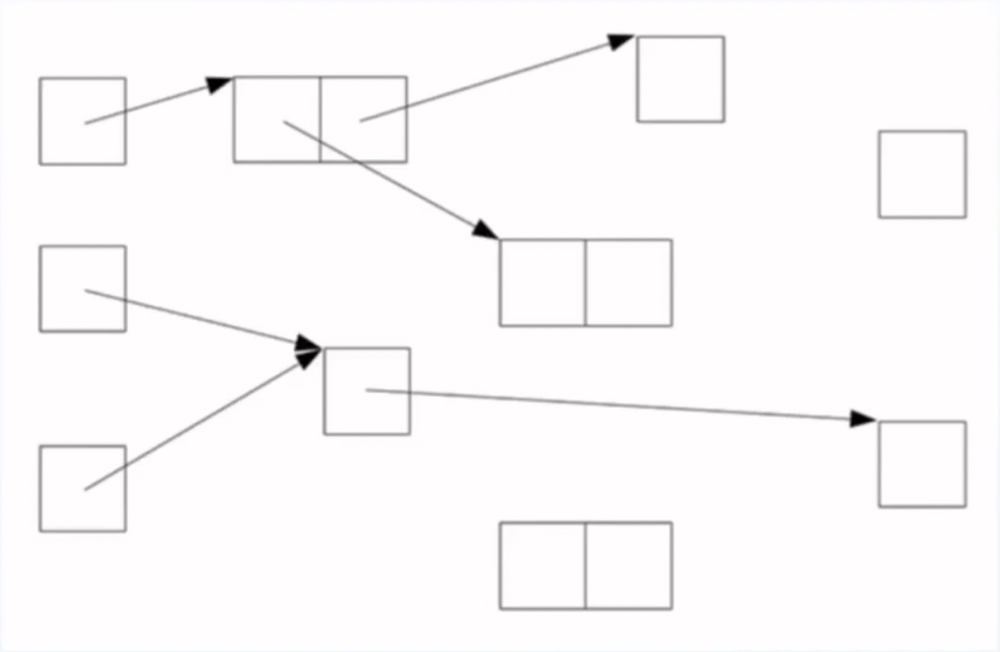

 图1

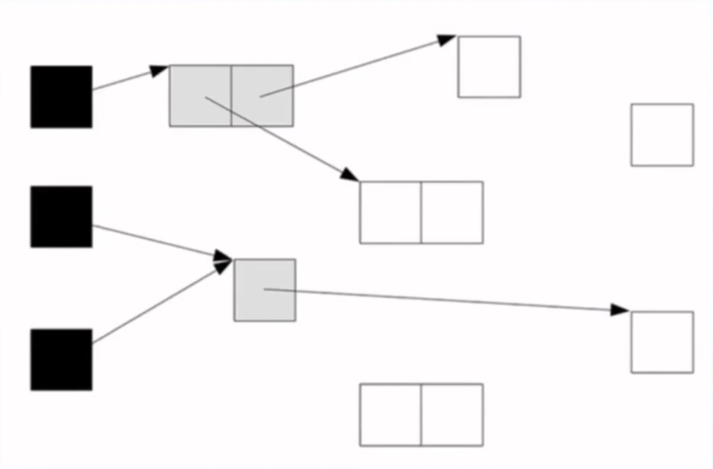

 图2

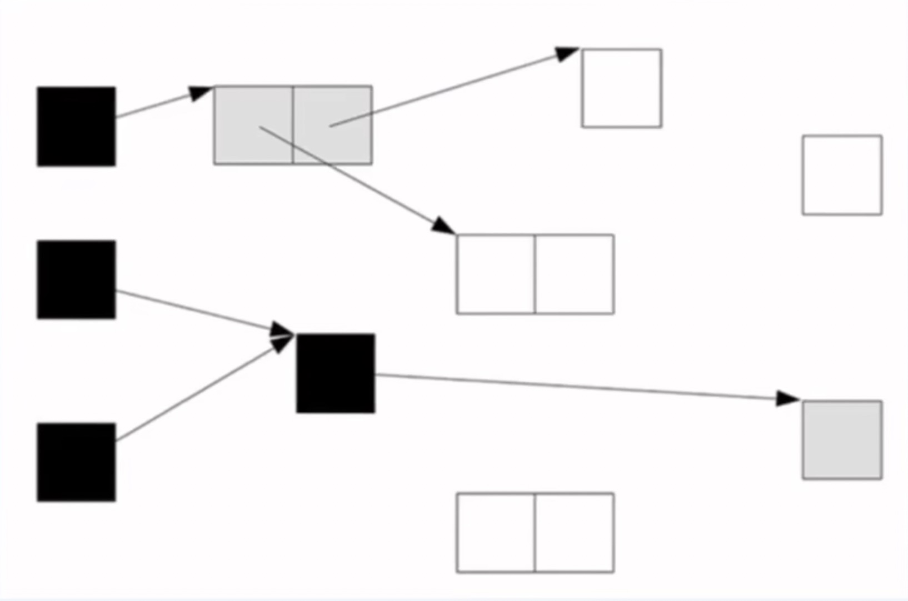

 图3

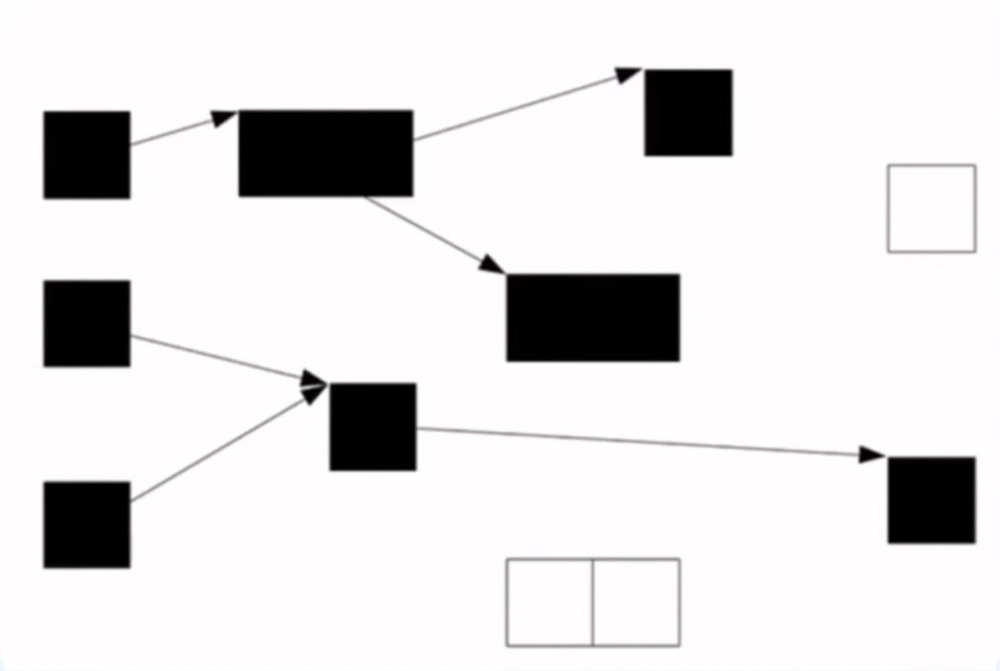

 图4

**Lost Object Problem**

并发标记的时候，上述的三色标记会引发如下问题，如下

1. 某一时刻cpu处理，垃圾标记线程将A置为黑色，B置为灰色，C还是白色，这时候垃圾回收线程让出cpu
2. 用户线程1获得cpu使用权，创建了A到C的引用，让出cpu
3. 用户线程2获得cpu使用权，删除了B到C的引用，让出cpu
4. 垃圾标记线程得cpu使用权，将B标记为黑色，并且灰色队列没有对象，标记结束。

这时候就会认为C是白色的，是不可触达的对象

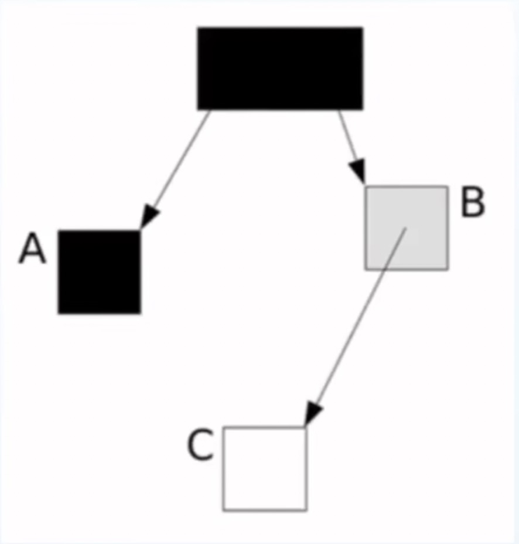

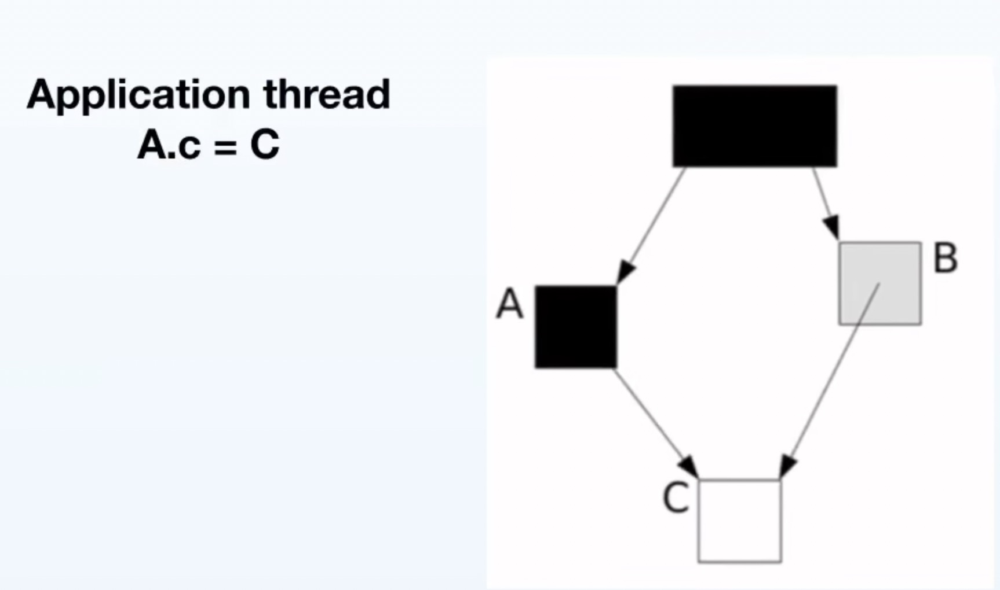

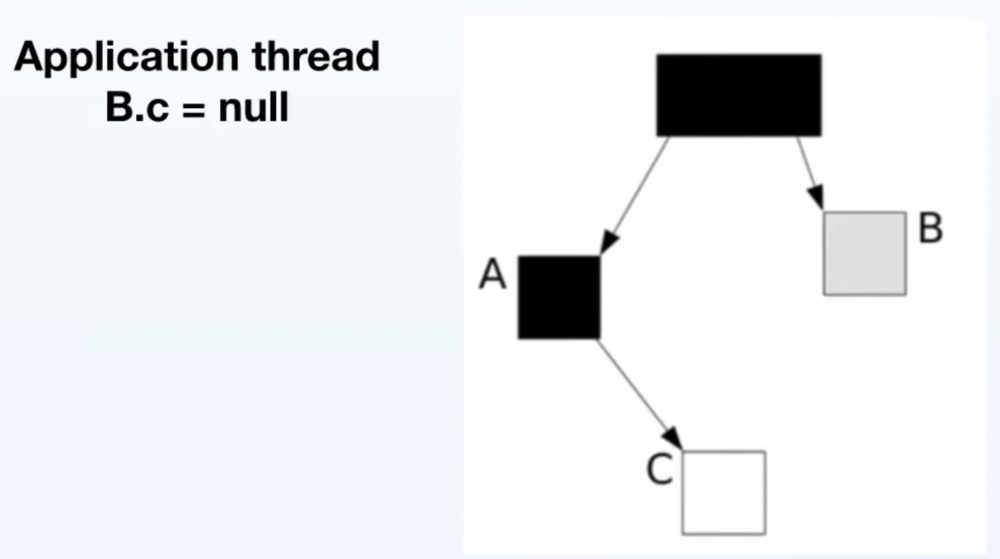

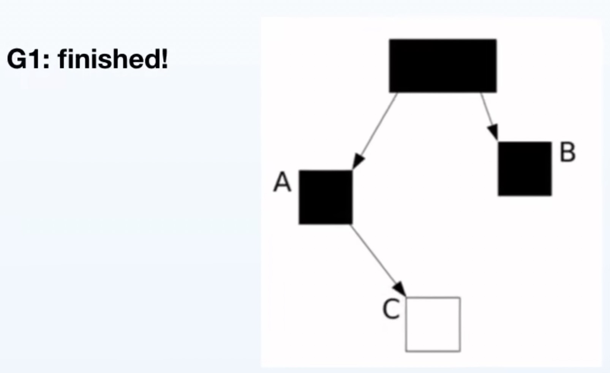

**问题解决**（这里还不太明白）

Snapshot at the beginning (SATB)当对象被引用的指针取消或者删除的时候，将c记录来下，也就是上述的 Write barrier。

1. 保持marking阶段开始的object graph

   

**Old GC**

1. 进行一次Fully young GC
2. 并发初始标记：恢复应用线程
3. STW，重新修正标记，SATB，这时候由于有写屏障，不会有Lost Object Problem发生
4. Cleanup：**！！！这里不是复制算法，这里只会回收完全是空的region**
5. 恢复应用线程

### 5、mix GC

上述的Old GC，没有复制算法那么就会产生很多碎片的region怎么办呢？所有就有mix GC

1. 不是立即进行：jvm通过设置的暂停时间，和历史GC的情况
2. 部分回收，默认回收 1/8的老年代回收
3. 和年轻代一起回收，是 STW + Paralle + Copy 垃圾回收算法
4. 根据暂停时间，优先回收垃圾多的regoin

## ZGC 和 shennandoap GC

区别，没有遍历和卡表，将GC的信息记录在别的地方

- ZGC：将GC信息记录在指针中，也就是染色指针
- shennandoap GC：将GC信息记录在对象头部，mark header