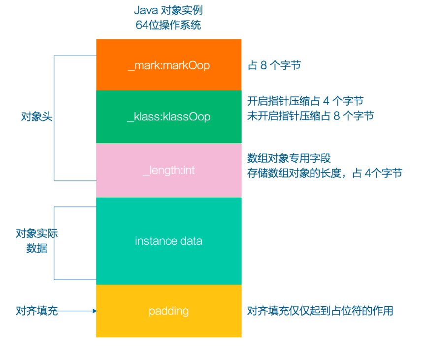

# 一、对象的内存布局

我们平时在开发中，评估内存使用的时候，很容易只算数据本身的占用内存，而忽略了对象头的内存，但是在很多情况下，对象头的内存甚至可能会超过数据本身，所以这块数据不可忽略。

在HotSpot虚拟机里，对象在堆内存中的存储布局可以划分为三个部分:**对象头(Header)、实例数据(Instance Data)和对齐填充(Padding)。**

- 对象头：
  - markOop：hashcode、锁信息、GC分代、偏向线程id等信息
  - klassOop：指向方法区中的类，表明这个对象是那个类的实例
  - 数组对象专用字段：存储数组长度
- 对象实际的数据：对象的话就是指针，数组的话就是数组
- 对齐填充

## 1.1 HotSpot虚拟机对象的**对象头**

- 第一类是用于存储对象自身的运行时数据，如哈希码，GC分代年龄、锁状态标志、线程持有的锁、偏向线程ID、偏向时间戳等，**这部分数据的长度在32位和64位的虚拟机中分别占用4个字节和8个字节**（未开启压缩指针）
- 第二类是类型指针，即对象指向它的类型元数据的指针，Java虚拟机通过这个指针来确定该对象是哪个类的实例。**在开启指针压缩的状况下占 4 字节，未开启状况下占 8 字节。（64位操作）**
- 如果是数组，那在对象头中还必须有一块用于记录数组长度的数据，**占4个字节**

## 1.2 对齐填充

对齐填充仅仅起着占位符的作用。由于HotSpot虚拟机的自动内存管理系统要求对象起始地址必须是8字节的整数倍，换句话说就是任何对象的大小都必须是8字节的整数倍。对象头部分已经被精心设计成正好是8字节的倍数(1倍或者2倍)（书里是这样写的，但是实际测试发现并不是，也可能是12字节），因此，如果对象实例数据部分没有对齐的话，就需要通过对齐填充来补全。

那么为何非要进行 8 字节对齐呢？这样岂不是浪费了空间资源？

因为CPU访问内存还是一个较慢的操作，所以计算机并非逐个字节读取，而是以2、4、8的倍数字节块读取内存，它们会要求这些数据的首地址的值是某个数是k(通常是4或8)的倍数 ，这就是所谓的[内存对齐](https://www.zhihu.com/search?q=内存对齐&search_source=Entity&hybrid_search_source=Entity&hybrid_search_extra={"sourceType"%3A"answer"%2C"sourceId"%3A2422363788})。大白话就是，各种数据类型都要一定的规则进行排列，而不是一个接一个的排放，这就是对齐。**对齐是在效率和空间上做的权衡。**

如果不对齐，**在读取某个对象的时候，就会需要多读不属于它的部分**，如下图，如果没有做内存对齐，因为CPU只能读取4或8的倍数，在每次读取Object2的时候，都必须把Object1和Object3都读进来

https://zhuanlan.zhihu.com/p/462924941