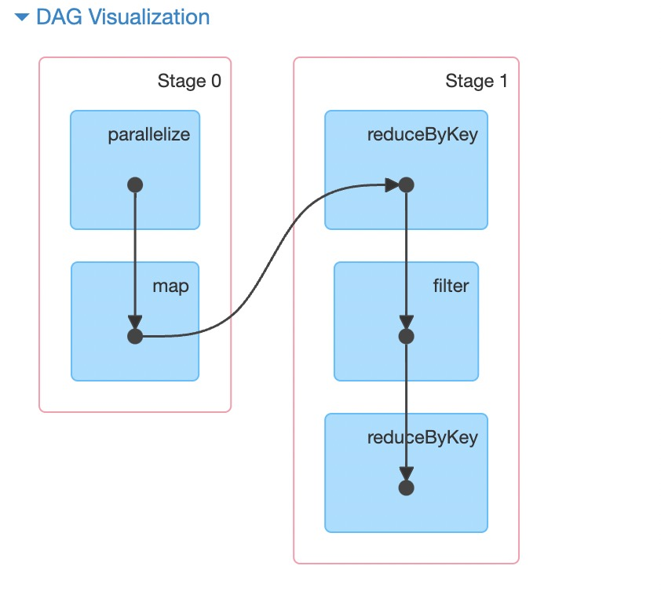
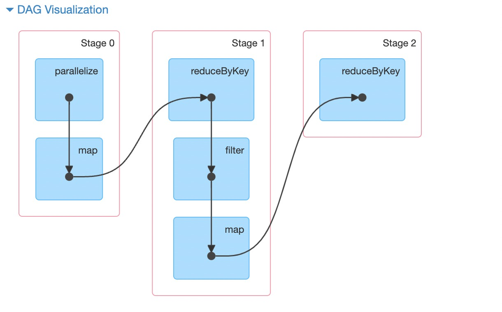

## 1 震惊！DAG生成为什么是这样的！

### 1.1先看如下代码，map-reduce-filter-reduce，生成了如下DAG

```java
public class SparkStageShuffleToMap {
    public static void main(String[] args) throws InterruptedException {

        SparkConf sf = new SparkConf().setAppName("appname").setMaster("local[2]");
        JavaSparkContext sc = new JavaSparkContext(sf);

        // 数据
        List<String> data1 = Arrays.asList("aa","bb","cc","dd","aa","dd","cc","bb","cc","cc");
        // 生成rdd
        JavaRDD<String> rdd1 = sc.parallelize(data1,2);
        // 进行一步map转化
        JavaPairRDD<String,Integer> rdd2 = rdd1.mapToPair(x->new Tuple2<>(x,1));
        // 经过一次reduce
        JavaPairRDD<String,Integer> rdd3 = rdd2.reduceByKey((x,y)->x.intValue()+y.intValue());
        // 经过一次filter
        JavaPairRDD<String,Integer> rdd4 = rdd3.filter(x->x._2>0);
        // 经过一次map
//        JavaPairRDD<String,Integer> rdd5 = rdd4.mapToPair(x->new Tuple2<>(x._1,x._2));
        // 经过一次reduce
        JavaPairRDD<String,Integer> rdd6 = rdd4.reduceByKey((x,y)->x.intValue()+y.intValue());
        
        rdd6.foreach(x-> System.out.println(x.toString()));
        
        Thread.sleep(10000000);

    }
}

```



按照我们之前的逻辑，从rdd4到rdd6，经过了reduce，是会有一次shuflle的，应该是生成宽依赖，重新划分stage的，为什么是这样呢？

### 1.2 先看如下代码，map-reduce-filter-map-reduce，生成了如下DAG

```java
public class SparkStageShuffleToMap {
    public static void main(String[] args) throws InterruptedException {

        SparkConf sf = new SparkConf().setAppName("appname").setMaster("local[2]");
        JavaSparkContext sc = new JavaSparkContext(sf);

        // 数据
        List<String> data1 = Arrays.asList("aa","bb","cc","dd","aa","dd","cc","bb","cc","cc");
        // 生成rdd
        JavaRDD<String> rdd1 = sc.parallelize(data1,2);
        // 进行一步map转化
        JavaPairRDD<String,Integer> rdd2 = rdd1.mapToPair(x->new Tuple2<>(x,1));
        // 经过一次reduce
        JavaPairRDD<String,Integer> rdd3 = rdd2.reduceByKey((x,y)->x.intValue()+y.intValue());
        // 经过一次filter
        JavaPairRDD<String,Integer> rdd4 = rdd3.filter(x->x._2>0);
        // 经过一次map
        JavaPairRDD<String,Integer> rdd5 = rdd4.mapToPair(x->new Tuple2<>(x._1,x._2));
        // 经过一次reduce
        JavaPairRDD<String,Integer> rdd6 = rdd5.reduceByKey((x,y)->x.intValue()+y.intValue());

        rdd6.foreach(x-> System.out.println(x.toString()));

        Thread.sleep(10000000);

    }
}
```

对应的DAG图如下



这段代码只是从rdd4到rdd6之间增加了rdd5，多了一次map而已，为什么这里又拆分成了两个stage？DAG的生成到底跟什么有关系？


演示join的DAG


### 问题

1. groupbykey、reducebykey、join一定会发生shuffle操作吗？
2. 是否shuffle和什么有关？宽窄依赖，宽窄依赖和什么有关？
3. 如何理解spark在遇到action算子才会触发计算？


## 2 什么是RDD

### 2.1rdd包含什么

1. pre_rdd：当前RDD是由哪个或者哪些RDD**直接**生成
2. SparkContext
3. partitioner : Option[Partitioner] = None
4. dependencies_ : Seq[Dependency[_]] = _ 
5. partitions_ : Array[Partition] = _
6. func（compute函数）：大概率是你调用的算子或调用算子实现的方法：map，join

rdd抽象类其实包含两个属性，sc：sparkcontext 和 deps：Seq[Dependency[_]] ，也就是spark程序的环境和一个依赖序列

```scala
abstract class RDD[T: ClassTag](
    @transient private var _sc: SparkContext,
    @transient private var deps: Seq[Dependency[_]] // RDD创建的时候，调用的RDD
  ) extends Serializable with Logging

// 分区器
val partitioner: Option[Partitioner] = None

// 目前看来，RDD先取的是checkpointRDD的依赖，然后取deps的依赖
private var dependencies_ : Seq[Dependency[_]] = _

// 当前RDD的所有分区
private var partitions_ : Array[Partition] = _
```


### 2.2partitioner有哪些

1. PythonPartitioner
2. RangePartitioner
3. HashPartitioner

```scala
abstract class Partitioner extends Serializable {
  def numPartitions: Int
  def getPartition(key: Any): Int
}


// python Partitioner
// 源码文档中有这样一句话： A Partitioner that performs handling of long-valued keys, for use by the Python API.
override def getPartition(key: Any): Int = key match {
    case null => 0
    // we don't trust the Python partition function to return valid partition ID's so
    // let's do a modulo numPartitions in any case
    case key: Long => Utils.nonNegativeMod(key.toInt, numPartitions)
    case _ => Utils.nonNegativeMod(key.hashCode(), numPartitions)
  }


// hash Partitioner
def getPartition(key: Any): Int = key match {
    case null => 0
    case _ => Utils.nonNegativeMod(key.hashCode, numPartitions)
  }

```


### 2.3常见的RDD

1. MapPartitionsRDD：map操作的RDD
2. ShuffledRDD：shuffle操作的RDD
3. CoGroupedRDD：join算子用到的RDD

这里是主要对比他们的构造方法的差异

```scala
// MapPartitionsRDD
private[spark] class MapPartitionsRDD[U: ClassTag, T: ClassTag](
    var prev: RDD[T],
    f: (TaskContext, Int, Iterator[T]) => Iterator[U],  // (TaskContext, partition index, iterator)
    preservesPartitioning: Boolean = false)
  extends RDD[U](prev)
override val partitioner = if (preservesPartitioning) firstParent[T].partitioner else None


// ShuffledRDD
class ShuffledRDD[K: ClassTag, V: ClassTag, C: ClassTag](
    @transient var prev: RDD[_ <: Product2[K, V]],
    part: Partitioner)
  extends RDD[(K, C)](prev.context, Nil)

// CoGroupedRDD
class CoGroupedRDD[K: ClassTag](
    @transient var rdds: Seq[RDD[_ <: Product2[K, _]]],
    part: Partitioner)
  extends RDD[(K, Array[Iterable[_]])](rdds.head.context, Nil)
```

### 2.4 partitioner的生成

partitioner并不是必须的，MapPartitionsRDD不会自己生成分区器，通过preservesPartitioning参数控制，如果是false的话，那就默认没有；其他RDD的生成，默认是要传参partitioner，具体如下

#### 默认法

目前来看，在生成rdd的时候会调一个，defaultPartitioner方法，生成一个partitioner，具体的代码流程如下

1. 这个方法，接收一个rdd（当前的），和一个rdd序列（scala的序列就是java的list），合并为一个rdds序列
2. 获取默认分区器：过滤掉没有分区和分区大小为零的rdd，将剩下的rdd按分区数据大小（也就是rdd的并行度）排序，取最大的rdd
3. 获取默认并行度：当前rdd的"spark.default.parallelism"，如果没有就取，上述rdds的最大并行度
4. 如果上述2存在，并且是合规的或者3的默认并行度是小于2的并行度，那就直接用2的分区器；否则用3的默认并行度生成一个HashPartitioner

具体代码：org.apache.spark.Partitioner

```scala
def defaultPartitioner(rdd: RDD[_], others: RDD[_]*): Partitioner = {
  val rdds = (Seq(rdd) ++ others)
  val hasPartitioner = rdds.filter(_.partitioner.exists(_.numPartitions > 0))

  val hasMaxPartitioner: Option[RDD[_]] = if (hasPartitioner.nonEmpty) {
    Some(hasPartitioner.maxBy(_.partitions.length))
  } else {
    None
  }

  val defaultNumPartitions = if (rdd.context.conf.contains("spark.default.parallelism")) {
    rdd.context.defaultParallelism
  } else {
    rdds.map(_.partitions.length).max
  }

  // If the existing max partitioner is an eligible one, or its partitions number is larger
  // than the default number of partitions, use the existing partitioner.
  if (hasMaxPartitioner.nonEmpty && (isEligiblePartitioner(hasMaxPartitioner.get, rdds) ||
      defaultNumPartitions < hasMaxPartitioner.get.getNumPartitions)) {
    hasMaxPartitioner.get.partitioner.get
  } else {
    new HashPartitioner(defaultNumPartitions)
  }
}
```


#### 2继承法

继承父RDD的Partitioner，preservesPartitioning：是否保留分区，默认不保，如果是new一个MapPartitionsRDD，那么就会指定这个参数，要不要继承上一个rdd的partitioner

```scala
override val partitioner = if (preservesPartitioning) firstParent[T].partitioner else None
```


这时候大家有疑问了，如果没有Partitioner，那怎么判断宽窄依赖，其实MapPartitionsRDD默认的就是窄依赖


## 3 什么是依赖

我们都知道DAG是由依赖生成，那么我们先来看看依赖的数据结构，

依赖本身只有一个方法rdd，他返回的就是所以依赖的RDD

### 3.1依赖分类

- 宽依赖
  - ShuffleDependency
- 窄依赖（NarrowDependency）
  - OneToOneDependency
  - RangeDependency  这个依赖目前看不懂：应该是类似于多对一的分区

```java
// 只有一个方法和一个属性；rdd，就是当前rdd所依赖的rdd，方法是getParents，目前还不知道有什么用处；猜测是用来获取当前RDD分区的父RDD分区数据


abstract class Dependency[T] extends Serializable {
  def rdd: RDD[T]
}

// 窄依赖
class OneToOneDependency[T](rdd: RDD[T]) extends NarrowDependency[T](rdd) {
  override def getParents(partitionId: Int): List[Int] = List(partitionId)
}

class RangeDependency[T](rdd: RDD[T], inStart: Int, outStart: Int, length: Int)
  extends NarrowDependency[T](rdd) {

  override def getParents(partitionId: Int): List[Int] = {
    if (partitionId >= outStart && partitionId < outStart + length) {
      List(partitionId - outStart + inStart)
    } else {
      Nil
    }
  }
}


// 宽依赖
class ShuffleDependency[K: ClassTag, V: ClassTag, C: ClassTag](
    @transient private val _rdd: RDD[_ <: Product2[K, V]],
    val partitioner: Partitioner,
    val serializer: Serializer = SparkEnv.get.serializer,
    val keyOrdering: Option[Ordering[K]] = None,
    val aggregator: Option[Aggregator[K, V, C]] = None,
    val mapSideCombine: Boolean = false)
  extends Dependency[Product2[K, V]] {

  override def rdd: RDD[Product2[K, V]] = _rdd.asInstanceOf[RDD[Product2[K, V]]]

  private[spark] val keyClassName: String = reflect.classTag[K].runtimeClass.getName
  private[spark] val valueClassName: String = reflect.classTag[V].runtimeClass.getName
  // Note: It's possible that the combiner class tag is null, if the combineByKey
  // methods in PairRDDFunctions are used instead of combineByKeyWithClassTag.
  private[spark] val combinerClassName: Option[String] =
    Option(reflect.classTag[C]).map(_.runtimeClass.getName)

  val shuffleId: Int = _rdd.context.newShuffleId()

  val shuffleHandle: ShuffleHandle = _rdd.context.env.shuffleManager.registerShuffle(
    shuffleId, _rdd.partitions.length, this)

  _rdd.sparkContext.cleaner.foreach(_.registerShuffleForCleanup(this))
}


```

这里只需要知道依赖中记录有RDD信息。实际上这个RDD是所以依赖的RDD信息，依赖本身也是RDD的一个属性，应该下边这样：

- RDD
  - Dependency1
    - RDD1
  - Dependency2
    - RDD2

实际上一个RDD可以有多个依赖，但是两个RDD之间最多只能有一种依赖关系，这个依赖关系就是宽窄依赖，依赖中属性RDD1意思就是RDD依赖RDD1，即RDD1时RDD的parent，RDD1可以写为parentRDD


### 3.2依赖生成

依赖会在什么时候生成，这里代码是这么实现的，具体为什么大家可以自己猜测一下


MapPartitionsRDD生成依赖的几个地方

1. mapRDD：创建mapRDD，当preservesPartitioning为真的时候会，生成分区，这时候会调用函数生成依赖
2. shuffleRDD获取默认分区的时候：获取默认分区的时候会调用函数，生成RDD，（这时候是所依赖的RDD生成依赖）


疑问，为什么依赖需要用到checkpointRDD


## 4 spark的DAG是怎么生成的


### 4.1 job和RDD

其实现在你就可以大胆理解，本质上，一个job其实只有**一个RDD**，因为所有的RDD都依赖或者被依赖别的RDD，如下：


- resultRDD
  - Dependency1A
    - RDD1A
  - Dependency1B
    - RDD1B
      - Dependency2B
        - RDD2B
      - ...........

这实际上就是一个树状结构。


### 4.2 DAG的生成

接下来我们就可以了解DAG的生成，分别从划分的思想和源码角度来说

#### 4.2.1

我们都知道，DAG是通过宽窄依赖划分，没错，就是这样。我们知道整个job其实就是个RDD树，DAG的生成也非常好理解，从root节点开始遍历树，碰到窄依赖不动，碰到宽依赖分开，就生成了DAG；


#### 4.2.2

如果有这样一个RDD树，让你划分生成DAG，你会怎做呢？也就是划分stage，由于spark中stage有依赖关系，父stage要先执行，所以在生成子stage的时候，父stage也必须先生成。大家可以看下stage的数据结构，如下：stage是一个抽象类，他的实现有两个，目前阶段我们先关注部分属性就行

- stage
  - ShuffleMapStage
  - ResultStage

```scala
private[scheduler] abstract class Stage(
    val id: Int,
    val rdd: RDD[_],
    val numTasks: Int,
    val parents: List[Stage],
    val firstJobId: Int,
    val callSite: CallSite)

private[spark] class ShuffleMapStage(
    id: Int,
    rdd: RDD[_],
    numTasks: Int,
    parents: List[Stage],
    firstJobId: Int,
    callSite: CallSite,
    val shuffleDep: ShuffleDependency[_, _, _],
    mapOutputTrackerMaster: MapOutputTrackerMaster)
  extends Stage(id, rdd, numTasks, parents, firstJobId, callSite)

private[spark] class ResultStage(
    id: Int,
    rdd: RDD[_],
    val func: (TaskContext, Iterator[_]) => _,
    val partitions: Array[Int],
    parents: List[Stage],
    firstJobId: Int,
    callSite: CallSite)
  extends Stage(id, rdd, partitions.length, parents, firstJobId, callSite)
```

子stage生成的时候，父stage其实就是构造方法的一个元素

~~spark这部分源码使用了递归的方式，我这里大概讲一下递归的思路，首先我们需要理解，除了resRDD外，一个宽依赖就会产生一个stage，也就是宽依赖归属的RDD（stage）要依赖于，这个宽依赖产生的stage，（这里需要画图）~~

1. ~~给定resRDD~~
2. ~~找到resRDD所有依赖的宽依赖（窄依赖我们认为。。。。）~~
3. ~~生成resRDD的所有父ParentStage~~
4. ~~相同的方法，找到ParentStage的所有父stage~~

到这里，大家应该大致能明白，stage和RDD的"结构"是相似的，最终是一个stage树，也就是一个resultStage

**难点：**最后一个resStage的生成是依赖他的父stage，如何通过最终的RDD用代码生成DAG，是你会怎么实现这个DAG的生成？最容易想到是**递归**吧


### DAG生成

步骤如下:

1. 找到resRDD的所有直接依赖的宽依赖parents
2. 寻找parents的所有依赖（非直接）的所有宽依赖ancestors
   1. 这里是有技巧的，生成两个栈ancestors用来保存所有的宽依赖和waitingForVisit用来保存需要遍历的宽依赖
   2. 遍历parents中的一个宽依赖，将找到宽依赖分别压入栈ancestors和waitingForVisit
   3. waitingForVisit.pop一个宽依赖，遍历这个宽依赖，将找到宽依赖分别压入栈ancestors和waitingForVisit
   4. 得到所有的宽依赖
3. 生成这些宽依赖ancestors对应的stage
4. 循环


如图：对于这个一个DAG，A是最终的RDD，其中红线代表的是宽依赖，黑线代表窄依赖，那么这个RDD的DAG是怎么生成呢

1. 先得到A的所有宽依赖[BD,BC]
2. 生成BC这个依赖的stage
   1. 生成两个栈ancestors和waitingForVisit
   2. 遍历BD将FH、FG宽依赖压入栈ancestors[FH,FG]，waitingForVisit[FH,FG]
   3. 弹出FG，遍历FG，没有宽依赖；ancestors[FH,FG]，waitingForVisit[FH]
   4. 弹出FH，遍历FH，将宽依赖HI压入栈；ancestors[FH,FG,HI]，waitingForVisit[HI]
   5. 弹出HI，遍历FHI，没有宽依赖；ancestors[FH,FG,HI]，waitingForVisit[]
   6. 遍历栈ancestors[FH,FG,HI]，生成对应宽依赖的stage，（这里按栈的弹出顺序，就不存在父stage还没有生成）
   7. 生成BC对应的stage，这时候BC所有的父stage已经生成了
3. 重复BC的过程，生成BD
4. 然后就成最终的resStage


看似递归，实际我认为是一个迭代。那我们现在再来看一下我们的开始给出的两个case

#### 源码解读

1. 在生成最后一个RDD后，我们就从这个入口方法看起 createResultStage
2. 调getOrCreateParentStages生成父stage


```scala
finalStage = createResultStage(finalRDD, func, partitions, jobId, callSite)


// 生成最后RDD
private def createResultStage(
      rdd: RDD[_],
      func: (TaskContext, Iterator[_]) => _,
      partitions: Array[Int],
      jobId: Int,
      callSite: CallSite): ResultStage = {
    val parents = getOrCreateParentStages(rdd, jobId)
    val id = nextStageId.getAndIncrement()
    val stage = new ResultStage(id, rdd, func, partitions, parents, jobId, callSite)
    stageIdToStage(id) = stage
    updateJobIdStageIdMaps(jobId, stage)
    stage
  }

// 生成一个RDD的父stage
private def getOrCreateParentStages(rdd: RDD[_], firstJobId: Int): List[Stage] = {
    getShuffleDependencies(rdd).map { shuffleDep =>
      getOrCreateShuffleMapStage(shuffleDep, firstJobId)
    }.toList
  }


// 获得一个RDD的所直接关系的宽依赖（父亲依赖）
private[scheduler] def getShuffleDependencies(
      rdd: RDD[_]): HashSet[ShuffleDependency[_, _, _]] = {
    val parents = new HashSet[ShuffleDependency[_, _, _]]
    val visited = new HashSet[RDD[_]]
    val waitingForVisit = new ArrayStack[RDD[_]]
    waitingForVisit.push(rdd)
    while (waitingForVisit.nonEmpty) {
      val toVisit = waitingForVisit.pop()
      if (!visited(toVisit)) {
        visited += toVisit
        toVisit.dependencies.foreach {
          case shuffleDep: ShuffleDependency[_, _, _] =>
            parents += shuffleDep
          case dependency =>
            waitingForVisit.push(dependency.rdd)
        }
      }
    }
    parents
  }

// 生成获得这个宽依赖的stage，这个宽依赖的所有stage都会在这里生成
private def getOrCreateShuffleMapStage(
      shuffleDep: ShuffleDependency[_, _, _],
      firstJobId: Int): ShuffleMapStage = {
    shuffleIdToMapStage.get(shuffleDep.shuffleId) match {
      case Some(stage) =>
        stage

      case None =>
        // Create stages for all missing ancestor shuffle dependencies.
        getMissingAncestorShuffleDependencies(shuffleDep.rdd).foreach { dep =>
          // Even though getMissingAncestorShuffleDependencies only returns shuffle dependencies
          // that were not already in shuffleIdToMapStage, it's possible that by the time we
          // get to a particular dependency in the foreach loop, it's been added to
          // shuffleIdToMapStage by the stage creation process for an earlier dependency. See
          // SPARK-13902 for more information.
          if (!shuffleIdToMapStage.contains(dep.shuffleId)) {
            createShuffleMapStage(dep, firstJobId)
          }
        }
        // Finally, create a stage for the given shuffle dependency.
        createShuffleMapStage(shuffleDep, firstJobId)
    }
  }

// 获得一个RDD的所有未注册stage的宽依赖(包括非直接的依赖)，注意这里的巧妙的数据结构，这里用的是栈，这里我会用一个示意图来解释
private def getMissingAncestorShuffleDependencies(
      rdd: RDD[_]): ArrayStack[ShuffleDependency[_, _, _]] = {
    val ancestors = new ArrayStack[ShuffleDependency[_, _, _]]
    val visited = new HashSet[RDD[_]]
    // We are manually maintaining a stack here to prevent StackOverflowError
    // caused by recursively visiting
    val waitingForVisit = new ArrayStack[RDD[_]]
    waitingForVisit.push(rdd)
    while (waitingForVisit.nonEmpty) {
      val toVisit = waitingForVisit.pop()
      if (!visited(toVisit)) {
        visited += toVisit
        getShuffleDependencies(toVisit).foreach { shuffleDep =>
          if (!shuffleIdToMapStage.contains(shuffleDep.shuffleId)) {
            ancestors.push(shuffleDep)
            waitingForVisit.push(shuffleDep.rdd)
          } // Otherwise, the dependency and its ancestors have already been registered.
        }
      }
    }
    ancestors
  }

// 创建一个RDD
def createShuffleMapStage(shuffleDep: ShuffleDependency[_, _, _], jobId: Int): ShuffleMapStage = {
    val rdd = shuffleDep.rdd
    val numTasks = rdd.partitions.length
    val parents = getOrCreateParentStages(rdd, jobId)
    val id = nextStageId.getAndIncrement()
    val stage = new ShuffleMapStage(
      id, rdd, numTasks, parents, jobId, rdd.creationSite, shuffleDep, mapOutputTracker)

    stageIdToStage(id) = stage
    shuffleIdToMapStage(shuffleDep.shuffleId) = stage
    updateJobIdStageIdMaps(jobId, stage)

    if (!mapOutputTracker.containsShuffle(shuffleDep.shuffleId)) {
      // Kind of ugly: need to register RDDs with the cache and map output tracker here
      // since we can't do it in the RDD constructor because # of partitions is unknown
      logInfo("Registering RDD " + rdd.id + " (" + rdd.getCreationSite + ")")
      mapOutputTracker.registerShuffle(shuffleDep.shuffleId, rdd.partitions.length)
    }
    stage
  }
```


## 5 join操作（了解）


先看下join的几个例子

```scala
public class SparkStageJoin {
    public static void main(String[] args) throws InterruptedException {
        SparkConf sf = new SparkConf().setAppName("appname").setMaster("local[2]");
        JavaSparkContext sc = new JavaSparkContext(sf);

        // 数据
        List<String> data1 = Arrays.asList("aa","bb","ff");
        List<String> data2 = Arrays.asList("aa","bb","cc","yy","zz");
        // 生成rdd
        JavaRDD<String> rdd1 = sc.parallelize(data1,3);
        // 进行一步map转化
        JavaPairRDD<String,Integer> rdd2 = rdd1.mapToPair(x->new Tuple2<>(x,1));
        // 经过一次reduce
        JavaPairRDD<String,Integer> rdd3 = rdd2.reduceByKey((x,y)->x.intValue()+y.intValue());


        JavaRDD<String> rddw1 = sc.parallelize(data2,3);
        // 进行一步map转化
        JavaPairRDD<String,Integer> rddw2 = rddw1.mapToPair(x->new Tuple2<>(x,1));
        // 经过一次reduce
        JavaPairRDD<String,Integer> rddw3 = rddw2.reduceByKey((x,y)->x.intValue()+y.intValue());

        JavaPairRDD<String, Tuple2<Integer, Integer>> rdd_final = rdd3.join(rddw3);


        rdd_final.foreach(x-> System.out.println(x.toString()));

        Thread.sleep(10000000);
    }
}
```


这里通过范型大胆猜测一下，join的流程即可，接下来我会专门花一节课讲一下spark中join的实现

1. 生成一个CoGroupedRDD[K] extends RDD[(K, Array[Iterable[_]])]，这里应该是个key，对应一个迭代器数组。
2. mapValues生成RDD[(K, (Iterable[V], Iterable[W]))]，这里仅仅是将value的迭代器数组，拆分成元组。
3. flatMapValues生成RDD[(K, (V, W))]，对于每一个key，的两个迭代器，遍历，生成最后的数据。

流程如下：

```scala
def join[W](other: RDD[(K, W)], partitioner: Partitioner): RDD[(K, (V, W))] = self.withScope {
    this.cogroup(other, partitioner).flatMapValues( pair =>
      for (v <- pair._1.iterator; w <- pair._2.iterator) yield (v, w)
    )
  }


// 将两个RDD合并为一个
def cogroup[W](other: RDD[(K, W)], partitioner: Partitioner)
      : RDD[(K, (Iterable[V], Iterable[W]))] = self.withScope {
    if (partitioner.isInstanceOf[HashPartitioner] && keyClass.isArray) {
      throw new SparkException("HashPartitioner cannot partition array keys.")
    }
    val cg = new CoGroupedRDD[K](Seq(self, other), partitioner)
    // key保持不变，只修改value的值
    cg.mapValues { case Array(vs, w1s) =>
      (vs.asInstanceOf[Iterable[V]], w1s.asInstanceOf[Iterable[W]])
    }
  }

// 将RDD的类型转换一下
def mapValues[U](f: V => U): RDD[(K, U)] = self.withScope {
    val cleanF = self.context.clean(f)
    new MapPartitionsRDD[(K, U), (K, V)](self,
      (context, pid, iter) => iter.map { case (k, v) => (k, cleanF(v)) },
      preservesPartitioning = true)
  }


// 将每一个key对应的迭代器展开
def flatMapValues[U](f: V => TraversableOnce[U]): RDD[(K, U)] = self.withScope {
    val cleanF = self.context.clean(f)
    new MapPartitionsRDD[(K, U), (K, V)](self,
      (context, pid, iter) => iter.flatMap { case (k, v) =>
        cleanF(v).map(x => (k, x))
      },
      preservesPartitioning = true)
  }

```


## 6总结

1. DAG如何生成的？通过最后一个resRDD，通过巧妙的迭代生成
2. 如何生成resRDD的？通过每一个RDD的调用生成，并记录直接依赖关系deps
3. deps是如何生成的？mapRDD直接窄依赖，非mapRDD需要比对父RDD的partitioner
4. 那么RDD的partitioner是怎么获取的？mapRDD需要通过继承，非mapRDD需要吊默认的分区方法defaultPartitioner


map操作的时候一定没有shuffle，非map操作不一定有shuffle


spark DAG生成过程

1. 通过最后一个rdd生成DAG？
2. 最后一个RDD怎么生成的呢？
3. RDD都包含哪些信息？
4. RDD的依赖都包含哪些信息？
5. RDD的分区器包含哪些信息？分别是怎么获得的？
6. 碰到action算子才会计算，那么在遇到action算之前都做了哪些事情？
7. 常见的RDD都有哪些类型，对应的算子什么？
8. 依赖类型有哪些？
9. 如何判断宽窄依赖的？
10. 本质上就是生成最后的一个rdd
