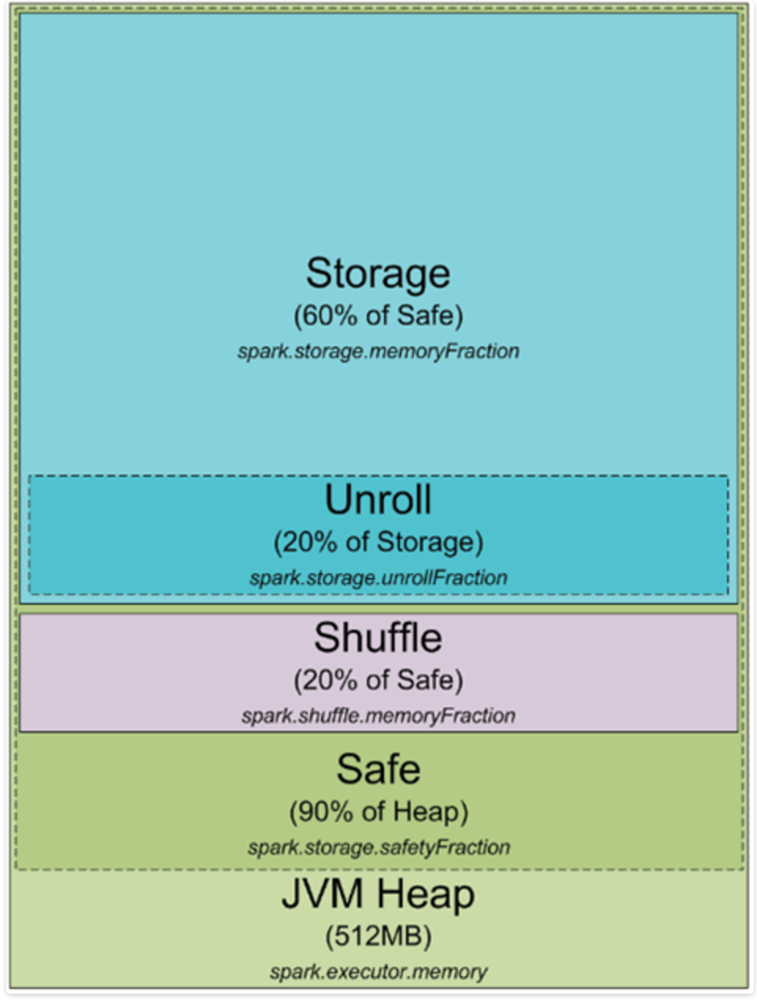
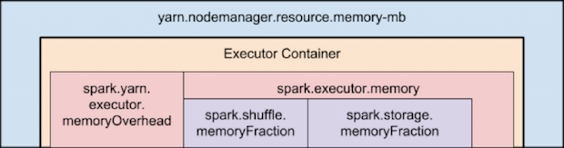

# 一、背景


    Spark 开源数据处理引擎，使得可以高效的，易用的处理复杂的数据分析。自发布以来，Spark快速被各大企业宽泛使用，包括Yahoo !，BAT等。Spark也正以迅猛之势逐步替代MapReduce，成为数据处理引擎的首选。Spark的广泛普及，得益于其灵活的计算因子，丰富的原生语言支持，及快捷的内存计算。Spark同样有一些常见问题，如OutOfMemory，Fetch Failed，Lost Executor等，暴露出来的信息不足以使得用户清楚问题所在。
   本文，将首先以Spark OutOfMemory（OOM）为主题，介绍Spark内存分布，并以实际案列分析Driver/Executor OOM的前因后果。

# 二、Spark 内存分布



## Executor Memory



相关参数：

| 参数                               | 默认值                                                       | 意义                                                         |
| ---------------------------------- | ------------------------------------------------------------ | ------------------------------------------------------------ |
| spark.executor.memory              | 1G                                                           | 每个executor进程使用的内存大小                               |
| spark.shuffle.memoryFraction       | 0.2                                                          | 在Java Heap中Shuffle阶段用于Reduce端聚合归约可使用的比例。 一旦聚合数据超过该阈值，将发生spill操作，将数据spill到磁盘。 |
| spark.storage.memoyFraction        | 0.6                                                          | 在Java Heap中Spark缓存数据可以使用的比例。 上限为JVM老年代内存大小。在现有YARN采用GC下，为0.8（老年代与新生代采用默认8：1）。 |
| spark.yarn.executor.memoryOverhead | max((0.1 * spark.executor.memory), 384M)，即取0.1倍申请的executor内存和384M的较大者 | 为每个executor分配的off heap内存大小。该内存用于JVM overhead，native overhead，字符串常量等。 |

   

## Driver Memory


相关参数：

| 参数                             | 默认值                                                       | 意义                                                         |
| -------------------------------- | ------------------------------------------------------------ | ------------------------------------------------------------ |
| spark.driver.memory              | 1G                                                           | Driver进程使用的内存大小。 若使用client模式，禁止在app中通过SparkConf直接配置该参数。 |
| spark.yarn.driver.memoryOverhead | max((0.1 * spark.driver.memory), 384M)，即取0.1倍申请的driver内存和384M的较大者 | 在cluster模式下，为driver分配的off heap内存大小。该内存用于JVM overhead，native overhead，字符串常量等。 |

## 配置实例

- —num-executors 100
- —executor-cores 2
- —executor-memory 8g
- —driver-memory 1g
- —master yarn-cluster
- —conf spark.shuffle.memoryFraction=0.5
- —conf spark.storage.memoryFraction=0.2


申请的总资源：vcores = 200，memory = 800G
每个Yarn container理论分配executor的内存总量为: executor.memory + executor.memoryOverhead = executor.memory + max(0.1 * executor.memory, 384M)= 8G + 819.2M = 9011.2M 
实际分配executor内存总量为 9216M <= 理论分配值向上取整为YARN配置yarn.scheduler.increment-allocation-mb的整数倍。

在shuffle阶段，用于数据Read/Write缓冲数据的最大内存为：executor.memory * spark.shuffle.memoryFraction * shuffle.safetyFraction = 8G * 0.5 * 0.8 = 3.2G
在需要将数据缓存到内存时，可使用的最大内存为：executor.memory * spark.storage.memoryFraction * storage,safetyFraction = 8G * 0.2 * 0.9 = 1.44G
driver端申请内存：driver.memory = 1G，即用于缓存数据，保存shuffle信息（MapStatus）等的最大使用内存为1G
本次运行模式下driver.memoryOverhead = max(0.1 * 1G, 384M) = 384M。

# 三、Spark OOM 分类

以流量流程bitmap表计算为例:


```scala
spark-submit \
--conf spark.hadoop.hive.metastore.custom.security.userpass=luoxin05:70s4M3tTxT \
--conf "spark.dynamicAllocation.maxExecutors=2000" \
--conf "spark.sql.shuffle.partitions=14336" \
--master yarn \
--deploy-mode cluster \
--queue bigdata-core \
--name heqi#DwdUserActcuidBitmapDf#zuoyebang# \
--driver-memory 8G \
--num-executors 200 \
--executor-cores 2 \
--executor-memory 6G \
--total-executor-cores 400 \
--class com.zyb.DwdUserActcuidBitmapDf cosn://zyb-offline/hive/flow_test/udf_scripts/spark3/test_bitmap_lx.jar {@date} {@date} "dataware" "zuoyebang"
```


正常运行下Spark UI：


## 3.1. driver端OOM：

### 3.1.1 大量计算结果返回Driver导致OOM

使用了将执行结果拉取到driver端的active操作：collect，take，show等，导致OOM

问题复现：

- 添加代码：
  - result.collect()

```scala
异常信息：

异常信息：
22/11/11 16:09:17 ERROR util.Utils: Uncaught exception in thread task-result-getter-1
java.lang.OutOfMemoryError: Java heap space
        at java.io.ObjectInputStream$HandleTable.grow(ObjectInputStream.java:3465)
        at java.io.ObjectInputStream$HandleTable.assign(ObjectInputStream.java:3271)
        at java.io.ObjectInputStream.readString(ObjectInputStream.java:1649)
        at java.io.ObjectInputStream.readObject0(ObjectInputStream.java:1341)
        at java.io.ObjectInputStream.defaultReadFields(ObjectInputStream.java:1990)
        at java.io.ObjectInputStream.readSerialData(ObjectInputStream.java:1915)
        at java.io.ObjectInputStream.readOrdinaryObject(ObjectInputStream.java:1798)
        at java.io.ObjectInputStream.readObject0(ObjectInputStream.java:1350)
        at java.io.ObjectInputStream.readArray(ObjectInputStream.java:1706)
        at java.io.ObjectInputStream.readObject0(ObjectInputStream.java:1344)
        at java.io.ObjectInputStream.readObject(ObjectInputStream.java:370)
        at org.apache.spark.serializer.JavaDeserializationStream.readObject(JavaSerializer.scala:72)
        at org.apache.spark.serializer.JavaSerializerInstance.deserialize(JavaSerializer.scala:92)
        at org.apache.spark.scheduler.DirectTaskResult.value(TaskResult.scala:97)
        at org.apache.spark.scheduler.TaskResultGetter$$anon$2$$anonfun$run$1.apply$mcV$sp(TaskResultGetter.scala:60)
        at org.apache.spark.scheduler.TaskResultGetter$$anon$2$$anonfun$run$1.apply(TaskResultGetter.scala:51)
        at org.apache.spark.scheduler.TaskResultGetter$$anon$2$$anonfun$run$1.apply(TaskResultGetter.scala:51)
        at org.apache.spark.util.Utils$.logUncaughtExceptions(Utils.scala:1699)
        at org.apache.spark.scheduler.TaskResultGetter$$anon$2.run(TaskResultGetter.scala:50)
        at java.util.concurrent.ThreadPoolExecutor.runWorker(ThreadPoolExecutor.java:1145)
        at java.util.concurrent.ThreadPoolExecutor$Worker.run(ThreadPoolExecutor.java:615)
        at java.lang.Thread.run(Thread.java:745)
Exception in thread "task-result-getter-1" java.lang.OutOfMemoryError: Java heap space
        at java.io.ObjectInputStream$HandleTable.grow(ObjectInputStream.java:3465)
        at java.io.ObjectInputStream$HandleTable.assign(ObjectInputStream.java:3271)
        at java.io.ObjectInputStream.readString(ObjectInputStream.java:1649)
        at java.io.ObjectInputStream.readObject0(ObjectInputStream.java:1341)
        at java.io.ObjectInputStream.defaultReadFields(ObjectInputStream.java:1990)
        at java.io.ObjectInputStream.readSerialData(ObjectInputStream.java:1915)
        at java.io.ObjectInputStream.readOrdinaryObject(ObjectInputStream.java:1798)
        at java.io.ObjectInputStream.readObject0(ObjectInputStream.java:1350)
        at java.io.ObjectInputStream.defaultReadFields(ObjectInputStream.java:1990)
        at java.io.ObjectInputStream.readSerialData(ObjectInputStream.java:1915)
        at java.io.ObjectInputStream.readOrdinaryObject(ObjectInputStream.java:1798)
        at java.io.ObjectInputStream.readObject0(ObjectInputStream.java:1350)
        at java.io.ObjectInputStream.readArray(ObjectInputStream.java:1706)
        at java.io.ObjectInputStream.readObject0(ObjectInputStream.java:1344)
        at java.io.ObjectInputStream.readObject(ObjectInputStream.java:370)
        at org.apache.spark.serializer.JavaDeserializationStream.readObject(JavaSerializer.scala:72)
        at org.apache.spark.serializer.JavaSerializerInstance.deserialize(JavaSerializer.scala:92)
        at org.apache.spark.scheduler.DirectTaskResult.value(TaskResult.scala:97)
        at org.apache.spark.scheduler.TaskResultGetter$$anon$2$$anonfun$run$1.apply$mcV$sp(TaskResultGetter.scala:60)
        at org.apache.spark.scheduler.TaskResultGetter$$anon$2$$anonfun$run$1.apply(TaskResultGetter.scala:51)
        at org.apache.spark.scheduler.TaskResultGetter$$anon$2$$anonfun$run$1.apply(TaskResultGetter.scala:51)
        at org.apache.spark.util.Utils$.logUncaughtExceptions(Utils.scala:1699)
        at org.apache.spark.scheduler.TaskResultGetter$$anon$2.run(TaskResultGetter.scala:50)
        at java.util.concurrent.ThreadPoolExecutor.runWorker(ThreadPoolExecutor.java:1145)
        at java.util.concurrent.ThreadPoolExecutor$Worker.run(ThreadPoolExecutor.java:615)
        at java.lang.Thread.run(Thread.java:745)
22/11/11 16:09:17 ERROR akka.ErrorMonitor: Uncaught fatal error from thread [sparkDriver-akka.remote.default-remote-dispatcher-24] shutting down ActorSystem [sparkDriver]
java.lang.OutOfMemoryError: Java heap space
        at scala.reflect.ManifestFactory$$anon$6.newArray(Manifest.scala:90)
        at scala.reflect.ManifestFactory$$anon$6.newArray(Manifest.scala:88)
        at scala.Array$.ofDim(Array.scala:218)
        at akka.util.ByteIterator.toArray(ByteIterator.scala:462)
        at akka.util.ByteString.toArray(ByteString.scala:330)
        at akka.remote.transport.AkkaPduProtobufCodec$.decodeMessage(AkkaPduCodec.scala:181)
        at akka.remote.EndpointReader.akka$remote$EndpointReader$$tryDecodeMessageAndAck(Endpoint.scala:993)
        at akka.remote.EndpointReader$$anonfun$receive$2.applyOrElse(Endpoint.scala:926)
        at akka.actor.Actor$class.aroundReceive(Actor.scala:467)
        at akka.remote.EndpointActor.aroundReceive(Endpoint.scala:411)
        at akka.actor.ActorCell.receiveMessage(ActorCell.scala:516)
        at akka.actor.ActorCell.invoke(ActorCell.scala:487)
        at akka.dispatch.Mailbox.processMailbox(Mailbox.scala:238)
        at akka.dispatch.Mailbox.run(Mailbox.scala:220)
        at akka.dispatch.ForkJoinExecutorConfigurator$AkkaForkJoinTask.exec(AbstractDispatcher.scala:397)
        at scala.concurrent.forkjoin.ForkJoinTask.doExec(ForkJoinTask.java:260)
        at scala.concurrent.forkjoin.ForkJoinPool$WorkQueue.runTask(ForkJoinPool.java:1339)
        at scala.concurrent.forkjoin.ForkJoinPool.runWorker(ForkJoinPool.java:1979)
        at scala.concurrent.forkjoin.ForkJoinWorkerThread.run(ForkJoinWorkerThread.java:107)
......
22/11/11 16:09:17 INFO remote.RemoteActorRefProvider$RemotingTerminator: Shutting down remote daemon.
22/11/11 16:09:17 INFO remote.RemoteActorRefProvider$RemotingTerminator: Remote daemon shut down; proceeding with flushing remote transports.
22/11/11 16:09:43 ERROR util.Utils: Uncaught exception in thread task-result-getter-3
java.lang.OutOfMemoryError: GC overhead limit exceeded
        at sun.reflect.GeneratedSerializationConstructorAccessor108.newInstance(Unknown Source)
        at java.lang.reflect.Constructor.newInstance(Constructor.java:526)
        at java.io.ObjectStreamClass.newInstance(ObjectStreamClass.java:967)
        at java.io.ObjectInputStream.readOrdinaryObject(ObjectInputStream.java:1782)
        at java.io.ObjectInputStream.readObject0(ObjectInputStream.java:1350)
        at java.io.ObjectInputStream.defaultReadFields(ObjectInputStream.java:1990)
        at java.io.ObjectInputStream.readSerialData(ObjectInputStream.java:1915)
        at java.io.ObjectInputStream.readOrdinaryObject(ObjectInputStream.java:1798)
        at java.io.ObjectInputStream.readObject0(ObjectInputStream.java:1350)
        at java.io.ObjectInputStream.readArray(ObjectInputStream.java:1706)
        at java.io.ObjectInputStream.readObject0(ObjectInputStream.java:1344)
        at java.io.ObjectInputStream.readObject(ObjectInputStream.java:370)
        at org.apache.spark.serializer.JavaDeserializationStream.readObject(JavaSerializer.scala:72)
        at org.apache.spark.serializer.JavaSerializerInstance.deserialize(JavaSerializer.scala:92)
        at org.apache.spark.scheduler.DirectTaskResult.value(TaskResult.scala:97)
        at org.apache.spark.scheduler.TaskResultGetter$$anon$2$$anonfun$run$1.apply$mcV$sp(TaskResultGetter.scala:60)
        at org.apache.spark.scheduler.TaskResultGetter$$anon$2$$anonfun$run$1.apply(TaskResultGetter.scala:51)
        at org.apache.spark.scheduler.TaskResultGetter$$anon$2$$anonfun$run$1.apply(TaskResultGetter.scala:51)
        at org.apache.spark.util.Utils$.logUncaughtExceptions(Utils.scala:1699)
        at org.apache.spark.scheduler.TaskResultGetter$$anon$2.run(TaskResultGetter.scala:50)
        at java.util.concurrent.ThreadPoolExecutor.runWorker(ThreadPoolExecutor.java:1145)
        at java.util.concurrent.ThreadPoolExecutor$Worker.run(ThreadPoolExecutor.java:615)
        at java.lang.Thread.run(Thread.java:745)
Exception in thread "task-result-getter-3" java.lang.OutOfMemoryError: GC overhead limit exceeded
        at sun.reflect.GeneratedSerializationConstructorAccessor108.newInstance(Unknown Source)
        at java.lang.reflect.Constructor.newInstance(Constructor.java:526)
        at java.io.ObjectStreamClass.newInstance(ObjectStreamClass.java:967)
        at java.io.ObjectInputStream.readOrdinaryObject(ObjectInputStream.java:1782)
        at java.io.ObjectInputStream.readObject0(ObjectInputStream.java:1350)
        at java.io.ObjectInputStream.defaultReadFields(ObjectInputStream.java:1990)
        at java.io.ObjectInputStream.readSerialData(ObjectInputStream.java:1915)
        at java.io.ObjectInputStream.readOrdinaryObject(ObjectInputStream.java:1798)
        at java.io.ObjectInputStream.readObject0(ObjectInputStream.java:1350)
        at java.io.ObjectInputStream.readArray(ObjectInputStream.java:1706)
        at java.io.ObjectInputStream.readObject0(ObjectInputStream.java:1344)
        at java.io.ObjectInputStream.readObject(ObjectInputStream.java:370)
        at org.apache.spark.serializer.JavaDeserializationStream.readObject(JavaSerializer.scala:72)
        at org.apache.spark.serializer.JavaSerializerInstance.deserialize(JavaSerializer.scala:92)
        at org.apache.spark.scheduler.DirectTaskResult.value(TaskResult.scala:97)
        at org.apache.spark.scheduler.TaskResultGetter$$anon$2$$anonfun$run$1.apply$mcV$sp(TaskResultGetter.scala:60)
        at org.apache.spark.scheduler.TaskResultGetter$$anon$2$$anonfun$run$1.apply(TaskResultGetter.scala:51)
        at org.apache.spark.scheduler.TaskResultGetter$$anon$2$$anonfun$run$1.apply(TaskResultGetter.scala:51)
        at org.apache.spark.util.Utils$.logUncaughtExceptions(Utils.scala:1699)
        at org.apache.spark.scheduler.TaskResultGetter$$anon$2.run(TaskResultGetter.scala:50)
        at java.util.concurrent.ThreadPoolExecutor.runWorker(ThreadPoolExecutor.java:1145)
        at java.util.concurrent.ThreadPoolExecutor$Worker.run(ThreadPoolExecutor.java:615)
        at java.lang.Thread.run(Thread.java:745)
22/11/11 16:09:44 WARN remote.RemoteActorRefProvider$RemotingTerminator: unhandled event Failure(akka.pattern.AskTimeoutException: Ask timed out on [Actor[akka://sparkDriver/system/endpointManager#1915469670]] after [10000 ms]) in state WaitTransportShutdown
22/11/11 16:09:44 WARN remote.ReliableDeliverySupervisor: Association with remote system [akka.tcp://sparkExecutor@rz-data-hdp-dn1293.rz.sankuai.com:37709] has failed, address is now gated for [5000] ms. Reason: [unread block data]
```


问题原因：
使用collect将数据拉取到driver端，而当数据量超过Driver内存时会报错OOM：
从日志中以下信息可以确认：


at org.apache.spark.scheduler.DirectTaskResult.value(TaskResult.scala:97)


解决方法：

- 避免使用：重新分析业务逻辑，采取其他实现
- 增大driver段内存：如果使用的是yarn-clustr模式，会受到16G最大分配memory的限制，因此需要综合考虑返回到driver数据大小，AppMaster及Driver本身的内存使用。


### 3.1.2 大量shuffle中间结果返回Driver导致

```
使用reduceByKey，distinct操作时，可能由于分区过多使得shuffle阶段向driver端返回的信息数据量过大，导致OOM
```

问题复现：

- repartition(100000)

```scala
异常信息：
22/11/11 16:40:51 ERROR akka.ErrorMonitor: Uncaught fatal error from thread [sparkDriver-akka.remote.default-remote-dispatcher-6] shutting down ActorSystem [sparkDriver]
java.lang.OutOfMemoryError: GC overhead limit exceeded
        at java.util.Arrays.copyOf(Arrays.java:2271)
        at java.io.ByteArrayOutputStream.grow(ByteArrayOutputStream.java:118)
        at java.io.ByteArrayOutputStream.ensureCapacity(ByteArrayOutputStream.java:93)
        at java.io.ByteArrayOutputStream.write(ByteArrayOutputStream.java:153)
        at java.io.DataOutputStream.write(DataOutputStream.java:107)
        at java.io.DataOutputStream.writeUTF(DataOutputStream.java:401)
        at java.io.DataOutputStream.writeUTF(DataOutputStream.java:323)
        at java.io.ObjectStreamClass.computeDefaultSUID(ObjectStreamClass.java:1739)
        at java.io.ObjectStreamClass.access$100(ObjectStreamClass.java:72)
        at java.io.ObjectStreamClass$1.run(ObjectStreamClass.java:250)
        at java.io.ObjectStreamClass$1.run(ObjectStreamClass.java:248)
        at java.security.AccessController.doPrivileged(Native Method)
        at java.io.ObjectStreamClass.getSerialVersionUID(ObjectStreamClass.java:247)
        at java.io.ObjectStreamClass.initNonProxy(ObjectStreamClass.java:613)
        at java.io.ObjectInputStream.readNonProxyDesc(ObjectInputStream.java:1622)
        at java.io.ObjectInputStream.readClassDesc(ObjectInputStream.java:1517)
        at java.io.ObjectInputStream.readOrdinaryObject(ObjectInputStream.java:1771)
        at java.io.ObjectInputStream.readObject0(ObjectInputStream.java:1350)
        at java.io.ObjectInputStream.defaultReadFields(ObjectInputStream.java:1990)
        at java.io.ObjectInputStream.readSerialData(ObjectInputStream.java:1915)
        at java.io.ObjectInputStream.readOrdinaryObject(ObjectInputStream.java:1798)
        at java.io.ObjectInputStream.readObject0(ObjectInputStream.java:1350)
        at java.io.ObjectInputStream.readObject(ObjectInputStream.java:370)
        at akka.serialization.JavaSerializer$$anonfun$1.apply(Serializer.scala:136)
        at scala.util.DynamicVariable.withValue(DynamicVariable.scala:57)
        at akka.serialization.JavaSerializer.fromBinary(Serializer.scala:136)
        at akka.serialization.Serialization$$anonfun$deserialize$1.apply(Serialization.scala:104)
        at scala.util.Try$.apply(Try.scala:161)
        at akka.serialization.Serialization.deserialize(Serialization.scala:98)
        at akka.remote.MessageSerializer$.deserialize(MessageSerializer.scala:23)
        at akka.remote.DefaultMessageDispatcher.payload$lzycompute$1(Endpoint.scala:58)
        at akka.remote.DefaultMessageDispatcher.payload$1(Endpoint.scala:58)
22/11/11 16:40:51 INFO scheduler.TaskSetManager: Starting task 24811.0 in stage 3.0 (TID 127956, rz-data-hdp-dn1675.rz.sankuai.com, PROCESS_LOCAL, 2159 bytes)
22/11/11 16:40:51 ERROR actor.ActorSystemImpl: Uncaught fatal error from thread [sparkDriver-akka.remote.default-remote-dispatcher-6] shutting down ActorSystem [sparkDriver]
java.lang.OutOfMemoryError: GC overhead limit exceeded
        at java.util.Arrays.copyOf(Arrays.java:2271)
        at java.io.ByteArrayOutputStream.grow(ByteArrayOutputStream.java:118)
        at java.io.ByteArrayOutputStream.ensureCapacity(ByteArrayOutputStream.java:93)
        at java.io.ByteArrayOutputStream.write(ByteArrayOutputStream.java:153)
        at java.io.DataOutputStream.write(DataOutputStream.java:107)
        at java.io.DataOutputStream.writeUTF(DataOutputStream.java:401)
        at java.io.DataOutputStream.writeUTF(DataOutputStream.java:323)
        at java.io.ObjectStreamClass.computeDefaultSUID(ObjectStreamClass.java:1739)
        at java.io.ObjectStreamClass.access$100(ObjectStreamClass.java:72)
        at java.io.ObjectStreamClass$1.run(ObjectStreamClass.java:250)
        at java.io.ObjectStreamClass$1.run(ObjectStreamClass.java:248)
        at java.security.AccessController.doPrivileged(Native Method)
        at java.io.ObjectStreamClass.getSerialVersionUID(ObjectStreamClass.java:247)
        at java.io.ObjectStreamClass.initNonProxy(ObjectStreamClass.java:613)
        at java.io.ObjectInputStream.readNonProxyDesc(ObjectInputStream.java:1622)
        at java.io.ObjectInputStream.readClassDesc(ObjectInputStream.java:1517)
        at java.io.ObjectInputStream.readOrdinaryObject(ObjectInputStream.java:1771)
        at java.io.ObjectInputStream.readObject0(ObjectInputStream.java:1350)
        at java.io.ObjectInputStream.defaultReadFields(ObjectInputStream.java:1990)
        at java.io.ObjectInputStream.readSerialData(ObjectInputStream.java:1915)
        at java.io.ObjectInputStream.readOrdinaryObject(ObjectInputStream.java:1798)
        at java.io.ObjectInputStream.readObject0(ObjectInputStream.java:1350)
        at java.io.ObjectInputStream.readObject(ObjectInputStream.java:370)
        at akka.serialization.JavaSerializer$$anonfun$1.apply(Serializer.scala:136)
        at scala.util.DynamicVariable.withValue(DynamicVariable.scala:57)
        at akka.serialization.JavaSerializer.fromBinary(Serializer.scala:136)
        at akka.serialization.Serialization$$anonfun$deserialize$1.apply(Serialization.scala:104)
        at scala.util.Try$.apply(Try.scala:161)
        at akka.serialization.Serialization.deserialize(Serialization.scala:98)
        at akka.remote.MessageSerializer$.deserialize(MessageSerializer.scala:23)
        at akka.remote.DefaultMessageDispatcher.payload$lzycompute$1(Endpoint.scala:58)
        at akka.remote.DefaultMessageDispatcher.payload$1(Endpoint.scala:58)
 
22/11/11 16:40:54 WARN akka.AkkaRpcEndpointRef: Error sending message [message = BlockManagerHeartbeat(BlockManagerId(197, rz-data-hdp-dn1180.rz.sankuai.com, 44473))] in 1 attempts
org.apache.spark.rpc.RpcTimeoutException: Recipient[Actor[akka://sparkDriver/user/BlockManagerMaster#1225598467]] had already been terminated.. This timeout is controlled by BlockManagerHeartbeat
        at org.apache.spark.rpc.RpcTimeout.org$apache$spark$rpc$RpcTimeout$$createRpcTimeoutException(RpcEnv.scala:214)
        at org.apache.spark.rpc.RpcTimeout$$anonfun$addMessageIfTimeout$1.applyOrElse(RpcEnv.scala:229)
        at org.apache.spark.rpc.RpcTimeout$$anonfun$addMessageIfTimeout$1.applyOrElse(RpcEnv.scala:225)
        at scala.runtime.AbstractPartialFunction.apply(AbstractPartialFunction.scala:33)
        at scala.util.Failure$$anonfun$recover$1.apply(Try.scala:185)
        at scala.util.Try$.apply(Try.scala:161)
        at scala.util.Failure.recover(Try.scala:185)
        at scala.concurrent.Future$$anonfun$recover$1.apply(Future.scala:324)
        at scala.concurrent.Future$$anonfun$recover$1.apply(Future.scala:324)
        at scala.concurrent.impl.CallbackRunnable.run(Promise.scala:32)
        at org.spark-project.guava.util.concurrent.MoreExecutors$SameThreadExecutorService.execute(MoreExecutors.java:293)
        at scala.concurrent.impl.ExecutionContextImpl$$anon$1.execute(ExecutionContextImpl.scala:133)
        at scala.concurrent.impl.CallbackRunnable.executeWithValue(Promise.scala:40)
        at scala.concurrent.impl.Promise$DefaultPromise.scala$concurrent$impl$Promise$DefaultPromise$$dispatchOrAddCallback(Promise.scala:280)
        at scala.concurrent.impl.Promise$DefaultPromise.onComplete(Promise.scala:270)
        at scala.concurrent.Future$class.recover(Future.scala:324)
        at scala.concurrent.impl.Promise$DefaultPromise.recover(Promise.scala:153)
        at org.apache.spark.rpc.akka.AkkaRpcEndpointRef.ask(AkkaRpcEnv.scala:319)
        at org.apache.spark.rpc.RpcEndpointRef.askWithRetry(RpcEndpointRef.scala:100)
        at org.apache.spark.scheduler.DAGScheduler.executorHeartbeatReceived(DAGScheduler.scala:194)
        at org.apache.spark.scheduler.TaskSchedulerImpl.executorHeartbeatReceived(TaskSchedulerImpl.scala:391)
        at org.apache.spark.HeartbeatReceiver$$anonfun$receiveAndReply$1$$anon$2$$anonfun$run$2.apply$mcV$sp(HeartbeatReceiver.scala:128)
        at org.apache.spark.util.Utils$.tryLogNonFatalError(Utils.scala:1185)
        at org.apache.spark.HeartbeatReceiver$$anonfun$receiveAndReply$1$$anon$2.run(HeartbeatReceiver.scala:127)
        at java.util.concurrent.Executors$RunnableAdapter.call(Executors.java:471)
        at java.util.concurrent.FutureTask.run(FutureTask.java:262)
        at java.util.concurrent.ScheduledThreadPoolExecutor$ScheduledFutureTask.access$201(ScheduledThreadPoolExecutor.java:178)
        at java.util.concurrent.ScheduledThreadPoolExecutor$ScheduledFutureTask.run(ScheduledThreadPoolExecutor.java:292)
        at java.util.concurrent.ThreadPoolExecutor.runWorker(ThreadPoolExecutor.java:1145)
        at java.util.concurrent.ThreadPoolExecutor$Worker.run(ThreadPoolExecutor.java:615)
        at java.lang.Thread.run(Thread.java:745)
Caused by: akka.pattern.AskTimeoutException: Recipient[Actor[akka://sparkDriver/user/BlockManagerMaster#1225598467]] had already been terminated.
        at akka.pattern.AskableActorRef$.ask$extension(AskSupport.scala:132)
        at org.apache.spark.rpc.akka.AkkaRpcEndpointRef.ask(AkkaRpcEnv.scala:307)
        ... 13 more22/11/11 16:40:55 INFO remote.RemoteActorRefProvider$RemotingTerminator: Shutting down remote daemon.
 
 
......
 
22/11/11 16:41:37 WARN akka.AkkaRpcEndpointRef: Error sending message [message = StopExecutors] in 1 attempts
org.apache.spark.rpc.RpcTimeoutException: Recipient[Actor[akka://sparkDriver/user/CoarseGrainedScheduler#1554693618]] had already been terminated.. This timeout is controlled by spark.rpc.askTimeout        ...
Caused by: akka.pattern.AskTimeoutException: Recipient[Actor[akka://sparkDriver/user/CoarseGrainedScheduler#1554693618]] had already been terminated.
 
 
......
  
22/11/11 16:41:43 WARN akka.AkkaRpcEndpointRef: Error sending message [message = StopMapOutputTracker] in 1 attempts
org.apache.spark.rpc.RpcTimeoutException: Recipient[Actor[akka://sparkDriver/user/MapOutputTracker#1217466949]] had already been terminated.. This timeout is controlled by spark.rpc.askTimeout        ...
Caused by: akka.pattern.AskTimeoutException: Recipient[Actor[akka://sparkDriver/user/MapOutputTracker#1217466949]] had already been terminated.
```


问题原因：
日志显示由于频繁GC，导致Driver端OOM，因此所有Executor HeartBeat Timeout，AppMaster判定所有Container Failed。
频繁GC为什么会导致OOM呢？

```
The concurrent/parallel collector will throw an OutOfMemoryError if too much time is being spent in garbage collection: if more than 98% of the total time is spent in garbage collection and less than 2% of the heap is recovered, an OutOfMemoryError will be thrown. This feature is designed to prevent applications from running for an extended period of time while making little or no progress because the heap is too small. If necessary, this feature can be disabled by adding the option -XX:-UseGCOverheadLimit to the command line.
```


当失败的Container数量超过最大允许Executor失败次数maxNumExecutorFailures（默认为executor个数的两倍），App失败。

```
22/11/11 16:41:36 INFO yarn.ApplicationMaster: Final app status: FAILED, exitCode: 11, (reason: Max number of executor failures (400) reached)
```


那么是什么导致Driver端OOM：
在shuffle阶段，map端执行完shuffle 数据的write操作后将结果信息压缩后MapStatus发送到driver MapOutputTrackerMasker进行缓存，以便其他reduce端数据从此获取shuffle元数据。
在一个shuffle stage write操作结束后，driver端接收到的数据量为压缩后的 mapNum * Size(mapStatus)。
而在driver端要使用这些mapStatus信息，需要解压缩，此时数据结构大小近似等于reducePartitionNum * 8Kb。reducePartitionNum为shuffle阶段reduce的个数，即shuffleDependency.partitioner.numPartitions。当driver内存分配较小，而分区数过多，在对driver端MapOutputTrackerMaster中的mapStatuses解压缩后获取特定shuffleId，reduceId的shuffle信息，容易造成内存溢出。
 对于本例Stage 3，一个解压后的MapStatus信息约为 100000 * 8 = 780K。而Stage 2有100000个map，将占用约70+G内存。

总结：
就是分区过多产生的shuffle元数据就多，会导致driver端内存溢出*

**解决方案：**

- 使用repartition或者coalesce减少分区数。

  - 原实现中rdd的partition数过大，未处理直接进行reduceByKey操作： rdd.reduceByKey(functions)  

  - 将rdd重分区到1000个partition后再处理： rdd.repartition(1000).reduceByKey(functions) rdd.reduceByKey(functions,1000)

  

  

## 3.2. executor端OOM：

### 3.2.1使用cache方式缓存RDD，由于Storage分配内存不足造成OOM

！！！这是一个误区。
！！！如果内存不足，Spark采取的方式是不做cache，不会造成OOM。

复现方案：

- 减少executor.memory： --executor-memory 1g

```
异常信息：
 22/11/11 16:02:13 WARN storage.MemoryStore: Not enough space to cache rdd_212_598 in memory! (computed 44.6 MB so far)
22/11/11 16:02:13 INFO storage.MemoryStore: Memory use = 753.6 KB (blocks) + 156.7 MB (scratch space shared across 4 tasks(s)) = 157.4 MB. Storage limit = 176.8 MB.
```


判断依据：
RDD进行cache调用流程：
CacheManager.getOrCompute
  => CacheManager.putInBlockManager
    => MemoryStore.unrollSafely
而unrollSafely 方法说明：

```scala
 \* Unroll the given block in memory safely.
 *
 \* The safety of this operation refers to avoiding potential OOM exceptions caused by
 \* unrolling the entirety of the block in memory at once. This is achieved by periodically
 \* checking whether the memory restrictions for unrolling blocks are still satisfied,
 \* stopping immediately if not. This check is a safeguard against the scenario in which
 \* there is not enough free memory to accommodate the entirety of a single block.
 *
 \* This method returns either an array with the contents of the entire block or an iterator
 \* containing the values of the block (if the array would have exceeded available memory).
 */
```


疑问：
为什么某些case下，使用cache会导致作业失败并报错OOM，而取消cache就可以正常运行呢？
Spark Executor内存管理并非按照storage.memoryFraction，shuffle.memoryFraction隔离分块（如果没有cache数据，storage部分内存将闲置），而是使用JVM整体内存。如果没有进行cache操作，那么其他包括对象创建，collection等可以使用除shuffle已缓存数据使用内存之外的全部内存。
当有cache操作，这部分内存将缩小，导致某项操作依赖的数据可能不能全部加载到内存，引发频繁GC，最终出现OutOfMemroy。

总结：

*cache操作会挤压JVM整体内存中其他部分*

### 3.2.2 Shuffle Write/Read 造成OOM

```
问题复现：
```

- 减少内存资源：--executor-memory 1g

```scala
异常信息：
22/11/11 17:33:57 WARN scheduler.TaskSetManager: Lost task 5.0 in stage 4.0 java.lang.OutOfMemoryError: GC overhead limit exceeded
    at java.io.ObjectInputStream.defaultReadFields(ObjectInputStream.java:1986)
    at java.io.ObjectInputStream.readSerialData(ObjectInputStream.java:1915)
    at java.io.ObjectInputStream.readOrdinaryObject(ObjectInputStream.java:1798)
    at java.io.ObjectInputStream.readObject0(ObjectInputStream.java:1350)
    at java.io.ObjectInputStream.readObject(ObjectInputStream.java:370)
    at org.apache.spark.serializer.JavaDeserializationStream.readObject(JavaSerializer.scala:72)
    at org.apache.spark.serializer.DeserializationStream.readValue(Serializer.scala:171)
    at org.apache.spark.util.collection.ExternalSorter$SpillReader.org$apache$spark$util$collection$ExternalSorter$SpillReader$$readNextItem(ExternalSorter.scala:559)
    at org.apache.spark.util.collection.ExternalSorter$SpillReader$$anon$5.hasNext(ExternalSorter.scala:588)
    at scala.collection.Iterator$$anon$1.hasNext(Iterator.scala:847)
    at org.apache.spark.util.collection.ExternalSorter$$anon$2.next(ExternalSorter.scala:386)
    at org.apache.spark.util.collection.ExternalSorter$$anon$2.next(ExternalSorter.scala:377)
    at scala.collection.Iterator$$anon$13.next(Iterator.scala:372)
    at scala.collection.Iterator$class.foreach(Iterator.scala:727)
    at scala.collection.AbstractIterator.foreach(Iterator.scala:1157)
    at scala.collection.generic.Growable$class.$plus$plus$eq(Growable.scala:48)
    at scala.collection.mutable.ListBuffer.$plus$plus$eq(ListBuffer.scala:176)
    at scala.collection.mutable.ListBuffer.$plus$plus$eq(ListBuffer.scala:45)
    at scala.collection.TraversableOnce$class.to(TraversableOnce.scala:273)
    at scala.collection.AbstractIterator.to(Iterator.scala:1157)
    at scala.collection.TraversableOnce$class.toList(TraversableOnce.scala:257)
    at scala.collection.AbstractIterator.toList(Iterator.scala:1157)
    at com.meituan.mthdp.waimai.elefood$$anonfun$2.apply(elefood.scala:77)
    at com.meituan.mthdp.waimai.elefood$$anonfun$2.apply(elefood.scala:75)
    at org.apache.spark.rdd.RDD$$anonfun$mapPartitions$1$$anonfun$apply$17.apply(RDD.scala:706)
    at org.apache.spark.rdd.RDD$$anonfun$mapPartitions$1$$anonfun$apply$17.apply(RDD.scala:706)
    at org.apache.spark.rdd.MapPartitionsRDD.compute(MapPartitionsRDD.scala:38)
    at org.apache.spark.rdd.RDD.computeOrReadCheckpoint(RDD.scala:297)
    at org.apache.spark.rdd.RDD.iterator(RDD.scala:264)
    at org.apache.spark.rdd.MapPartitionsRDD.compute(MapPartitionsRDD.scala:38)
    at org.apache.spark.rdd.RDD.computeOrReadCheckpoint(RDD.scala:297)
    at org.apache.spark.rdd.RDD.iterator(RDD.scala:264)
 
 
......
  
22/11/11 17:34:02 WARN scheduler.TaskSetManager: Lost task 156.0 in stage 4.0, shuffleId=1, mapId=413, reduceId=156, message=
org.apache.spark.shuffle.FetchFailedException: java.io.FileNotFoundException: /data2/hadoop/yarn/nm-local-dir/usercache/hadoop-data/appcache/application_1452598356232_8773679/blockmgr-3c41f28b-3ac9-4884-a189-b6cc2becf7a4/19/shuffle_1_530_0.index (没有那个文件或目录)
    at java.io.FileInputStream.open(Native Method)
    at java.io.FileInputStream.<init>(FileInputStream.java:146)
    at org.apache.spark.shuffle.IndexShuffleBlockResolver.getBlockData(IndexShuffleBlockResolver.scala:98)
    at org.apache.spark.storage.BlockManager.getBlockData(BlockManager.scala:300)
    at org.apache.spark.network.netty.NettyBlockRpcServer$$anonfun$2.apply(NettyBlockRpcServer.scala:57)
    at org.apache.spark.network.netty.NettyBlockRpcServer$$anonfun$2.apply(NettyBlockRpcServer.scala:57)
    at scala.collection.TraversableLike$$anonfun$map$1.apply(TraversableLike.scala:244)
    at scala.collection.TraversableLike$$anonfun$map$1.apply(TraversableLike.scala:244)
    at scala.collection.IndexedSeqOptimized$class.foreach(IndexedSeqOptimized.scala:33)
    at scala.collection.mutable.ArrayOps$ofRef.foreach(ArrayOps.scala:108)
    at scala.collection.TraversableLike$class.map(TraversableLike.scala:244)
    at scala.collection.mutable.ArrayOps$ofRef.map(ArrayOps.scala:108)
    at org.apache.spark.network.netty.NettyBlockRpcServer.receive(NettyBlockRpcServer.scala:57)
    at org.apache.spark.network.server.TransportRequestHandler.processRpcRequest(TransportRequestHandler.java:114)
    at org.apache.spark.network.server.TransportRequestHandler.handle(TransportRequestHandler.java:87)
    at org.apache.spark.network.server.TransportChannelHandler.channelRead0(TransportChannelHandler.java:101)
    at org.apache.spark.network.server.TransportChannelHandler.channelRead0(TransportChannelHandler.java:51)
    at io.netty.channel.SimpleChannelInboundHandler.channelRead(SimpleChannelInboundHandler.java:105)
    at io.netty.channel.AbstractChannelHandlerContext.invokeChannelRead(AbstractChannelHandlerContext.java:308)
    at io.netty.channel.AbstractChannelHandlerContext.fireChannelRead(AbstractChannelHandlerContext.java:294)
    at io.netty.handler.timeout.IdleStateHandler.channelRead(IdleStateHandler.java:266)
    at io.netty.channel.AbstractChannelHandlerContext.invokeChannelRead(AbstractChannelHandlerContext.java:308)
    at io.netty.channel.AbstractChannelHandlerContext.fireChannelRead(AbstractChannelHandlerContext.java:294)
    at io.netty.handler.codec.MessageToMessageDecoder.channelRead(MessageToMessageDecoder.java:103)
    at io.netty.channel.AbstractChannelHandlerContext.invokeChannelRead(AbstractChannelHandlerContext.java:308)
    at io.netty.channel.AbstractChannelHandlerContext.fireChannelRead(AbstractChannelHandlerContext.java:294)
    at io.netty.handler.codec.ByteToMessageDecoder.channelRead(ByteToMessageDecoder.java:244)
    at io.netty.channel.AbstractChannelHandlerContext.invokeChannelRead(AbstractChannelHandlerContext.java:308)
    at io.netty.channel.AbstractChannelHandlerContext.fireChannelRead(AbstractChannelHandlerContext.java:294)
    at io.netty.channel.DefaultChannelPipeline.fireChannelRead(DefaultChannelPipeline.java:846)
    at io.netty.channel.nio.AbstractNioByteChannel$NioByteUnsafe.read(AbstractNioByteChannel.java:131)
    at io.netty.channel.nio.NioEventLoop.processSelectedKey(NioEventLoop.java:511)
    at io.netty.channel.nio.NioEventLoop.processSelectedKeysOptimized(NioEventLoop.java:468)
    at io.netty.channel.nio.NioEventLoop.processSelectedKeys(NioEventLoop.java:382)
    at io.netty.channel.nio.NioEventLoop.run(NioEventLoop.java:354)
    at io.netty.util.concurrent.SingleThreadEventExecutor$2.run(SingleThreadEventExecutor.java:111)
    at java.lang.Thread.run(Thread.java:745)
 
    at org.apache.spark.storage.ShuffleBlockFetcherIterator.throwFetchFailedException(ShuffleBlockFetcherIterator.scala:321)
    at org.apache.spark.storage.ShuffleBlockFetcherIterator.next(ShuffleBlockFetcherIterator.scala:306)
    at org.apache.spark.storage.ShuffleBlockFetcherIterator.next(ShuffleBlockFetcherIterator.scala:51)
    at scala.collection.Iterator$$anon$11.next(Iterator.scala:328)
    at scala.collection.Iterator$$anon$13.hasNext(Iterator.scala:371)
    at scala.collection.Iterator$$anon$11.hasNext(Iterator.scala:327)
    at org.apache.spark.util.CompletionIterator.hasNext(CompletionIterator.scala:32)
    at org.apache.spark.InterruptibleIterator.hasNext(InterruptibleIterator.scala:39)
    at org.apache.spark.util.collection.ExternalSorter.insertAll(ExternalSorter.scala:217)
    at org.apache.spark.shuffle.hash.HashShuffleReader.read(HashShuffleReader.scala:102)
    at org.apache.spark.rdd.ShuffledRDD.compute(ShuffledRDD.scala:90)
    at org.apache.spark.rdd.RDD.computeOrReadCheckpoint(RDD.scala:297)
    at org.apache.spark.rdd.RDD.iterator(RDD.scala:264)
    at org.apache.spark.rdd.MapPartitionsRDD.compute(MapPartitionsRDD.scala:38)
    at org.apache.spark.rdd.RDD.computeOrReadCheckpoint(RDD.scala:297)
    at org.apache.spark.rdd.RDD.iterator(RDD.scala:264)
    at org.apache.spark.rdd.MapPartitionsRDD.compute(MapPartitionsRDD.scala:38)
    at org.apache.spark.rdd.RDD.computeOrReadCheckpoint(RDD.scala:297)
    at org.apache.spark.rdd.RDD.iterator(RDD.scala:264)
    at org.apache.spark.rdd.MapPartitionsRDD.compute(MapPartitionsRDD.scala:38)
    at org.apache.spark.rdd.RDD.computeOrReadCheckpoint(RDD.scala:297)
    at org.apache.spark.rdd.RDD.iterator(RDD.scala:264)
    at org.apache.spark.rdd.MapPartitionsRDD.compute(MapPartitionsRDD.scala:38)
    at org.apache.spark.rdd.RDD.computeOrReadCheckpoint(RDD.scala:297)
    at org.apache.spark.rdd.RDD.iterator(RDD.scala:264)
    at org.apache.spark.rdd.MapPartitionsRDD.compute(MapPartitionsRDD.scala:38)
    at org.apache.spark.rdd.RDD.computeOrReadCheckpoint(RDD.scala:297)
    at org.apache.spark.rdd.RDD.iterator(RDD.scala:264)
    at org.apache.spark.rdd.MapPartitionsRDD.compute(MapPartitionsRDD.scala:38)
    at org.apache.spark.rdd.RDD.computeOrReadCheckpoint(RDD.scala:297)
    at org.apache.spark.rdd.RDD.iterator(RDD.scala:264)
    at org.apache.spark.scheduler.ResultTask.runTask(ResultTask.scala:66)
    at org.apache.spark.scheduler.Task.run(Task.scala:88)
    at org.apache.spark.executor.Executor$TaskRunner.run(Executor.scala:214)
    at java.util.concurrent.ThreadPoolExecutor.runWorker(ThreadPoolExecutor.java:1145)
    at java.util.concurrent.ThreadPoolExecutor$Worker.run(ThreadPoolExecutor.java:615)
    at java.lang.Thread.run(Thread.java:745)
Caused by: java.lang.RuntimeException: java.io.FileNotFoundException: /data2/hadoop/yarn/nm-local-dir/usercache/hadoop-data/appcache/application_1452598356232_8773679/blockmgr-3c41f28b-3ac9-4884-a189-b6cc2becf7a4/19/shuffle_1_530_0.index (没有那个文件或目录)
    at java.io.FileInputStream.open(Native Method)
    at java.io.FileInputStream.<init>(FileInputStream.java:146)
    at org.apache.spark.shuffle.IndexShuffleBlockResolver.getBlockData(IndexShuffleBlockResolver.scala:98)
    at org.apache.spark.storage.BlockManager.getBlockData(BlockManager.scala:300)
    at org.apache.spark.network.netty.NettyBlockRpcServer$$anonfun$2.apply(NettyBlockRpcServer.scala:57)
    at org.apache.spark.network.netty.NettyBlockRpcServer$$anonfun$2.apply(NettyBlockRpcServer.scala:57)
    at scala.collection.TraversableLike$$anonfun$map$1.apply(TraversableLike.scala:244)
    at scala.collection.TraversableLike$$anonfun$map$1.apply(TraversableLike.scala:244)
    at scala.collection.IndexedSeqOptimized$class.foreach(IndexedSeqOptimized.scala:33)
    at scala.collection.mutable.ArrayOps$ofRef.foreach(ArrayOps.scala:108)
    at scala.collection.TraversableLike$class.map(TraversableLike.scala:244)
    at scala.collection.mutable.ArrayOps$ofRef.map(ArrayOps.scala:108)
    at org.apache.spark.network.netty.NettyBlockRpcServer.receive(NettyBlockRpcServer.scala:57)
    at org.apache.spark.network.server.TransportRequestHandler.processRpcRequest(TransportRequestHandler.java:114)
    at org.apache.spark.network.server.TransportRequestHandler.handle(TransportRequestHandler.java:87)
    at org.apache.spark.network.server.TransportChannelHandler.channelRead0(TransportChannelHandler.java:101)
    at org.apache.spark.network.server.TransportChannelHandler.channelRead0(TransportChannelHandler.java:51)
    at io.netty.channel.SimpleChannelInboundHandler.channelRead(SimpleChannelInboundHandler.java:105)
    at io.netty.channel.AbstractChannelHandlerContext.invokeChannelRead(AbstractChannelHandlerContext.java:308)
    at io.netty.channel.AbstractChannelHandlerContext.fireChannelRead(AbstractChannelHandlerContext.java:294)
    at io.netty.handler.timeout.IdleStateHandler.channelRead(IdleStateHandler.java:266)
    at io.netty.channel.AbstractChannelHandlerContext.invokeChannelRead(AbstractChannelHandlerContext.java:308)
    at io.netty.channel.AbstractChannelHandlerContext.fireChannelRead(AbstractChannelHandlerContext.java:294)
    at io.netty.handler.codec.MessageToMessageDecoder.channelRead(MessageToMessageDecoder.java:103)
    at io.netty.channel.AbstractChannelHandlerContext.invokeChannelRead(AbstractChannelHandlerContext.java:308)
    at io.netty.channel.AbstractChannelHandlerContext.fireChannelRead(AbstractChannelHandlerContext.java:294)
    at io.netty.handler.codec.ByteToMessageDecoder.channelRead(ByteToMessageDecoder.java:244)
    at io.netty.channel.AbstractChannelHandlerContext.invokeChannelRead(AbstractChannelHandlerContext.java:308)
    at io.netty.channel.AbstractChannelHandlerContext.fireChannelRead(AbstractChannelHandlerContext.java:294)
    at io.netty.channel.DefaultChannelPipeline.fireChannelRead(DefaultChannelPipeline.java:846)
    at io.netty.channel.nio.AbstractNioByteChannel$NioByteUnsafe.read(AbstractNioByteChannel.java:131)
    at io.netty.channel.nio.NioEventLoop.processSelectedKey(NioEventLoop.java:511)
    at io.netty.channel.nio.NioEventLoop.processSelectedKeysOptimized(NioEventLoop.java:468)
    at io.netty.channel.nio.NioEventLoop.processSelectedKeys(NioEventLoop.java:382)
    at io.netty.channel.nio.NioEventLoop.run(NioEventLoop.java:354)
    at io.netty.util.concurrent.SingleThreadEventExecutor$2.run(SingleThreadEventExecutor.java:111)
    at java.lang.Thread.run(Thread.java:745)
 
    at org.apache.spark.network.client.TransportResponseHandler.handle(TransportResponseHandler.java:162)
    at org.apache.spark.network.server.TransportChannelHandler.channelRead0(TransportChannelHandler.java:103)
    at org.apache.spark.network.server.TransportChannelHandler.channelRead0(TransportChannelHandler.java:51)
    at io.netty.channel.SimpleChannelInboundHandler.channelRead(SimpleChannelInboundHandler.java:105)
    at io.netty.channel.AbstractChannelHandlerContext.invokeChannelRead(AbstractChannelHandlerContext.java:308)
    at io.netty.channel.AbstractChannelHandlerContext.fireChannelRead(AbstractChannelHandlerContext.java:294)
    at io.netty.handler.timeout.IdleStateHandler.channelRead(IdleStateHandler.java:266)
    at io.netty.channel.AbstractChannelHandlerContext.invokeChannelRead(AbstractChannelHandlerContext.java:308)
    at io.netty.channel.AbstractChannelHandlerContext.fireChannelRead(AbstractChannelHandlerContext.java:294)
    at io.netty.handler.codec.MessageToMessageDecoder.channelRead(MessageToMessageDecoder.java:103)
    at io.netty.channel.AbstractChannelHandlerContext.invokeChannelRead(AbstractChannelHandlerContext.java:308)
    at io.netty.channel.AbstractChannelHandlerContext.fireChannelRead(AbstractChannelHandlerContext.java:294)
    at io.netty.handler.codec.ByteToMessageDecoder.channelRead(ByteToMessageDecoder.java:244)
    at io.netty.channel.AbstractChannelHandlerContext.invokeChannelRead(AbstractChannelHandlerContext.java:308)
    at io.netty.channel.AbstractChannelHandlerContext.fireChannelRead(AbstractChannelHandlerContext.java:294)
    at io.netty.channel.DefaultChannelPipeline.fireChannelRead(DefaultChannelPipeline.java:846)
    at io.netty.channel.nio.AbstractNioByteChannel$NioByteUnsafe.read(AbstractNioByteChannel.java:131)
    at io.netty.channel.nio.NioEventLoop.processSelectedKey(NioEventLoop.java:511)
    at io.netty.channel.nio.NioEventLoop.processSelectedKeysOptimized(NioEventLoop.java:468)
    at io.netty.channel.nio.NioEventLoop.processSelectedKeys(NioEventLoop.java:382)
    at io.netty.channel.nio.NioEventLoop.run(NioEventLoop.java:354)
    at io.netty.util.concurrent.SingleThreadEventExecutor$2.run(SingleThreadEventExecutor.java:111)
    ... 1 more
 
)
```


问题分析：
在异常堆栈日志中看到以下信息：该操作发生在Shuffle Write阶段。

```scala
org.apache.spark.util.collection.ExternalSorter$SpillReader.org$apache$spark$util$collection$ExternalSorter$SpillReader$$readNextItem(ExternalSorter.scala:559)
    at org.apache.spark.util.collection.ExternalSorter$SpillReader$$anon$5.hasNext(ExternalSorter.scala:588)
```


Shuffle Write：将当前shuffleMapTask中数据放到内存collection中缓存，当达到某些条件（该task可用内存小于collection容量）会发生spill操作，
将数据排序后写入磁盘。在中间阶段该task对应的数据将分布在多个spillFile，以及残留的collection中。在最后将所有shuffe数据写到一个data文件时，需要按照partition分片，并将信息写到index文件。
因此需要执行merge操作，将每个spillFile对应生成SpillReader对象，每次从SpillReader中读取特定partition的数据，和其他SpillReader数据以及collection中对应该partition的数据进行merge。
此时，需要将所有数据压入内存，当数据量过大，同样引发频繁GC，最终导致OutOfMemroy。

```scala
/**
 * Merge a sequence of sorted files, giving an iterator over partitions and then over elements
 * inside each partition. This can be used to either write out a new file or return data to
 * the user.
 *
 * Returns an iterator over all the data written to this object, grouped by partition. For each
 * partition we then have an iterator over its contents, and these are expected to be accessed
 * in order (you can't "skip ahead" to one partition without reading the previous one).
 * Guaranteed to return a key-value pair for each partition, in order of partition ID.
 */
private def merge(spills: Seq[SpilledFile], inMemory: Iterator[((Int, K), C)])
    : Iterator[(Int, Iterator[Product2[K, C]])] = {
  val readers = spills.map(new SpillReader(_))
  val inMemBuffered = inMemory.buffered
  (0 until numPartitions).iterator.map { p =>
    val inMemIterator = new IteratorForPartition(p, inMemBuffered)
    val iterators = readers.map(_.readNextPartition()) ++ Seq(inMemIterator)
    if (aggregator.isDefined) {
      // Perform partial aggregation across partitions
      (p, mergeWithAggregation(
        iterators, aggregator.get.mergeCombiners, keyComparator, ordering.isDefined))
    } else if (ordering.isDefined) {
      // No aggregator given, but we have an ordering (e.g. used by reduce tasks in sortByKey);
      // sort the elements without trying to merge them
      (p, mergeSort(iterators, ordering.get))
    } else {
      (p, iterators.iterator.flatten)
    }
  }
}
```


解决方案：

- 增大executor内存：--executor-memory
- 减少单executor并发：--executor-cores↓，cores增多代表一个excutor**要同时合并**的split的文件增多(*这里对比mr是根据map数量生成溢写文件的数量,最后也是要将这些文件通过归并排序合并为一个文件,这样可以减少写磁盘和网络传输的数量)*，并发的提升带来的是内存的消耗。executor-memory和executor-cores的配置依然要注意不要超过集群对container的配置。
- 提高整体并发，增加map partition个数：由分析可知是某个task中对应的reduce端某partition数据过大（如果仅个别，则为数据倾斜），可以通过增加map task使得单task处理数据减少而避免该问题。

### 3.2.3 Spark算子内用户自定义操作导致OOM

问题复现：

- 扩大输入数据：读取20160101之后的所有数据：按平均一天数据4.2G算，总计280+G。原使用数据80+G。

- 减少内存资源和executor个数：--executor-memory 1g --num-executors 20

```scala
 异常信息：
 折叠原码
 22/11/11 12:33:56 WARN scheduler.TaskSetManager: Lost task 267.0 in stage 4.0: java.lang.OutOfMemoryError: GC overhead limit exceeded
        at java.lang.Integer.toString(Integer.java:331)
        at java.lang.Integer.toString(Integer.java:739)
        at com.meituan.mthdp.waimai.functions$$anonfun$1.apply(functions.scala:47)
        at com.meituan.mthdp.waimai.functions$$anonfun$1.apply(functions.scala:46)
        at scala.util.Sorting$.stableSort(Sorting.scala:510)
        at scala.util.Sorting$.stableSort(Sorting.scala:505)
        at scala.util.Sorting$.stableSort(Sorting.scala:506)
        at scala.util.Sorting$.stableSort(Sorting.scala:505)
        at scala.util.Sorting$.stableSort(Sorting.scala:505)
        at scala.util.Sorting$.stableSort(Sorting.scala:506)
        at scala.util.Sorting$.stableSort(Sorting.scala:505)
        at scala.util.Sorting$.stableSort(Sorting.scala:51)
        at scala.util.Sorting$.stableSort(Sorting.scala:63)
        at org.apache.spark.rdd.RDD$$anonfun$mapPartitions$1$$anonfun$apply$17.apply(RDD.scala:706)
        at org.apache.spark.rdd.RDD$$anonfun$mapPartitions$1$$anonfun$apply$17.apply(RDD.scala:706)
        at org.apache.spark.rdd.MapPartitionsRDD.compute(MapPartitionsRDD.scala:38)        at org.apache.spark.rdd.RDD.computeOrReadCheckpoint(RDD.scala:297)
 
......
 
22/11/11 12:33:59 WARN scheduler.TaskSetManager: Lost task 276.0 in stage 4.2 : FetchFailed(huffleId=1, mapId=42, reduceId=724, message=
org.apache.spark.shuffle.FetchFailedException: Connection from zuoyebang.com/10.16.102.10:27973 closed
        at org.apache.spark.storage.ShuffleBlockFetcherIterator.throwFetchFailedException(ShuffleBlockFetcherIterator.scala:321)
        at org.apache.spark.storage.ShuffleBlockFetcherIterator.next(ShuffleBlockFetcherIterator.scala:306)
        at org.apache.spark.storage.ShuffleBlockFetcherIterator.next(ShuffleBlockFetcherIterator.scala:51)
        at scala.collection.Iterator$$anon$11.next(Iterator.scala:328)
        at scala.collection.Iterator$$anon$13.hasNext(Iterator.scala:371)
        at scala.collection.Iterator$$anon$11.hasNext(Iterator.scala:327)
        at org.apache.spark.util.CompletionIterator.hasNext(CompletionIterator.scala:32)
        at org.apache.spark.InterruptibleIterator.hasNext(InterruptibleIterator.scala:39)
        at org.apache.spark.util.collection.ExternalSorter.insertAll(ExternalSorter.scala:217)
        at org.apache.spark.shuffle.hash.HashShuffleReader.read(HashShuffleReader.scala:102)        at org.apache.spark.rdd.ShuffledRDD.compute(ShuffledRDD.scala:90)
 
......
 
22/11/11 12:34:07 WARN scheduler.TaskSetManager: Lost task 360.0 in stage 4.2, shuffleId=1, mapId=42, reduceId=808, message=
org.apache.spark.shuffle.FetchFailedException: java.io.FileNotFoundException: /data8/hadoop/yarn/nm-local-dir/usercache/hadoop-data/appcache/application_1452598356232_8748905/blockmgr-123694e3-a7c6-4698-a6d2-86dd1dadaf4f/03/shuffle_1_42_0.index (No such file or directory)
        at java.io.FileInputStream.open(Native Method)
        at java.io.FileInputStream.<init>(FileInputStream.java:146)
        at org.apache.spark.shuffle.IndexShuffleBlockResolver.getBlockData(IndexShuffleBlockResolver.scala:98)
        at org.apache.spark.storage.BlockManager.getBlockData(BlockManager.scala:300)
 
......
 
  
```

 

问题原因：
根据异常堆栈信息，很容易发现是代码中使用stableSort导致。
局部代码：

```scala
val sbkRDD = fieldNeeded.sortByKey().mapPartitions (
  //Iterable[(Int, (String, Float, Int, Int, String))]: id:_1, price:_2, numSold:_3, utag:_4, dt:_5
  lines => {
    //在partition内部排序，保证同foodId记录聚合在一起，且按dt排序
    val sortLines = stableSort(lines.toList, compare)
    judgement(sortLines.toList)
  }
)
```


在通过sortByKey将Rdd按Key分组聚合后，使用stableSort将partition内数据再排序。该排序实现会将需要数据转化成Array全部加载到内存，当内存不足将频繁GC，导致该Executor OOM。
当此时其他Executor向该Executor发送请求获取Shuffle 数据，则会报错：FileNotFoundException 或者 FetchFailedException，进而该task失败。（常见这两个Exception仅是引发的结果，并非真正导致作业失败的元凶）
在某task执行失败达到4次，整个APP失败。

解决方案：

- 增大executor内存：--executor-memory
- 提高并发，避免同一个executor运行的task过多：—num-executors
- 优化逻辑，减少当前内存中处理的数据量

# 四、注意事项

## 4.1 Spark on Yarn

```
公司Spark采取on Yarn的部署模式，因此运行在集群上的进程将受到集群Yarn的配置：spark-内存分布
特别注意：
```

- 每个executor最多可分配core个数为8，即配置的executor.cores不得超过8
- 每个executor最多可申请memory为16G，即executor.memory + executor.memoryOverhead总和不得超过16G

## 4.2 参数调整建议

- 当遇到以上问题，在调整参数之前建议先审视业务实现逻辑，是否合理，有无优化空间
- 如需调整参数，不要一次性直接调整为最大值，可以逐渐double配置，以解决问题且避免资源浪费