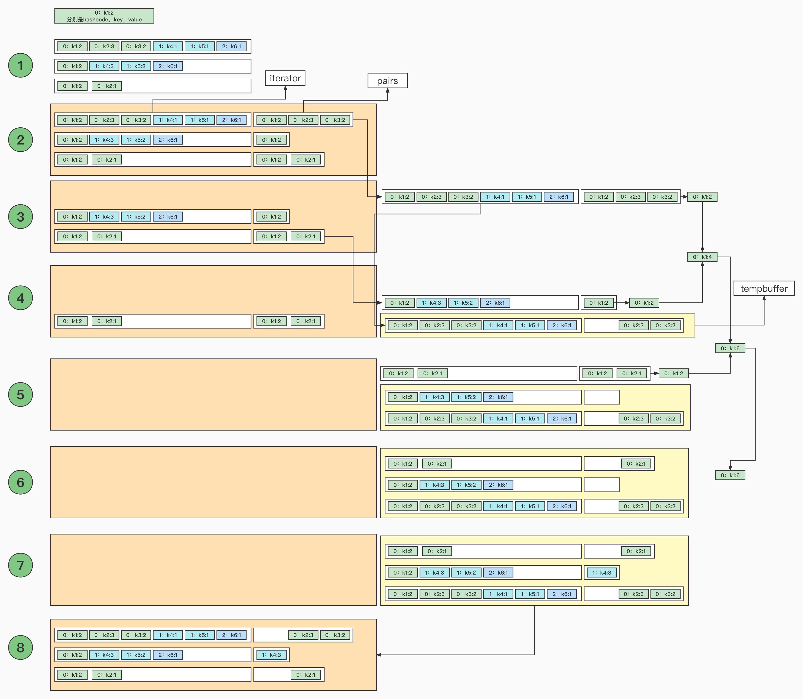

## spark批处理map阶段逻辑


1. 存储结构
   1. 可以聚合
   2. 不能聚合
2. 数据写入
   1. map扩容
3. 数据溢写
   1. 评估内存
   2. 申请内存: 初始
   3. 排序、溢写
4. 溢写数据合并


### 1、存储结构

和mr相比，那么spark的map阶段的存储结构是什么样的呢？目前看来spark的map阶段，是通过是否需要聚合分为不同的结构进行存储的**shouldCombine**

1. **不需要聚合**（shouldCombine = false）：**使用的是buffer**（本质上是一个数组），通过顺序写入的方式写进buffer，这里需要注意的是写入的key是（分区id，key），这里并不影响

   data(2 * curSize) = (partition, key.asInstanceOf[AnyRef])
   data(2 * curSize + 1) = value.asInstanceOf[AnyRef]

2. **需要聚合**（shouldCombine = true）：**使用的是map**（本质上也是个数组），但是写入方式有差异，并不是顺序写入，具体如下

   1. 计算key的hashcode取模得到offset，通过索引找到这个位置
   2. 如果当前位置上没有数据，那么直接插入
   3. 如果当前位置有数据，判断当前位置上数据和即将插入的数据key是否相同
      1. 如果相同：那么进行聚合，得到新的value
      2. 如果不同：offset+1，回到步骤2 

问题：为什么要分成两个结构？这样的话溢写和处理数据是单线程的

猜测：这里我的猜想是：

1. 不需要聚合：不需要聚合的话，顺序添加元素就行，如果用hashcode的方法，效率很低
2. 需要聚合：需要聚合，因为每一次都需要数据对比的过程，那么就涉及到数据查找，这时候带有hash的数组可能效率更高一点


参考：org.apache.spark.util.collection.ExternalSorter 这个类


## 2、扩容

由于是map结构，所以不可能无限使用，当达到某种程度，就需要扩容了（mr就先给定100m，然后溢写）

开始初始化的数组存储能力是 **initialCapacity: Int = 64**，这里的是指能存储64个key-value，由于key和value各自都要占用一个空，所以需要数组的初始长度为128；当数组的使用率达到 **LOAD_FACTOR = 0.7**，开始扩容，扩容就是将数组长度增加一倍，然后数据重新hash到新的数组上


和 java中的hashmap扩容非常的类似，参考：org.apache.spark.util.collection.AppendOnlyMap 这个类。上述不需要聚合用的是array和map类似这里就以map为例来说


## 3、内存评估和内存申请

上述的扩容也不是无限扩容，map结构达到一定的内存，就会新申请内存，那么这里就涉及到两个问题：

1. 怎么获取当前的内存？
2. 下一次申请多少内存？

### 3.1、内存评估

由于获取一个对内对象的大小，时间成本很高，所以spark中读写数据，内存大小的获取是通过抽样获取的方式。具体的思想是这样的：

**抽样采集内存**：就是指间隔一定时间（map操作次数）统计一次数据结构的存储大小。采集的方法如下：

比如: 第n次时候采样时数据结构更新了100次，大小为100k；第n+1次时候采样时数据结构更新了110次，大小为120k；所以按照1.1的增速，下次采样应该是在更新第121 = 110 * 1.1 次的时候 。前两次采样，更新了10次 = 110 - 100，增加了20k = 120k - 100k，的平均每次更新的大小为 20k / 10次 = 2k/次。

|          | 第n次 | 第n+1次     | 第n+2次                                          | 第n+3次       |
| -------- | ----- | ----------- | ------------------------------------------------ | ------------- |
| 对象大小 | 100K  | 120K        | 142k = 120K + (120-100)/(110-100)  * (121 - 110) |               |
| 更新次数 | 100   | 110=100*1.1 | 121 = 110 * 1.1                                  | ceil(121*1.1) |

1. 更新次数：上一次重置采样到当前的更新次数。我们可以自己定义，什么样的操作是对对象的更新操作（比如map结构：只有old-key聚合认为是更新）
2. 抽样时刻：当，更新次数 = 抽样次数时；每一次抽样完，下一次抽样时刻 = 更新次数*抽样频率（默认频率是1.1），也就是更新次数为1、2、4、8、16.......时进行内存采样


**内存评估：**

区别于内存采样，内存采样不是每次操作都会有，但是内存评估每次操作都会有，需要判断内存是否到达上限

公式大概如下

**size = 上一次抽样的size + 平均每一次更新size * （上次采样到现在的更新次数）**

比如第125次更新，这时候内存使用大小为 size = 142k + 2k*（125 - 121）= 150k。上一次采样是第n+2次，为142k，距离现在为4次，上两次的采样的平均增涨为2k

 

具体可以参考：org.apache.spark.util.collection.SizeTracker


### 3.2、内存申请

当我们评估得到内存后，如果达到上限，那就需要继续申请内存：

**amountToRequest = 2 * currentMemory - myMemoryThreshold**

1. currentMemory评估得到内存
2. myMemoryThreshold内存上限：初始化=5 * 1024 * 1024 = 5M
3. amountToRequest我们当前需要申请的内存


我们这里看到其实我们需要amountToRequest，但是比不一定能得到这么多。申请内存的时候，是taskMemoryManager向excutor申请内存，如果excutor内存充足，就会给；如果不足，为了减少溢写次数，就会尝试去释放其他taskMemoryManager的内存

释放其他task内存，也是有规排序，先按照已使用内存大小爱许

1. 释放最小的，大于当前需要内存的taskMemoryManager；
2. 如果没有满足1的，那就就获取当前使用最大的，如果还是不够，再获取第二大的
3. 如果2还是所有task都释放完了，还是不足，那就当前task发生spill

参考 org.apache.spark.memory包下TaskMemoryManager类下的acquireExecutionMemory方法


```scala
// 判断是否需要发生溢写 或者申请内存
protected def maybeSpill(collection: C, currentMemory: Long): Boolean = {
  var shouldSpill = false
  if (elementsRead % 32 == 0 && currentMemory >= myMemoryThreshold) {
    // Claim up to double our current memory from the shuffle memory pool
    val amountToRequest = 2 * currentMemory - myMemoryThreshold
    val granted = acquireMemory(amountToRequest)
    myMemoryThreshold += granted
    // If we were granted too little memory to grow further (either tryToAcquire returned 0,
    // or we already had more memory than myMemoryThreshold), spill the current collection
    shouldSpill = currentMemory >= myMemoryThreshold
  }
  shouldSpill = shouldSpill || _elementsRead > numElementsForceSpillThreshold
  // Actually spill
  if (shouldSpill) {
    _spillCount += 1
    logSpillage(currentMemory)
    spill(collection)
    _elementsRead = 0
    _memoryBytesSpilled += currentMemory
    releaseMemory()
  }
  shouldSpill
}


// 申请内存
/**
   * Acquire N bytes of memory for a consumer. If there is no enough memory, it will call
   * spill() of consumers to release more memory.
   *
   * @return number of bytes successfully granted (<= N).
   */
public long acquireExecutionMemory(long required, MemoryConsumer consumer) {
  assert(required >= 0);
  assert(consumer != null);
  MemoryMode mode = consumer.getMode();
  // If we are allocating Tungsten pages off-heap and receive a request to allocate on-heap
  // memory here, then it may not make sense to spill since that would only end up freeing
  // off-heap memory. This is subject to change, though, so it may be risky to make this
  // optimization now in case we forget to undo it late when making changes.
  synchronized (this) {
    long got = memoryManager.acquireExecutionMemory(required, taskAttemptId, mode);

    // Try to release memory from other consumers first, then we can reduce the frequency of
    // spilling, avoid to have too many spilled files.
    if (got < required) {
      // Call spill() on other consumers to release memory
      // Sort the consumers according their memory usage. So we avoid spilling the same consumer
      // which is just spilled in last few times and re-spilling on it will produce many small
      // spill files.
      TreeMap<Long, List<MemoryConsumer>> sortedConsumers = new TreeMap<>();
      for (MemoryConsumer c: consumers) {
        if (c != consumer && c.getUsed() > 0 && c.getMode() == mode) {
          long key = c.getUsed();
          List<MemoryConsumer> list =
          sortedConsumers.computeIfAbsent(key, k -> new ArrayList<>(1));
          list.add(c);
        }
      }
      while (!sortedConsumers.isEmpty()) {
        // Get the consumer using the least memory more than the remaining required memory.
        Map.Entry<Long, List<MemoryConsumer>> currentEntry =
        sortedConsumers.ceilingEntry(required - got);
        // No consumer has used memory more than the remaining required memory.
        // Get the consumer of largest used memory.
        if (currentEntry == null) {
          currentEntry = sortedConsumers.lastEntry();
        }
        List<MemoryConsumer> cList = currentEntry.getValue();
        MemoryConsumer c = cList.remove(cList.size() - 1);
        if (cList.isEmpty()) {
          sortedConsumers.remove(currentEntry.getKey());
        }
        try {
          long released = c.spill(required - got, consumer);
          if (released > 0) {
            logger.debug("Task {} released {} from {} for {}", taskAttemptId,
                         Utils.bytesToString(released), c, consumer);
            got += memoryManager.acquireExecutionMemory(required - got, taskAttemptId, mode);
            if (got >= required) {
              break;
            }
          }
        } catch (ClosedByInterruptException e) {
          // This called by user to kill a task (e.g: speculative task).
          logger.error("error while calling spill() on " + c, e);
          throw new RuntimeException(e.getMessage());
        } catch (IOException e) {
          logger.error("error while calling spill() on " + c, e);
          throw new SparkOutOfMemoryError("error while calling spill() on " + c + " : "
                                          + e.getMessage());
        }
      }
    }

    // call spill() on itself
    if (got < required) {
      try {
        long released = consumer.spill(required - got, consumer);
        if (released > 0) {
          logger.debug("Task {} released {} from itself ({})", taskAttemptId,
                       Utils.bytesToString(released), consumer);
          got += memoryManager.acquireExecutionMemory(required - got, taskAttemptId, mode);
        }
      } catch (ClosedByInterruptException e) {
        // This called by user to kill a task (e.g: speculative task).
        logger.error("error while calling spill() on " + consumer, e);
        throw new RuntimeException(e.getMessage());
      } catch (IOException e) {
        logger.error("error while calling spill() on " + consumer, e);
        throw new SparkOutOfMemoryError("error while calling spill() on " + consumer + " : "
                                        + e.getMessage());
      }
    }

    consumers.add(consumer);
    logger.debug("Task {} acquired {} for {}", taskAttemptId, Utils.bytesToString(got), consumer);
    return got;
  }
}
```


## 4、溢写（spill）

注：使用map结构存储

1. 当map长度不够扩容
2. 当map内存过大或者达到需要溢写的数据条数，溢写

### 4.1排序

spark在溢写之前默认是要排序的


### 4.2溢写


1. 是否溢写

   1. 申请的内存太小就会溢写
   2. 达到了强制译写的条数
2. 溢写

   1. 分批溢写


```scala
protected def maybeSpill(collection: C, currentMemory: Long): Boolean = {
  var shouldSpill = false
  if (elementsRead % 32 == 0 && currentMemory >= myMemoryThreshold) {
    // Claim up to double our current memory from the shuffle memory pool
    val amountToRequest = 2 * currentMemory - myMemoryThreshold
    val granted = acquireMemory(amountToRequest)
    myMemoryThreshold += granted
    // If we were granted too little memory to grow further (either tryToAcquire returned 0,
    // or we already had more memory than myMemoryThreshold), spill the current collection
    shouldSpill = currentMemory >= myMemoryThreshold
  }
  shouldSpill = shouldSpill || _elementsRead > numElementsForceSpillThreshold
  // Actually spill
  if (shouldSpill) {
    _spillCount += 1
    logSpillage(currentMemory)
    spill(collection)
    _elementsRead = 0
    _memoryBytesSpilled += currentMemory
    releaseMemory()
  }
  shouldSpill
}


override def spill(size: Long, trigger: MemoryConsumer): Long = {
    if (trigger != this && taskMemoryManager.getTungstenMemoryMode == MemoryMode.ON_HEAP) {
      val isSpilled = forceSpill()
      if (!isSpilled) {
        0L
      } else {
        val freeMemory = myMemoryThreshold - initialMemoryThreshold
        _memoryBytesSpilled += freeMemory
        releaseMemory()
        freeMemory
      }
    } else {
      0L
    }
  }
```

### 5、合并多次溢写的文件

合并过程和mr比较类似，唯一的不同点在于mr每次合并文件的个数有限制，spark一次合并所有文件

合并大致可以分区两种，具体如下就不做细致的讲解了


spark为每一个溢写的文件，生成一个StreamBuffer，将所有的StreamBuffer放入一个小顶堆中，StreamBuffer包括一个文件输入流iterator（迭代器）和一个缓冲区pairs。参考 下图

pairs：读取每一个key-value

pairs：每一次缓存的都是相同hashcode的kv对，是hashcode相同，不是key相同


1. 先取生成的3个溢写文件，文件是按照hashcode和key排序完的结果
2. 生成StreamBuffer（iterator和pairs），并且将这些StreamBuffer入小顶堆mergeHeap
3. 取堆顶的minStreamBuffer（StreamBuffer1出队列），从minStreamBuffer.pairs取出最小的kv对 ：key1:2
4. 将上述的StreamBuffer1先加入临时tempbuffer（后续会重新加入队列），判断当前堆顶的StreamBuffer2最小key是否与步骤3的key相同，相同，从pairs取出最小的kv对 ：key1:2，并聚合得到key1:4
5. 将上述的StreamBuffer2先加入临时tempbuffer，重复步骤4，聚合得到key1:6
6. 将上述的StreamBuffer3先加入临时tempbuffer，这时候mergeHeap空了
7. 判断tempbuffer中的所有StreamBuffer的pairs是否为空，如果为空，那就读取下一个hashcode的所有kv对
8. 将tempbuffer中的所有StreamBuffer加入小顶堆mergeHeap
9. 继续合并下一个key




```scala
/**
   * Merge a sequence of sorted files, giving an iterator over partitions and then over elements
   * inside each partition. This can be used to either write out a new file or return data to
   * the user.
   *
   * Returns an iterator over all the data written to this object, grouped by partition. For each
   * partition we then have an iterator over its contents, and these are expected to be accessed
   * in order (you can't "skip ahead" to one partition without reading the previous one).
   * Guaranteed to return a key-value pair for each partition, in order of partition ID.
   */
  private def merge(spills: Seq[SpilledFile], inMemory: Iterator[((Int, K), C)])
      : Iterator[(Int, Iterator[Product2[K, C]])] = {
    val readers = spills.map(new SpillReader(_))
    val inMemBuffered = inMemory.buffered
    (0 until numPartitions).iterator.map { p =>
      val inMemIterator = new IteratorForPartition(p, inMemBuffered)
      val iterators = readers.map(_.readNextPartition()) ++ Seq(inMemIterator)
      if (aggregator.isDefined) {
        // Perform partial aggregation across partitions
        (p, mergeWithAggregation(
          iterators, aggregator.get.mergeCombiners, keyComparator, ordering.isDefined))
      } else if (ordering.isDefined) {
        // No aggregator given, but we have an ordering (e.g. used by reduce tasks in sortByKey);
        // sort the elements without trying to merge them
        (p, mergeSort(iterators, ordering.get))
      } else {
        (p, iterators.iterator.flatten)
      }
    }
  }

  /**
   * Merge-sort a sequence of (K, C) iterators using a given a comparator for the keys.
   */
  private def mergeSort(iterators: Seq[Iterator[Product2[K, C]]], comparator: Comparator[K])
      : Iterator[Product2[K, C]] =
  {
    val bufferedIters = iterators.filter(_.hasNext).map(_.buffered)
    type Iter = BufferedIterator[Product2[K, C]]
    val heap = new mutable.PriorityQueue[Iter]()(new Ordering[Iter] {
      // Use the reverse of comparator.compare because PriorityQueue dequeues the max
      override def compare(x: Iter, y: Iter): Int = -comparator.compare(x.head._1, y.head._1)
    })
    heap.enqueue(bufferedIters: _*)  // Will contain only the iterators with hasNext = true
    new Iterator[Product2[K, C]] {
      override def hasNext: Boolean = !heap.isEmpty

      override def next(): Product2[K, C] = {
        if (!hasNext) {
          throw new NoSuchElementException
        }
        val firstBuf = heap.dequeue()
        val firstPair = firstBuf.next()
        if (firstBuf.hasNext) {
          heap.enqueue(firstBuf)
        }
        firstPair
      }
    }
  }

  /**
   * Merge a sequence of (K, C) iterators by aggregating values for each key, assuming that each
   * iterator is sorted by key with a given comparator. If the comparator is not a total ordering
   * (e.g. when we sort objects by hash code and different keys may compare as equal although
   * they're not), we still merge them by doing equality tests for all keys that compare as equal.
   */
  private def mergeWithAggregation(
      iterators: Seq[Iterator[Product2[K, C]]],
      mergeCombiners: (C, C) => C,
      comparator: Comparator[K],
      totalOrder: Boolean)
      : Iterator[Product2[K, C]] =
  {
    if (!totalOrder) {
      // We only have a partial ordering, e.g. comparing the keys by hash code, which means that
      // multiple distinct keys might be treated as equal by the ordering. To deal with this, we
      // need to read all keys considered equal by the ordering at once and compare them.
      new Iterator[Iterator[Product2[K, C]]] {
        val sorted = mergeSort(iterators, comparator).buffered

        // Buffers reused across elements to decrease memory allocation
        val keys = new ArrayBuffer[K]
        val combiners = new ArrayBuffer[C]

        override def hasNext: Boolean = sorted.hasNext

        override def next(): Iterator[Product2[K, C]] = {
          if (!hasNext) {
            throw new NoSuchElementException
          }
          keys.clear()
          combiners.clear()
          val firstPair = sorted.next()
          keys += firstPair._1
          combiners += firstPair._2
          val key = firstPair._1
          while (sorted.hasNext && comparator.compare(sorted.head._1, key) == 0) {
            val pair = sorted.next()
            var i = 0
            var foundKey = false
            while (i < keys.size && !foundKey) {
              if (keys(i) == pair._1) {
                combiners(i) = mergeCombiners(combiners(i), pair._2)
                foundKey = true
              }
              i += 1
            }
            if (!foundKey) {
              keys += pair._1
              combiners += pair._2
            }
          }

          // Note that we return an iterator of elements since we could've had many keys marked
          // equal by the partial order; we flatten this below to get a flat iterator of (K, C).
          keys.iterator.zip(combiners.iterator)
        }
      }.flatMap(i => i)
    } else {
      // We have a total ordering, so the objects with the same key are sequential.
      new Iterator[Product2[K, C]] {
        val sorted = mergeSort(iterators, comparator).buffered

        override def hasNext: Boolean = sorted.hasNext

        override def next(): Product2[K, C] = {
          if (!hasNext) {
            throw new NoSuchElementException
          }
          val elem = sorted.next()
          val k = elem._1
          var c = elem._2
          while (sorted.hasNext && sorted.head._1 == k) {
            val pair = sorted.next()
            c = mergeCombiners(c, pair._2)
          }
          (k, c)
        }
      }
    }
  }
```


## 和mr的不同

1、在内存中会聚合

- mr：在缓冲区中只加载数据，当达到阈值，然后触发spill，这时候才可能会触发combine；read ->IsSpill->sort->combine;
- spark：使用的map结构，读数据的时候对于相同的key就可以合并了;read ->combine->IsSpill->sort;

