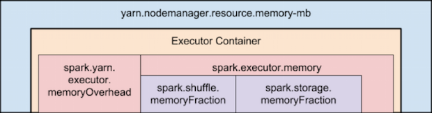

在讲解Spark作业memory使用前，确保理解以下Spark 基本概念：

- Application： 基于Spark的用户程序，包含了一个driver program 和 集群中多个的executor
- Driver：运行Application的main()函数并且创建SparkContext，通常用SparkContext代表Driver Program
- Executor： 是为某Application运行在worker node上的一个进程，该进程负责运行Task，并且负责将数据存在内存或者磁盘上。每个Application都有各自独立的executors。
- Task： 被送到某个executor上的工作单元
- RDD：Spark的基本计算单元，可以通过一系列算子进行操作


# Spark on Yarn 运行模式及线上配置


可见：Spark on YARN模式下，每一个Spark Executor将作为一个YARN Container运行。
那么，每一个Executor的资源分配将受限于Container可使用的资源。

## 集群线上配置

......


## YARN分配给每一个Executor的资源


YarnAllocator

```scala
// In YarnSparkHadoopUtil.scala
val MEMORY_OVERHEAD_FACTOR = 0.10
val MEMORY_OVERHEAD_MIN = 384
  
// In YarnAllocator.scala
// Executor memory in MB.
protected val executorMemory = args.executorMemory
// Additional memory overhead.
protected val memoryOverhead: Int = sparkConf.getInt("spark.yarn.executor.memoryOverhead",
  math.max((MEMORY_OVERHEAD_FACTOR * executorMemory).toInt, MEMORY_OVERHEAD_MIN))
// Number of cores per executor.
protected val executorCores = args.executorCores
// Resource capability requested for each executors
private val resource = Resource.newInstance(executorMemory + memoryOverhead, executorCores)
```


可见：
YARN真正分配给Executor的Memory为：
executor申请的memory，与executor堆外内存的总和，
而默认堆外内存executor.memoryOverhead(用于存储已被加载的类信息、常量、静态变量等数据) = max { 1/10  * executor.memory, 384M }


# Spark memory on Yarn 分布：



executor可用内存 = spark.executor.memoryOverhead + spark.executor.memory
spark.executor.memory = spark.shuffle.memoryFraction + spark.storage.memoryFraction + other（JVM 堆栈空间）

## Storage Memory：

用于缓存需要复用的RDD 、DataFrame
那么storage memory使用的空间为多少呢：
BlockManager

```scala
/** Return the total amount of storage memory available. */
private def getMaxMemory(conf: SparkConf): Long = {
  val memoryFraction = conf.getDouble("spark.storage.memoryFraction", 0.6)
  val safetyFraction = conf.getDouble("spark.storage.safetyFraction", 0.9)
  (Runtime.getRuntime.maxMemory * memoryFraction * safetyFraction).toLong
}
```

可见，默认情况下
分配用于存储的内存：
实际分配得到的内存 * spark.storage.memoryFraction(默认0.6)
真正用于storage的内存为：
实际分配得到的内存 * spark.storage.memoryFraction(默认0.6) * spark.shuffle.safetyFraction(默认0.9)
需要注意：
用于缓冲数据的内存空间不应该超过JVM老年代的大小
ResourceManager、NodeManager使用Parallel Scavenge + Parallel Old 组合进行GC管理，新生代与老年代比例取默认值，为1：2。
即，Executor（Container）内能够实际用于缓存数据的最大值为 executor.memory * (2/3)


## Shuffle Memory：

用于shuffle时，缓存从map端拉取过来的数据
那么shuffle memory使用的空间为多少呢：
ShuffleMemoryManager


```scala
/**
 * Figure out the shuffle memory limit from a SparkConf. We currently have both a fraction
 * of the memory pool and a safety factor since collections can sometimes grow bigger than
 * the size we target before we estimate their sizes again.
 */
def getMaxMemory(conf: SparkConf): Long = {
  val memoryFraction = conf.getDouble("spark.shuffle.memoryFraction", 0.2)
  val safetyFraction = conf.getDouble("spark.shuffle.safetyFraction", 0.8)
  (Runtime.getRuntime.maxMemory * memoryFraction * safetyFraction).toLong
}
```

可见：默认情况下，
分配用于shuffle的内存为：
实际分配得到的内存 * spark.shuffle.memoryFraction(默认0.2)
真正用于shuffle的内存为：
实际分配得到的内存 * spark.shuffle.memoryFraction(默认0.2) * spark.shuffle.safetyFraction(默认0.8)
实际分配内存可近似等于 spark.executor.memory 。
如果设置spark.shuffle.spill为true，则当这部分内存不能满足shuffle数据的缓存需求时，会将超出的部分存储到磁盘。
spark.shuffle/storage.safetyFraction 作用：
  提供一个安全使用这部分内存的门限值，剩余部分起缓冲作用。


# 如何计算Spark申请的内存值？

total_memory = total_executor_memory + total_driver_memory
            = num-executors * (executor.memory + executor.memoryOverhead) + (driver.memory + driver.memoryOverhead)
            = num-executors * (executor.memory + max(10% * executor.memory, executor,memoryOverhead)) + (driver.memory + max(10% * driver.memory, driver.memoryOverhead))
最后 total_memory向上去256M的整数倍（此为简单算法，实际上是executor及driver的单内存申请量是256的向取去整数倍）。

举例：
driver.memory = 4g
executor.memory = 4g
spark.executor.memoryOverhead=4g
num-executors = 200
total_memory = [ (200 * (4g + 4g) + 4g + 0.1 * 4g ) / 256m] * 256m = [(1600 + 4.4) / 256 gb/mb] * 256mb = 1604.5 gb


# 参考文献

知乎大佬内存分层讲解：https://zhuanlan.zhihu.com/p/63187650

overhead内存：https://stackoverflow.com/questions/58666517/difference-between-spark-yarn-executor-memoryoverhead-and-spark-memory-offhea/61723456#61723456

资源申请：https://www.jianshu.com/p/45c6d74ae55b


